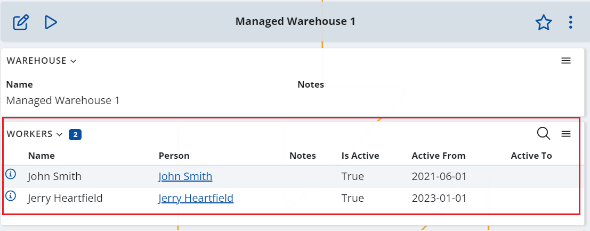
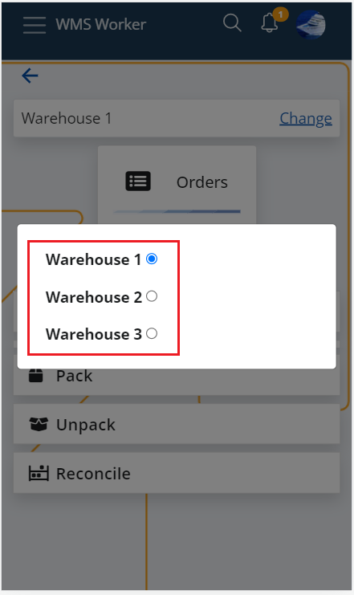

## Warehouse workers

Warehouse workers are the people who are performing the tasks within the warehouse. 
They are set up in the Workers panel of the Warehouse, where you can create records for each of the persons working in the particular warehouse.

Having a worker set up, defines which Warehouses will be visible for the user when he logs into the @wms-worker app. The user only sees the Warehouses in which he is a worker. 

This means that one user might be connected to a multiple warehouses and respectively can be related to more than one worker definitions - one for each warehouse.

The connection between the user and the worker is performed through the Person field - the Person specified in the worker/workers and in the user he is going to use to log into the app should be the same. 
