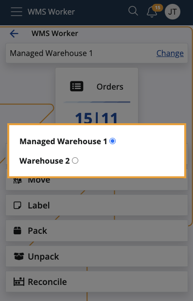

# Warehouse workers

Warehouse workers are human or robot workers who can execute warehouse tasks.

They reside in the **Workers** panel of the respective managed warehouse, where you can view and modify their records.

### Worker details

Within the panel, you can find the following information about every worker:

- **Name** - The worker's full name.

- **Person** - The person representing the worker, as specified in the worker's User definition. If a User is **not** set, this field will be **NULL**, which means that the worker's identity may be unknown or they might be a non-person entity. 

- **Notes** - Additional information or special instructions related to the worker's role and responsibilities.

- **Is Active** - Specifies whether the worker is active and capable of executing tasks. 

- **Active From** - The date the worker's record became active in the warehouse. This helps in tracking the duration of the worker's service.

- **Active To** - The termination date of the worker's activity in the warehouse. This can be NULL for workers who are still active and have not been terminated previously.

- **User** - Refers to the user account associated with the worker. This applies only to **internal** and **virtual** users.

### WMS Worker app access

One and the same user may be assigned to multiple warehouses.

The **WMS Worker app** determines which warehouses to show to the currently logged-in worker based on the **User** they're associated with.

In other words, workers will only have access to those warehouses where their user accounts are added. 

