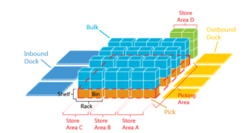
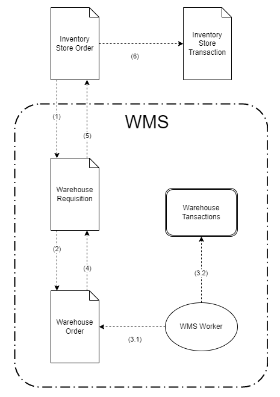

# WMS 

For larger warehouses with multiple locations where real-time tracking of stock availability is essential, you can take advantage of the **Warehouse management system**. 

**WMS** follows the concepts of [warehouse management systems](https://en.wikipedia.org/wiki/Warehouse_management_system). The main objective for implementing a WMS is to optimize the efficiency of the warehouse operations in the **managed warehouses**.

**Managed warehouses** are physical warehouses, which have managed operation. They exist outside of existing store definitions. The Stores concept is used for the management of inventory levels and general ledger (accounting) entries. Managed Warehouses are sub-level, which is used to manage all warehouse activities, including:

- Picking
- Put-Away
- Counting
- Packing/Unpacking
- Inspection
- Robot interactions
- etc.

> [!NOTE]
> One managed warehouse can encapsulate the storage and operations of multiple legal entities (Enterprise companies). While the existing "Store" concept is strictly bound to the enterprise company, the warehouse can accommodate goods of multiple entities. It can even be used to store goods from external companies.

The most important part for achieving operational effectiveness is to properly organize the layout of the warehouses. Layout optimization is outside the scope of this document.

Managed Warehouses are organized using **Zones** and **Locations**. Zones are sub-divisions of a warehouse.

> [!NOTE]
> Zones are used to accommodate different storage needs, such as different temperature requirements or turnover rate of the products.

The zones are further divided in **Locations**. Locations have name (like #1-8-20), which is used to uniquely identify them.

> [!NOTE]
> Use warehouse management to increase efficiency by automating warehouse routing and identifying storage locations for your products.

The two most basic documents of WMS are:

- **Warehouse requisitions (W.R.)**  
  They contain outside requests for warehouse operations (usually inbound/outbound).

- **Warehouse orders (W.O.)**  
  They are the internal plan for execution of W.R. They contain routes, locations, workers, etc.

The basic operation flow of WMS is the following:

The steps, noted in (parens) in the diagram are as follows:

1. The outside module/department creates W.R. based on its needs. The connection is performed trough the **Iventory Store Orders (S.O.)**.
2. Inside the WMS, the team devises a plan for execution and stores it as a W.O. In the best-case scenario, the creation of WO is totally automated.
3. The workers use their handheld devices and the **[WMS Worker app](xref:wms-worker)** to execute the order. Each step is recorded as both document fulfillments (3.1) and warehouse transactions (3.2).
4. After the W.O. is fully executed (completed), the warehouse requisition fulfillments are updated with the execution information.
5. After the W.R. is fully executed (completed), the store transaction fulfillments are updated with the execution information.
6. After the S.O. is fully executed (completed), it creates the **Inventory Store Transaction** based in the execution information returned by the WMS.

Typically, managed warehouse operations are executed using some sort of handheld device, which is used to scan bar-codes, NFC tags, etc.

## Push and Pull task management

When a warehouse requisition document comes in, there are many ways we can plan how to fulfill it. The plan is represented by warehouse order documents.  
But how these Order documents are created? There are at least two main ways to organize the work.

### Pull system

The Pull system is the easiest way to organize the execution. Under some circumstances, it can also be the most efficient. 
In the Pull system, each warehouse worker decides when to get (pull) work. Whenever they are ready, they request more work through their mobile app.

Pros:

- Do not require a central planner.
- Effective for small orders, usually e-Commerce.
- Very easy to setup.
- Easy to maintain - no need to plan for workers missing, overloaded, etc.
- Efficient - workers achieve high efficiency without central planning (but might need more control).

Cons:

- Not good for B2B, because large orders are better served with Push System.
- Without a central planner, worker control needs to be better controlled.
- Cannot implement complex order mixing, splitting or other complex work procedures.

### Push system

Under the Push system, there is a central planner, who plans the work and pushes it to the workers. The Push system might be required in more complicated execution environments.

Pros:

- A central planner can better allocate the worker and machine resources to fulfill the requisitions.
- In complicated execution, the Pull System might be inappropriate.
- Worker task management is taken away from the workers and controlled centrally.

Cons:

- More expensive - require a central planner.
- The efficiency of the workers depends heavily on the planner.

### Choosing the right strategy

There can be other organizations of the workflow within a warehouse. The ERP.net data model allows implementing almost any conceivable strategy, with the most prominent ones built-in.

However, planning the execution can be externalized to custom apps and services. Applying AI/ML strategies for achieving better efficiency is a possible direction.
Also, mixing robots with human workers might require using custom strategies.

> [!NOTE]
> 
> The screenshots taken for this article are from v24 of the platform.
