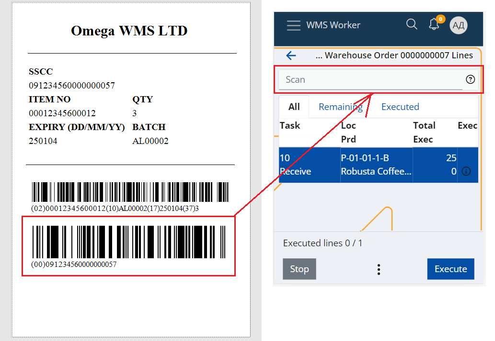
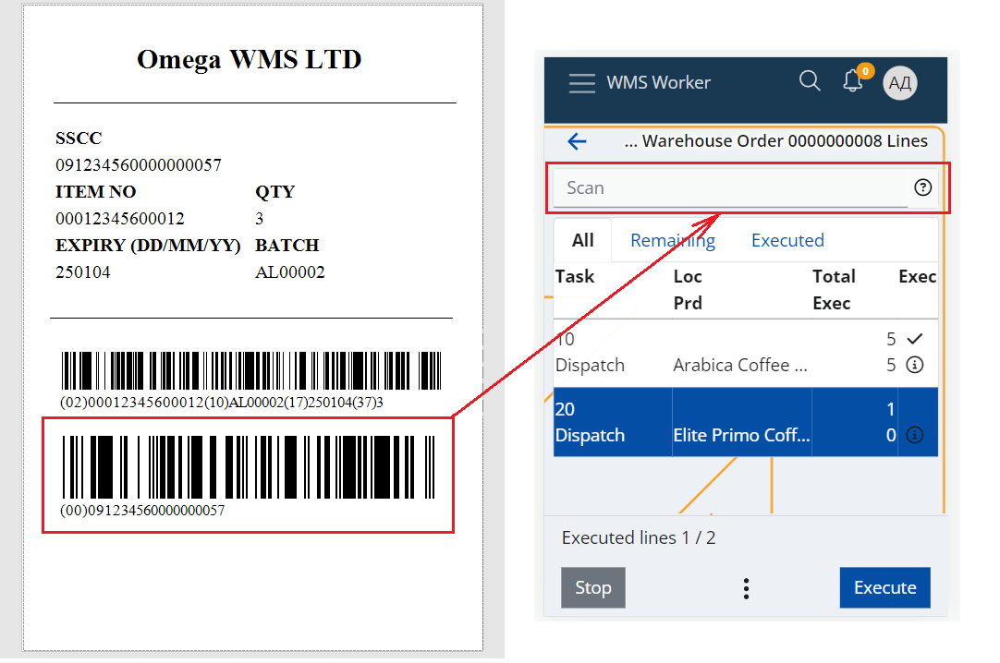

# Work with Logistic Units 

## Using Logistic Units in the Receiving Process

Using LUs in the receiving process can significantly reduce the amount of time and effort it requires, especially if the the data about the expected Logistic Units contents is exchanged prior the shipment arrival via using an **[Advance Shipping Notice (ASN)](../../logistic-units/asn.md)**, for example. 

Here is what to do depending on whether you have information about the SSCC codes and its prior the shipment or not.

#### The LU’s data is exchanged prior the shipment arrival
In these cases it is highly advisable to create their definitions into the database before the arrival of the units. This will allow receiving the unit with a single scan of its SSCC code. The worker needs to simply scan the SSCC barcode into the Scan field of the [Orders menu](xref:orders-menu) of the WMS Worker app. 

The [P03: GS1 – SSCC barcode parser](/modules/logistics/wms/how-it-works/barcode-parsers/p03.md) will automatically find the appropriate Warehouse Order Lines and will automatically execute them with the logistic unit’s Contents.

#### The LU’s data is NOT exchanged prior the shipment arrival 
- **If the shipping label contains trade item information**
 If the LU is homogeneous, then its Shipping Label probably contains trade item information about the product, lot, etc.. This means then you can still receive the LU contents by simply scanning the trade information label.

   - **If the shipping label DOES NOT contain trade item information**
 In these cases you need to inspect the LU content in order to know what it actually is. Once you know its content, you can receive it by executing the Order lines for each product.

Once, the content is received, you can decide whether you still want to handle it as a whole Logistic Unit? 

If you do, you can assing your own SSCC code. In this case you need to pack the content using the Pack menu in WMS Worker and choose its “Create logic unit now” button. This will automatically create new LU with the new SSCC code, the scanned contents and appropriate specifications. Then you just need to print and attach new [logistics labels](../../logistic-units/logistic-labels.md) with the newly assigned SSCC barcode.

Alternatively, you use the SSCC code that has been assigned by the supplier. In this case you need to manually create the LU definition into the database, where you need to specify both its SSCC and Contents. Then you still have to Pack its content by using the Pack menu in WMS Worker by selecting the defined LU. This will update the availability with the information that these product are now contained in this LU.

## Using Logistic Units in the Dispatching Process
Here we have two situations depending on whether you are dispatching an existing LUs or you want to create LUs to pack the dispatched content of an Sales Order.

#### Dispatching existing LU
То dispatch an existing LU you need to simply scan the SSCC barcode into the Scan field of the [Orders menu](xref:orders-menu) of the WMS Worker app. 

The [P03: GS1 – SSCC barcode parser](/modules/logistics/wms/how-it-works/barcode-parsers/p03.md) will automatically execute the appropriate Warehouse Order lines with the logistic unit’s Contents.

#### Creating new LUs to pack a dispatched Sales Order
You have completed the dispatching of a Sales Order and now you want to pack its products into Logistic Units?

You can do that by using the Label menu in WMS Worker. With it you can select the completed Sales Order and create new LU’s for its content.

Then you can print [logistics labels](../../logistic-units/logistic-labels.md) and attach them to each unit.

