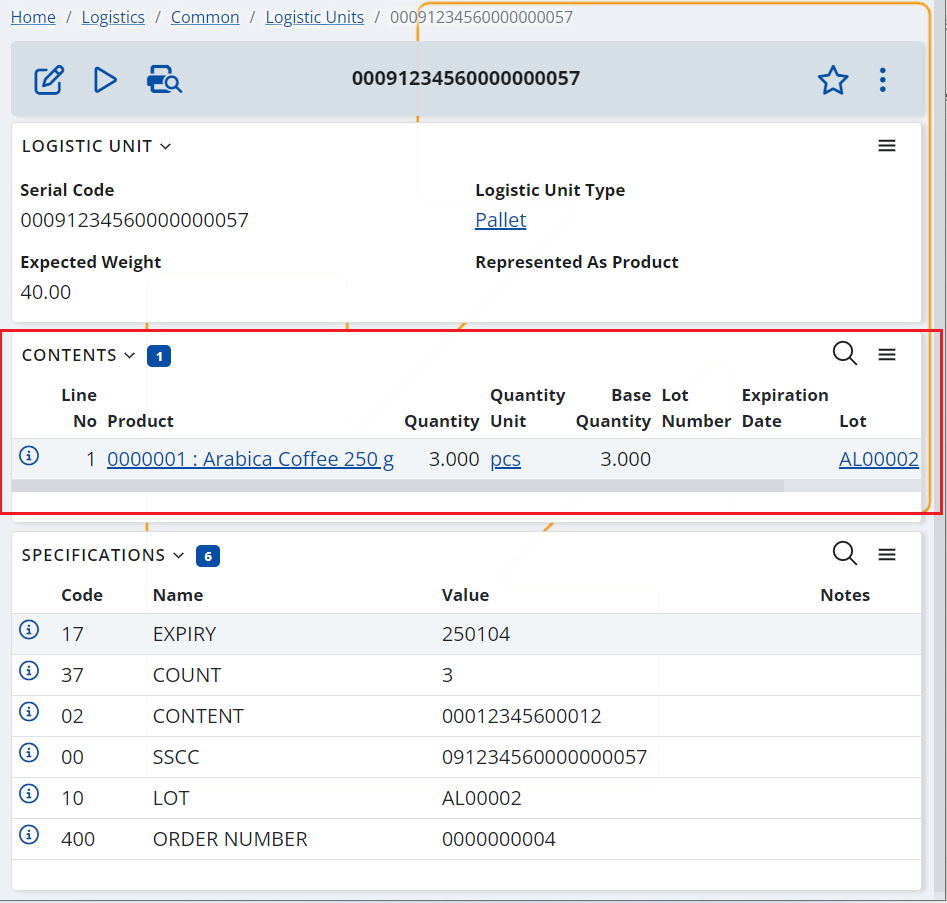

# Logistic Units
Logistic units are physical objects or containers that are used to transport goods or products from one location to another. These units are typically standardized and can be handled and transported easily by machinery such as forklifts or conveyor belts.

Logistic units can come in many different forms, including pallets, containers, and boxes. They are designed to hold a specific amount of products or goods, and their size and shape are usually determined by the requirements of the transportation mode or the storage facility.

In the context of logistics and warehousing, logistic units play an important role in the efficient movement of goods through the supply chain. By using standard units, companies can ensure that products are packed and transported in a consistent and predictable way. This helps to reduce the risk of damage or loss during transit, and it also makes it easier to track and manage inventory as it moves through different stages of the supply chain.

## Logistic unit’s definition
Logistic Units definition in @@name contains important information about the unit’s serial number, type, weight, its contents, and specifications.

The Logistic Units are identified using their unique Serial Number. If it is used GS1 coding, this is actually the SSCC code. For SSCC codes it is recommended that the serial number includes the leading two zeroes “00” that represent the GS1 SSCC identifier. This way you will be able to search in the Logistic Units drop down lists by scanning its barcode. Serial Codes can be reused if needed, but it this case the “old” LU with the same serial number must be deactivated.

The Contents panel holds information about what the content of the logistics unit is – what products, what is their quantity, lot, serial number, etc. Note that this is the theoretical content of the unit, the actual content may be different and can be seen in the Warehouse Availability menu. 

The Specifications panel contains synthesized information about the Logistic Unit. The database can contain any kind of specification, but most client applications and integrated methods process GS1 specifications (application identifiers). These specifications are usually used when generating Logistic Labels.

## Serial Shipping Container Code (SSCC)
As mentioned above, one of the most common methods for identifying Logistic Units is SSCC codes.

SSCC (Serial Shipping Container Code) is a unique 18-digit code used to identify shipping containers, typically used in the supply chain industry. It is used to track and manage the movement of goods as they move through the supply chain, from production to delivery to the end customer.

Because the SSCC provides a unique number for the delivery, it can be used as a lookup number to provide not only detailed information regarding the contents of the load, but also as part of the Advance Ship Notice (ASN) process.
ypically, this means that just one scan of the SSCC on a logistic unit at a receiving bay can be linked to a pre-received electronic ASN of the contents of the logistic unit to facilitate speedy receiving, reconciliation, and put-away processes. Alternatively, when tracking a unit in transit, the SSCC provides all the information required for accurate identification. 

The SSCC code is generated by the organization that is packing/ creating the logistic unit and it is formed by several parts, , including a GS1 Company Prefix, a unique serial number, and a check digit.

Example: **(00) 0 9123456 000000009 5**
, where:

- **(00) is the Application Identifier (AI)**. It is not a part of the 18-digit code. Therefore, it is not included in the code in the SSCC specification in the logistic unit’s definition. The leading 00 still should be included in the Serial Number field in order to be able to search in the LU drop down lists by scanning the SSCC barcode.
- **0 **is the Extension Digit**. It can take values from 0 to 9. Its determined by company generating the logistics label and serves to increase the capacity of the Serial Reference within the SSCC. Currently, ERP.net simply sets “0” as a constant.
- **9123456 is the GS1 Company Prefix**. This is a globally unique number issued to a GS1 member company. It is assigned and provided to the company by the GS1 National Organization. The company prefix gives uniqueness to the generated SSCC, but does not indicate the origin of the goods. The prefix can be of different lengths, depending on the capacity of the prefixes offered by the relevant GS1 National Organization. In @@name the GS1 Company Prefix is specified in the “GS1 SSCC Company Prefix” warehouse policy.
- **000000009 is a Serial Reference**. This is a serial number that is assigned by the company that has created the logistics unit. The reference number has the function of a sequence counter: for example 0000001, 0000002, 0000003,.....0000010, 0000011........9999999.
Its length varies depending on the length of the GS1 company prefix and is calculated as a function of it: (Extension digit + GS1 Company Prefix + Serial Reference) = 17 digits
In @@name the Serial Reference is specified in the “GS1 SSCC Next Serial” warehouse policy.
-  **5 is a Check Digit**. It is a one-digit number used for data integrity. It is calculated automatically by ERP.net when generating the SSCC code.

## Logistic units types
When it comes to the content a logistic unit can either be **homogeneous** or **heterogeneous**.

The **homogeneous logistic units** contain one type of trade item. This means that all the items at the highest level of packaging are the same and are identified with the same GTIN. 

**Example:** *a pallet containing 50 trade item groupings (e.g. boxes)  of shampoo.*

In this case information of GTIN and other trade item information such as Lot, Quantity and , etc. CAN be included in the GS1 barcode and on the logistic label. I.e., for homogeneous logistic units and logistic units that are trade items it is possible to include information about the trade item(s) on the logistic label. This can be useful in situations where no Advance Ship Notice (ASN) is used or is unavailable and the receiving company is not aware of the content of each specific logistic unit in advance.

The **heterogeneous logistic units** contain different types of trade items at the highest level of packaging that are identified with different GTINs. 

**Example:** *a pallet containing 30 standard trade item groupings (e.g. boxes) of shampoo and 20 standard trade item groupings (e.g. boxes) of conditioner.*

In this case information of GTIN and other trade item information such as Lot, Quantity and , etc. CANNOT be included in the GS1 barcode and on the logistic label. I.e., for heterogeneous logistic units it is not possible to include trade item information on the logistic label and therefore the use of advance exchange of and Advance Ship Notice (ASN) is strongly encouraged. This will allow the exchange of data linked with the SSCC and the logistic units’ content in advance. This way the receiving company can create the logistic units definitions before the shipment arrival, which will allow receiving the unit with a single scan of its SSCC code (for more info, see [GS1 – SSCC barcode parser](xref:P03)). 
