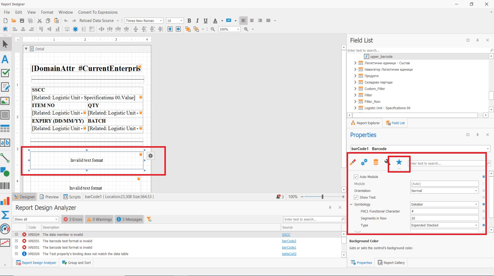

# Logistic Labels 
**GS1 logistic labels** are standardized labels used to identify and track products throughout the supply chain. GS1 is a global organization that sets standards for product and **[Logistic Units](index.md)** identification and communication, and their logistic labeling standards are widely used in the retail and healthcare industries.

**The GS1 logistic label consists of three sections**:
-	**The top section** of the label contains information in free format that can be used by the label-making company for various purposes.
-	**The middle section** contains the encoded data in readable text format, in accordance with GS1 Standards.
-	**The last section** contains the barcode symbols. For the encoding of the information are used **[GS1 barcode](/modules/logistics/wms/gs1-barcodes.md)** identifiers.

The SSCC is the single mandatory element for all GS1 Logistic Labels. Other information, when needed, shall comply with the specifications in this document and with the proper use of GS1 Application Identifiers.

If the [Logistic Unit](index.md) is **homogeneous** (for more information, see [Logistic units types](index.md#logistic-units-types)) and therefore contains one type of trade item, in addition to the SSCC code, these labels can include trade item information. This typically includes a Global Trade Item Number (GTIN), which is a unique identifier assigned to each product, as well as other information such as the product description, batch or lot number, and expiration date. 

If the [Logistic Unit](index.md) is **heterogeneous** (for more information, see [Logistic units types](index.md#logistic-units-types)) and therefore contains different types of trade items that are identified with different GTINs, then it is NOT possible to include trade item information on the logistic label. In these cases the data about the expected Logistic Units contents is exchanged prior the shipment arrival using an **[Advance Shipping Notice (ASN)](asn.md)**. 

By using standardized **logistic labels**, companies can improve the efficiency and accuracy of their supply chain operations, reduce the risk of errors and delays, and improve customer satisfaction by ensuring that the right products are delivered on time.

## Logistic Labels in @@name

In @@name, the **logistic labels** are created and printed using the standard report and printout functionality. They are usually printed from the Logistic Unit definition. The printout as set up using the Reports functionality in ERP.net, as a report for which the “One Row” check-mark is set.

The information in the logistic label is gathered from the logistic unit's Specifications panel. The Pack functiallity in WMS Worker automatically fills in Specifications with the oppropriate information, following the GS1 Standards and you can directly use this information in your labels.

Here is a picture of the mandatory settings for the barcode field in order to generate GS1 barcodes from the Specifications.

The special FNC1 symbol by default is #, meaning it should be included at the beginning of the barcode and as a separator for the variable length identifiers. The barcode information is extracted using calculated fields. An example of a calculated field that generates the GS1 barcode in a printout is:

'#'+[Related: Logistic Unit - Specifications 02].[Code]+[Related: Logistic Unit - Specifications 02].[Value]+[Related: Logistic Unit - Specifications 10].[Code]+[Related: Logistic Unit - Specifications 10].[Value]+'#'+[Related: Logistic Unit - Specifications 17].[Code]+[Related: Logistic Unit - Specifications 17].[Value]+[Related: Logistic Unit - Specifications 37].[Code]+[Related: Logistic Unit - Specifications 37].[Value]

Here are the files with the source and view of an sample printout report in the logistic unit's definition. The report can be use as a base and be adjusted according to the specific company's needs:

- <a id="raw-url" href="https://github.com/ErpNetDocs/tech/blob/master/modules/logistics/wms/logistic-units/pictures/Logistic_Label.repx">Download "Sample Logistic Label Report Layout"</a>
- <a id="raw-url" href="https://github.com/ErpNetDocs/tech/raw/master/modules/logistics/wms/logistic-units/pictures/Logistic_Label.dsrc">Download "Sample Logistic Label Data Source"</a>

The labels are typically printed on adhesive labels that are affixed to **[Logistic Unit](index.md)**, and they are scanned at various points in the supply chain to ensure the product is properly tracked and accounted for.
