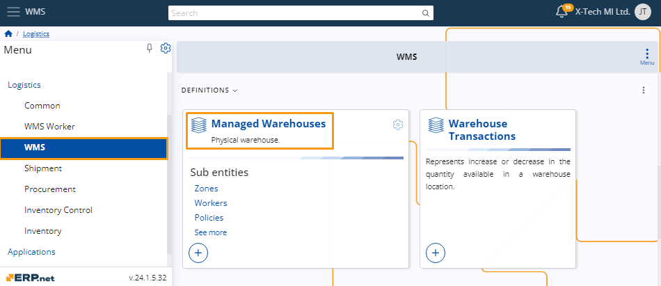
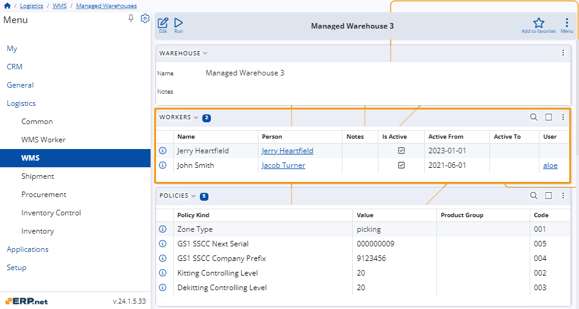
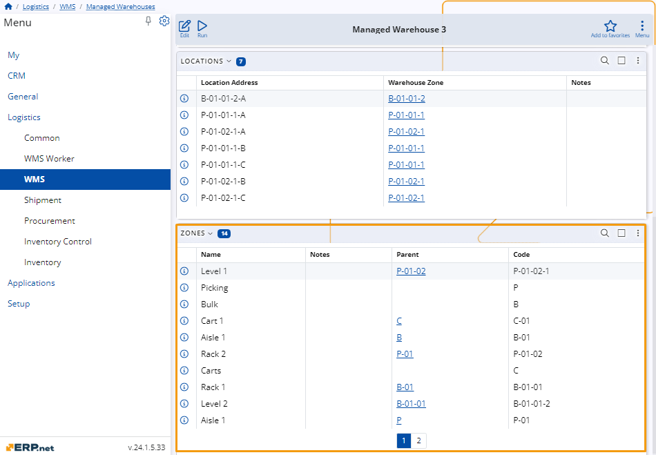

# Managed Warehouses 

In the ERP.net, **managed warehouses** represent complex storage facilities for efficient inventory management. 

These warehouses are carefully organized into various components such as locations, zones, policies, and workers. 

This structured approach allows for precise tracking, better organization, and streamlined logistics within the warehouse, ensuring optimal operational efficiency.

## Navigation 

To access your managed warehouses, navigate to **Logistics**, then **WMS**, and select the **Managed Warehouses** panel. 

Clicking the panel title will display a table listing all the managed warehouses and various options for managing them.

## Warehouse components 

The components of the managed warehouses are established during their creation. 

They can be subsequently modified if the warehouse experiences any alterations.

### Warehouse 

This section contain only the name of the warehouse and notes about it. 

### Workers 

The Workers section on the platform provides detailed information about each worker in the managed warehouses. 

You can find information about every worker in a table that includes the following details:

- **Name** - The worker's full name, which can be recorded in multiple languages. This ensures proper identification and communication within diverse teams.

- **Person** - Defines the individual worker, specifying if the worker is a human. If NULL, it means the person's identity is unknown or the worker might be a non-human entity such as a robot.

> [!NOTE]
> A Person is defined based on a user profile and is read-only.

- **Notes** - Any additional information or special instructions related to the worker's role and responsibilities.

- **Is Active** - Specifies whether the worker is active and can execute new tasks. This is a crucial status indicator for workforce management.

- **Active From** - The date the worker's record became active in the warehouse. This helps in tracking the duration of the worker's service.

- **Active To** - The termination date of the worker's activity in the warehouse. This can be NULL for workers who are still active and have not been terminated previously.

- **User** - Identifies the user account linked to the worker, typically used for logging in and performing tasks within the warehouse system.

### Policies 

In the **Policies** section, the system presents details regarding specific policies related to the managed warehouse. 

Each policy is associated with a particular zone, denoted by its code. 

Additional information provided includes the type of policy, its corresponding value, and any associated product group codes.

### Locations

In the **Locations** section, the system displays details about specific locations within the managed warehouse. 

Each location is identified by its unique address within the warehouse zone. 

The table also provides any additional notes relevant to each location.

### Zones 

In the **Zones** section, the system provides information about different zones within the managed warehouse. 

Each zone is identified by its name and may include additional notes for clarification. 

The table also indicates the parent zone, if applicable, and assigns a unique code to each zone for identification purposes.
