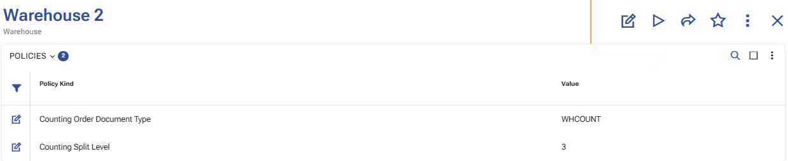
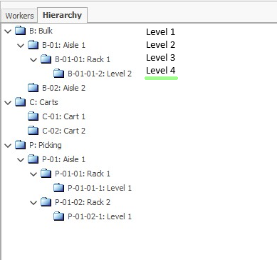

# Configuring Planned Reconcile

This page describes the setup required to use **Planned Reconcile** in WMS.

Before users start working with Planned Reconcile, prepare the required document types, [warehouse policies](../how-to/setup-warehouse/warehouse-policies.md), and warehouse zone structure.

## Required setup

Configure the following:

- a document type for **Warehouse Reconciliations**;
- a document type for **Warehouse Orders** used for count orders;
- the warehouse policy **CountingOrderDocumentType**;
- optionally, the warehouse policy **CountingSplitLevel**;
- the warehouse zone hierarchy, when count orders must be split by zones.

## Document types

Create a document type for the entity **Warehouse Reconciliations**. This document type is used for the reconciliation document.

Create a document type for the entity **Warehouse Orders**. This document type is used for the generated count orders.

The document type for generated count orders is defined through the [Warehouse policies](../how-to/setup-warehouse/warehouse-policies.md), using the **CountingOrderDocumentType** policy.

## Warehouse policies

Configure the **CountingOrderDocumentType** warehouse policy. Its value must be the **DocumentType.Code** of a document type for the entity **Warehouse Orders**.

Configure the **CountingSplitLevel** warehouse policy when count orders must be split by warehouse zones. Its value must be a non-negative integer.

Use the following values for **CountingSplitLevel**:

- `0` for a single count order;
- a value greater than `0` to split count orders by warehouse zones at the corresponding hierarchy level.

> [!NOTE]
> **CountingSplitLevel** is used only in scenarios that support split order generation. It does not apply to **Recount (Single Order)**.

## Warehouse zone hierarchy

When **CountingSplitLevel** is used, review the warehouse zone hierarchy in advance so that the split level matches the intended order distribution.

The generated count orders follow the configured zone hierarchy level.

## Warehouse scope

Select the reconciliation scope in the warehouse:

- the whole warehouse;
- selected zones;
- selected locations.

When zones or locations are selected, use ones that belong to the selected warehouse.

## Operational preparation

After the snapshot is generated, keep the selected scope free from warehouse movements until the counting and review are finished.

Do not perform warehouse movements for the selected locations and products during the reconciliation process.
