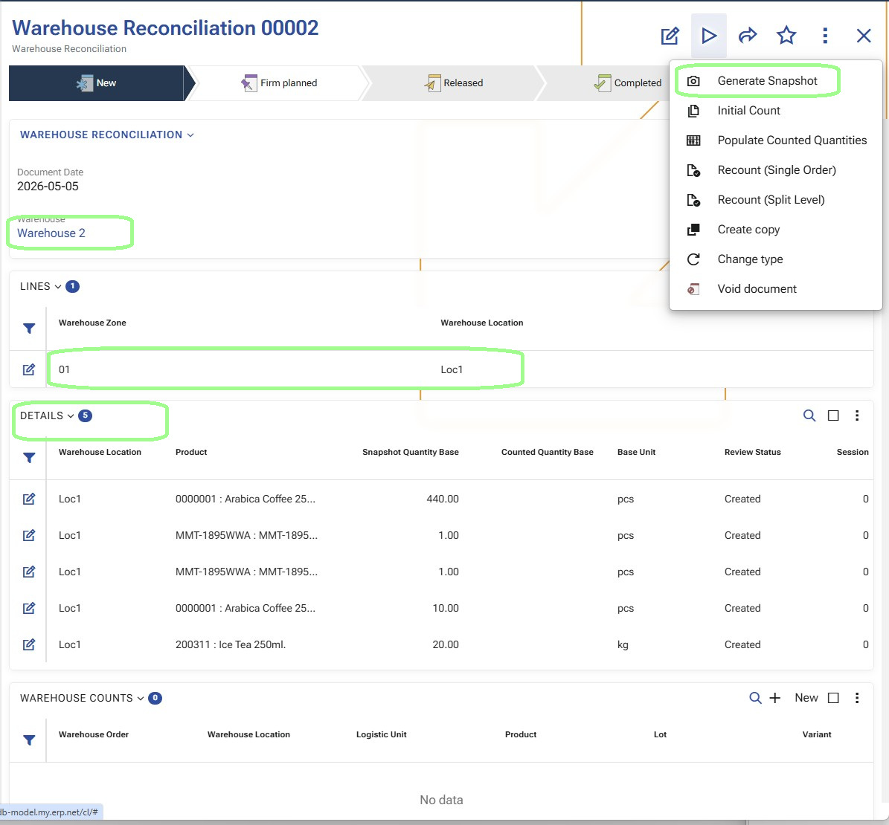
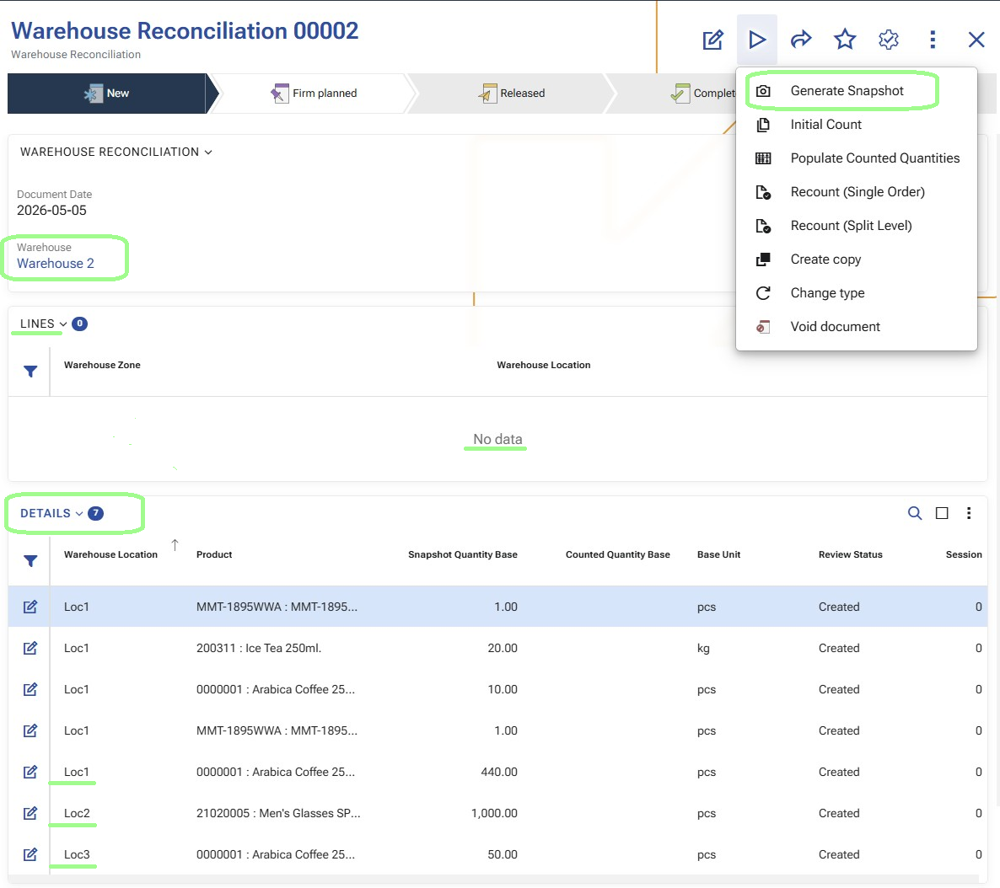
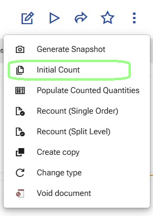
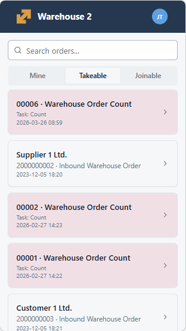
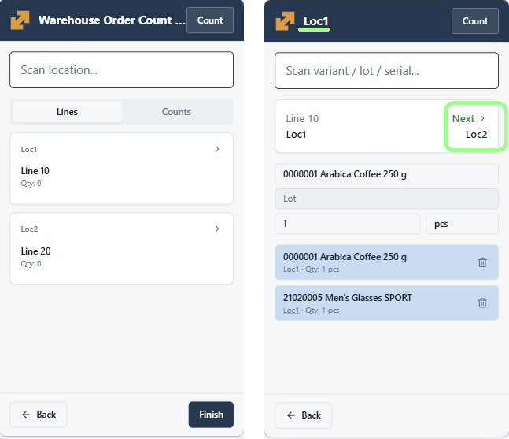
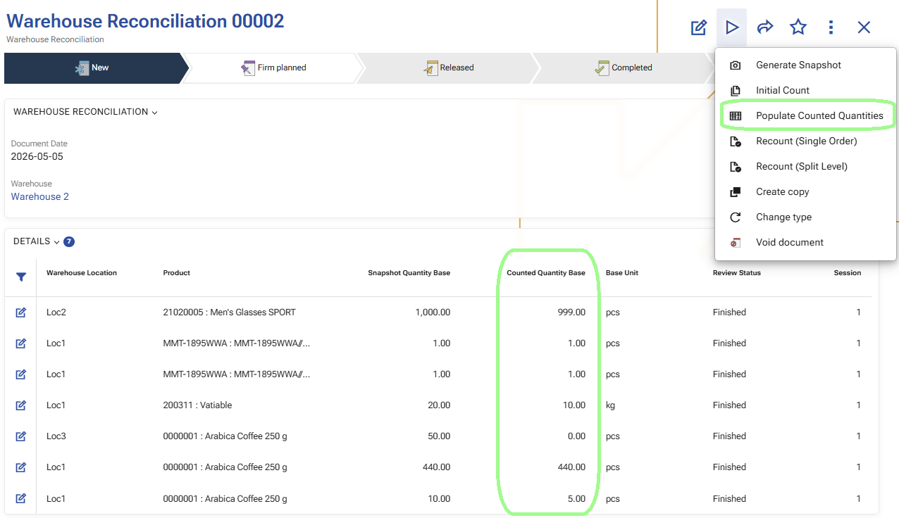
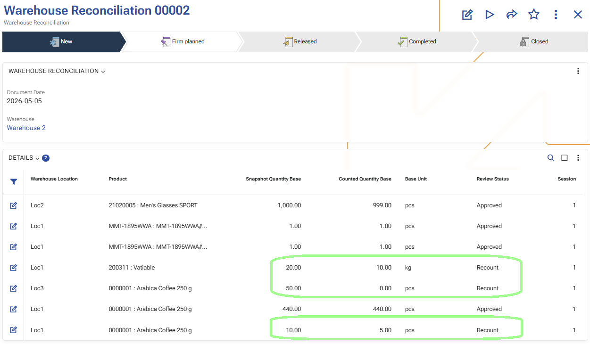
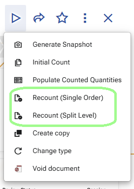
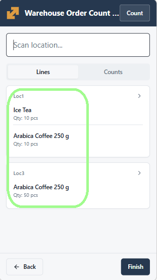
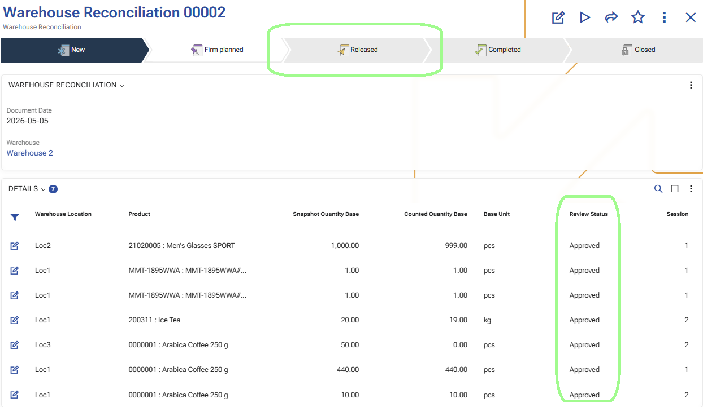

# Warehouse reconciliation scenarios

This article describes the main operational scenarios for working with warehouse reconciliation in WMS.

A reconciliation can cover a whole warehouse or a selected part of it, such as specific zones or locations. Depending on the business need, the process can start either with a broad first count or with a focused recount of selected product rows.

## Full warehouse reconciliation for a whole warehouse or selected zones and locations

This scenario describes a complete warehouse reconciliation process. The reconciliation can cover a whole warehouse or a selected part of it, such as specific zones or locations.

In the example below, the process is shown for a whole warehouse. The same overall flow also applies when the reconciliation scope is limited to selected zones or locations.

The process starts with preparing the reconciliation and [generating the snapshot](operations/generate-snapshot.md), continues with the [initial count](operations/initial-count.md), and then moves to one focused recount for selected differences. When the result is confirmed, the reconciliation is released and the approved differences are applied through [warehouse transactions](operations/generate-warehouse-transactions.md).

### Before you begin

Before the counting starts, a warehouse manager creates a Warehouse Reconciliation document and defines the scope of the process.

The scope can cover:

- the whole warehouse,
- selected zones, or
- selected locations.

To keep the reconciliation reliable, the selected scope should not be affected by other warehouse operations while the process is running. As much as possible, avoid receipts, issues, moves, replenishments, or other warehouse movements in the selected locations and products until the counting and review are finished.

**Expected result:**  
The reconciliation is prepared, the scope is defined, and the warehouse team is ready to start.

### Step 1: Open the Warehouse Reconciliation and confirm the scope

The warehouse manager opens the prepared Warehouse Reconciliation document and verifies that the correct warehouse, zones, and locations are included.

> [!Important]
> In the example below, the reconciliation is created for the **Whole Warehouse**.

This is the point where the manager confirms exactly what will be counted.

**Expected result:**  
The reconciliation scope is confirmed and ready for execution.

### Step 2: Generate Snapshot

From the Warehouse Reconciliation document, the warehouse manager runs [Generate Snapshot](operations/generate-snapshot.md).

This creates the detailed reconciliation rows that will be used during counting and review.

The snapshot is the momentary picture of the warehouse availability at the exact time when the function is executed. It records what the system expects to be available in the selected scope before the physical counting begins.

From a user perspective, this is the step that turns the reconciliation from a prepared plan into a working document with detailed rows for review and counting.

Because the snapshot captures the expected availability at a specific moment, it is best to avoid other warehouse movements in the selected scope after the snapshot is generated and before the counting is finished.

**Expected result:**  
The reconciliation now contains detailed rows with the expected availability captured at the moment of snapshot generation.

## Step 3: Start the Initial Count
After the [snapshot](operations/generate-snapshot.md) is generated, the warehouse manager starts [Initial Count](operations/initial-count.md).

When this function is executed, the system creates Warehouse Orders for the first counting pass.

These orders are generated from the reconciliation details and are intended for the warehouse workers who will perform the counting in [WMS Worker](operations/execute-count-orders-in-wms-worker.md).

In this first pass, the generated orders are focused on the locations that must be counted.

Depending on the warehouse setup, the system may create:

- one Warehouse Order, or
- multiple Warehouse Orders.

If a [counting split policy](operations/initial-count.md#how-the-split-works) is used, the initial count can be distributed between several orders. If no split is applied, the first pass is created as one order.

In the example below, the initial count starts for the whole warehouse.

**Expected result:**  
One or more Warehouse Orders are created for the initial count.

### Step 4: Open the initial count order in WMS Worker

A warehouse worker opens [WMS Worker](https://wmsworker.app.erp.net/) and goes to the available Warehouse Orders.

The worker opens one of the newly created count orders.

In the initial count flow, the worker starts from the assigned locations. This is a broad first pass through the selected scope.

In the example below, this scope covers the whole warehouse.

**Expected result:**  
The worker is inside the initial count flow and is ready to count by location.

### Step 5: Perform the initial count

The worker goes through the assigned locations and records what is physically found there.

During this process, the worker scans or enters the required values in [WMS Worker](operations/execute-count-orders-in-wms-worker.md) and confirms each step until the location is completed.

This first pass is intended to cover the whole selected scope of the reconciliation.

If several orders were generated during Initial Count, different workers can process them separately. This allows the counting work to be distributed across zones or teams.

**Expected result:**  
The initial count is completed and the system has recorded the first counting result.

## Step 6: Populate Counted Quantities and review the result

After the first counting pass is completed in [WMS Worker](operations/execute-count-orders-in-wms-worker.md), the warehouse manager returns to the Warehouse Reconciliation document and runs [Populate Counted Quantities](operations/populate-counted-quantities.md).

This operation transfers the counted result from the completed count orders to the reconciliation details for the current session. It updates the counted quantities in the existing rows and prepares the reconciliation for review.

After that, the manager reviews the result and decides which rows can be accepted and which rows require another verification.

This review step separates the broad first pass from the focused second pass.

**Expected result:**  
The reconciliation details are updated with the counted quantities, and the manager identifies the rows that need another count.

### Step 7: Mark selected rows for recount

For the rows that need another physical check, the warehouse manager marks them for Recount.

Only the selected rows should be included in this step. The goal is not to repeat the whole reconciliation, but to send back only the rows that need confirmation.

**Expected result:**  
The selected rows are marked for recount.

### Step 8: Start Recount (Single Order)

After the required rows are marked, the warehouse manager starts [Generate recount orders](operations/generate-recount-orders.md) in **Recount (Single Order)** mode.

At this point, the system creates one common Warehouse Order for the selected recount rows.

This is different from Initial Count.

During the initial count, the system may create one or several orders depending on the split policy. In Recount (Single Order), the system creates one single order that contains all selected recount rows.

This order is more detailed than the initial count order.

**Expected result:**  
A single Warehouse Order is created for the selected recount rows.

In the Recount (Single Order) scenario, the system creates one common order. It is not split by zones.

### Step 9: Open the recount order in WMS Worker

The warehouse worker opens [WMS Worker](https://wmsworker.app.erp.net/) again and selects the newly created recount order.

Unlike the initial count, this order is not a broad location-based first pass. At this stage, the worker is checking specific products and their exact tracked characteristics for the selected rows.

This means the recount is focused on concrete product positions such as:

- product,
- location,
- logistic unit,
- lot,
- serial number,
- variant,
- and other tracking data when applicable.

From a user perspective, the worker is no longer counting the whole location again, but rechecking the exact products that need confirmation.

**Expected result:**  
The worker is ready to recheck the selected products and their tracking details.

### Step 10: Perform the recount

The worker follows the recount order and checks the requested products again.

This second pass is narrower and more precise than the initial count because it targets only the selected rows.

The worker records the updated counted result for the specific products that were sent for recount.

**Expected result:**  
The recount result is recorded for the selected rows.

### Step 11: Review the updated result

After the recount is completed, the warehouse manager opens the Warehouse Reconciliation again and reviews the updated result.

At this point, the reconciliation already contains:

- the result from the initial count for the full scope, and
- the recount result for the selected rows that needed another check.

The manager decides which rows can now be Approved and whether another recount is still needed.

**Expected result:**  
The updated reconciliation result is ready for final review.

### Step 12: Repeat the recount if necessary

If some rows still require another verification, the process can continue with another recount.

This means the warehouse manager can start:

- a second recount,
- a third recount,
- and so on,

until the result is considered reliable.

Each new recount is another controlled verification cycle for the selected rows only.

**Expected result:**  
Additional recount cycles can be performed until the remaining differences are clarified.

### Step 13: Release the reconciliation

When all relevant rows are reviewed and the result is accepted, the warehouse manager releases the Warehouse Reconciliation.

At this stage, the approved differences are turned into [Warehouse Transactions](operations/generate-warehouse-transactions.md).

The created transactions use:

- task type Count,
- direction IN for positive differences,
- direction OUT for negative differences,
- and the corresponding quantities from the approved reconciliation result.

This is the step where the confirmed reconciliation result is applied in the warehouse process.

**Expected result:**  
The approved differences are converted into warehouse transactions.

### Step 14: Apply the approved differences in WMS

When all relevant rows are reviewed and the result is accepted, the warehouse manager changes the document state of the **Warehouse Reconciliation** to **Release**.

At this stage, the system generates **Warehouse Transactions** for the approved reconciliation differences.

The created transactions use:

- task type **Count**;
- direction **IN** for positive differences;
- direction **OUT** for negative differences;
- and the corresponding quantities from the approved reconciliation result.

With this step, the warehouse availability in the **WMS warehouse** is updated according to the approved counted result.

**Expected result:**  
The approved differences are applied in WMS, and the warehouse availability is updated.

### Step 15: Transfer the result to Inventory Reconciliation

After the approved differences are applied in WMS, the result can be transferred to an **Inventory Reconciliation** document.

This is done by using the **Add the reconciliation lines from the WMS module** UI function in the **Reconciliation** document.

At this stage, the result from WMS is ready to be loaded into the Inventory module for further review and application to the inventory availability.

For detailed information, see [Reconcile](https://docs.erp.net/tech/modules/logistics/wms/how-to/reconcile.html).

**Expected result:**  
The generated warehouse transactions are available to be loaded into an **Inventory Reconciliation** document.

### Why this workflow is useful

This workflow separates the process into two practical stages:

- Initial Count – a broad first pass through the selected locations,
- Recount – a focused second pass only for selected rows.

This approach keeps the process efficient:

- the whole scope is counted once,
- only selected differences are checked again,
- recount stays short and controlled,
- and the warehouse manager can guide the process step by step.

## Product-based reconciliation for selected products in a whole warehouse

This scenario is used when the reconciliation is created for a whole warehouse, but the counting is performed only for selected products.

The process starts in the same way as in the full warehouse scenario - with a prepared reconciliation and a [generated snapshot](operations/generate-snapshot.md). The difference is that the manager does not start a broad first counting pass. Instead, the manager filters the reconciliation details by product and sends only the selected rows to [recount](operations/generate-recount-orders.md).

### Before you begin

Create a Warehouse Reconciliation for the whole warehouse and make sure the selected products will not be affected by other warehouse movements while the process is running.

### Step 1: Generate the snapshot

Run [Generate Snapshot](operations/generate-snapshot.md).

This creates the reconciliation details for the warehouse availability at the moment of snapshot generation. After that, the manager filters the details and keeps only the rows for the products that need to be verified.

### Step 2: Generate the recount order

Mark the filtered rows for recount and run [Generate recount orders](operations/generate-recount-orders.md) in **Recount (Single Order)** mode.

This creates one recount order for the selected product rows. In this scenario, the process starts directly with recount instead of a broad first count.

### Step 3: Execute the recount in WMS Worker

Open the recount order in [WMS Worker](operations/execute-count-orders-in-wms-worker.md) and record the counted result for the selected product rows.

Unlike the initial count flow, this step is focused directly on the selected product positions.

### Step 4: Populate and review the result

Run [Populate Counted Quantities](operations/populate-counted-quantities.md) and review the updated reconciliation result.

At this stage, the manager decides which rows can be accepted and which rows need another recount cycle.

### Step 5: Approve the accepted rows or repeat the recount

Approve the accepted rows with [Approve counted results](operations/approve-counted-results.md).

If some rows still require verification, repeat the recount cycle for those rows until the result is accepted.

### Step 6: Apply the approved differences in WMS

When the result is accepted, release the reconciliation and let the system generate the [warehouse transactions](operations/generate-warehouse-transactions.md).

This applies the approved differences in WMS for the selected product rows.

### Step 7: Transfer the result to Inventory Reconciliation

If needed, continue with [Transfer the result to Inventory Reconciliation](operations/transfer-the-result-to-inventory-reconciliation.md).
