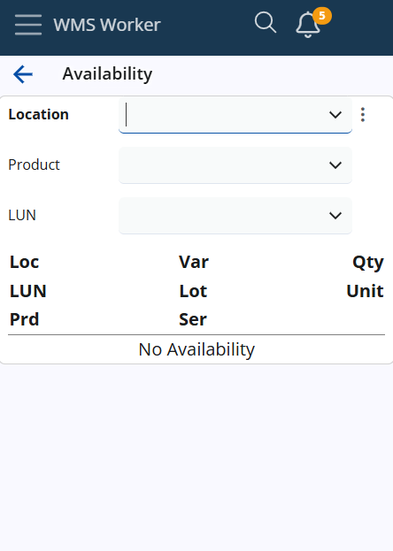
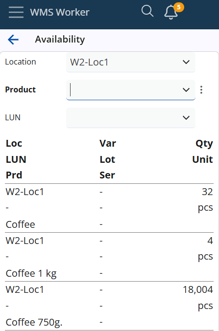
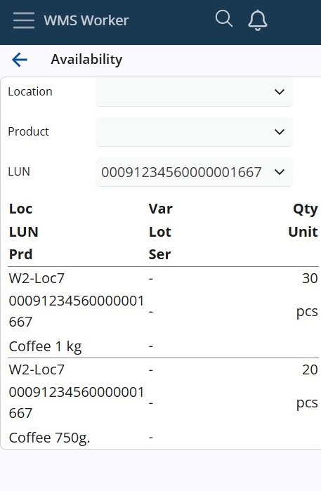
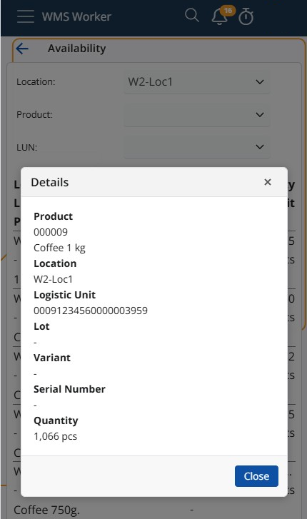

# Availability

The system provides quick and easy availability checks. A location, product or LUN should be selected to get the search engine up and running:

If you select Location for example, the availability shows after your selection:
 

You will find the following information about the product:
-	<b>Location</b> - The location of the product
-	<b>LUN</b> - Logistic Unit
-	<b>Prd</b> - Product name/code
-	<b>Var</b> - Product variations
-	<b>Lot</b> - Lot Information
-	<b>Ser</b> - Serial number
-	<b>Qty</b> - Quantity available
-	<b>Unit</b> - Unit for the shown quantity

If you select a LUN, the availability of this particular LUN is shown. In the LUN field, you can enter values from LogisticUnits.SerialCode. The location is only one, you can read more about preventing LUN from being in different locations. You will see the availability only in this LUN:

### Details panel on row selection

Tapping a row opens a **Details** panel showing the full names of all fields. Labels are bold and displayed above their values for improved readability.

For the **Product**, both the product code (`PartNumber`) and the name are shown, one below the other.

This view makes it easier to inspect item information in context, especially when products have similar names, lots, or serials.

