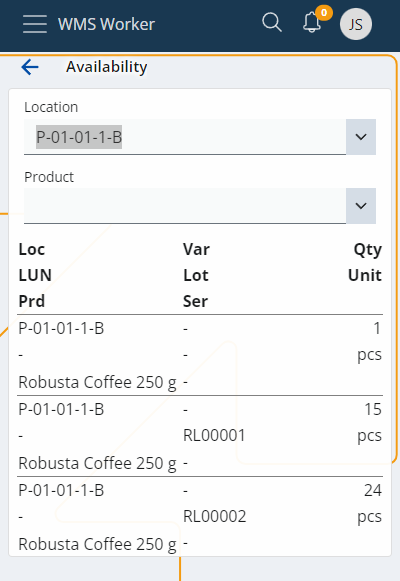

# Availability

The system provides quick and easy availability checks. A location or product should be selected to get the search engine up and running:

The availability shows after your selection:
 

You will find the following information about the product:
-	<b>Location</b> - The location of the product
-	<b>LUN</b> - Logistic Unit
-	<b>Prd</b> - Product name/code
-	<b>Var</b> - product variations
-	<b>Lot</b> - Lot Information
-	<b>Ser</b> - serial number
-	<b>Qty</b> - Quantity available
-	<b>Unit</b> - Unit for the shown quantity

Once you have selected a location or product, you have the following actions available:

-	<b>Copy</b> - to copy the value you have entered
-	<b>Paste</b> - to paste something in the field
-	<b>Clear</b> - to clear the field and potentially enter a new value
 

