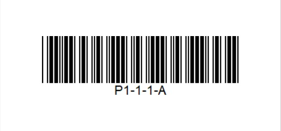
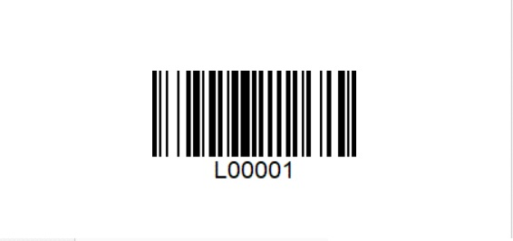

# WMS Worker compatibility

The app is web-based and does not require any installation. 

These are the requirements for mobile RF handheld devices when using WMS Worker.
- Operational system: Android 8.0 (Oreo) or higher
-	Minimum RAM: 1GB, recommended: 2GB or higher
-	Minimum Processor: 1GHZ
-	The following screen resolutions (pixel dimensions) are supported:

The following Android devices have been tested:
- ???
Other models may work as well when meeting the other requirements in this document but cannot be guaranteed.

Recommendations:
- The manufacturers device software should allow to configure following scanner settings on the device:
- Convert barcode input via scan head or camera to text
- Possibility to give an automatic ENTER after a scan
- Identifies GS1-128/EAN128 barcodes (when such is used in the warehouse)

## Test WMS Worker with your mobile RF handheld devices

You have a mobile RF handheld devices and you want to make sure it is compatible with  WMS Worker?
We've created a test environment where you can test the WMS Worker in action.

How to test your device:
1. Open the following link in the browser of the mobile terminal https://testdb.my.erp.net/cl/wms/ 
user: admin
password: 123
2. Select Orders 
3. Select Warehouse Order 0000000003 
4. Change the Quantity of the first line to 4
5. Scan the Location

6. Scan the Lot

7. Press Execute
8. Scan the Location for the second line

9. Press Execute

You have executed your first order!

