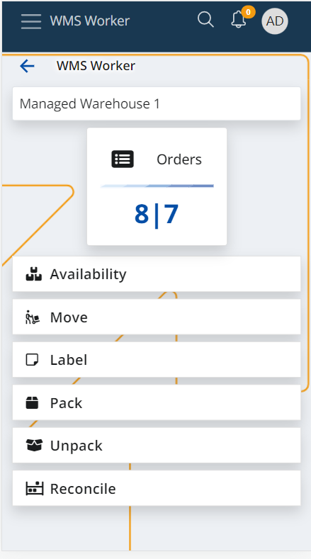

# WMS Worker

WMS Worker is a warehouse management application with a contemporary and intuitive easy to use design. 
WMS worker allows the warehouse workers to complete their tasks such as receiving and order picking in a more efficient, more productive, and more accurate manner... all synchronized in real-time with your ERP.net system.

The algorithm of the application works in such a way that it can give instructions not only to humans but also to robots. Learn more about the WMS Worker in the following articles:

-	[Orders](https://docs.erp.net/tech/modules/logistics/wms/wms-worker/orders.html)
-	[Availability](https://docs.erp.net/tech/modules/logistics/wms/wms-worker/availability.html)
-	[Move](https://docs.erp.net/tech/modules/logistics/wms/wms-worker/move.html)
-	[Reconcile](https://docs.erp.net/tech/modules/logistics/wms/wms-worker/reconcile.html)
