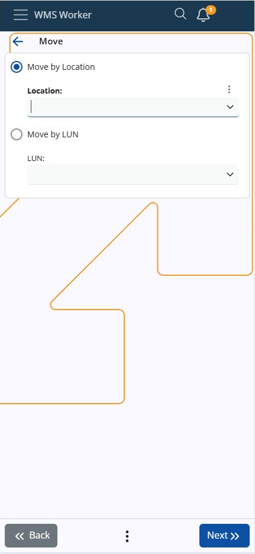
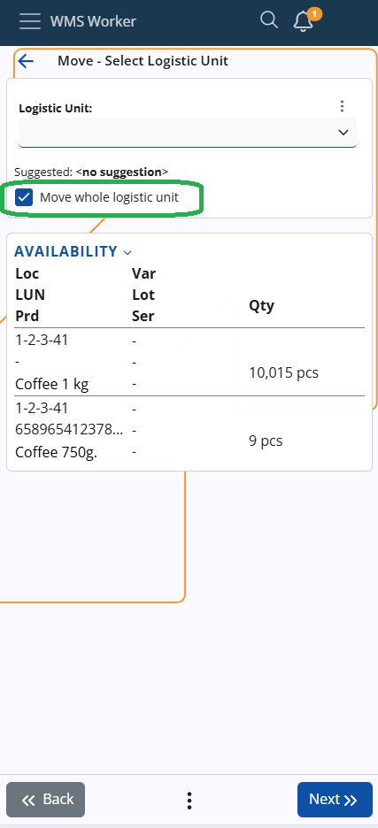
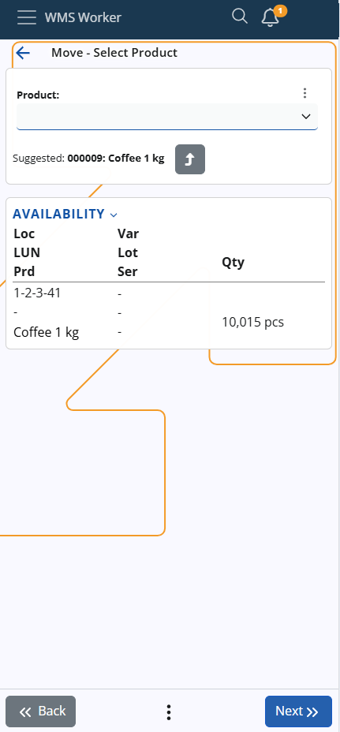
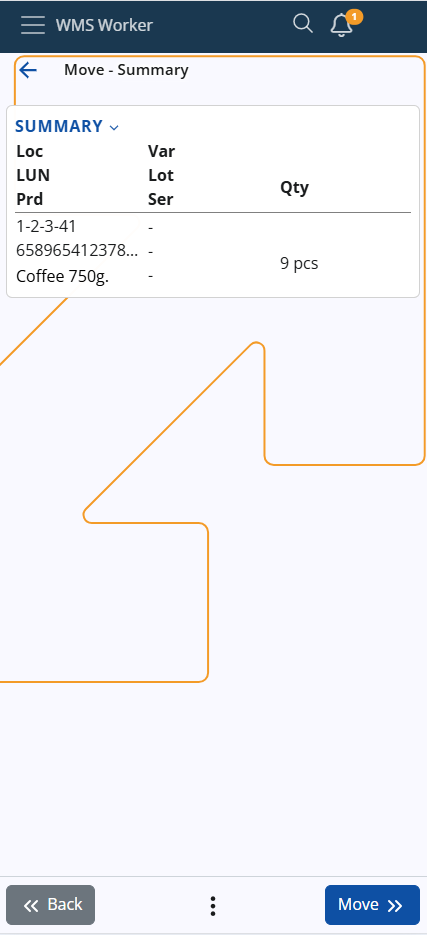

# Move

This screen allows you to perform product transfers within the warehouse using one of two options:

## Move by Location or LUN

You can now perform a transfer either by **Location** or directly by **Logistic Unit (LUN)**. Use the radio buttons at the top of the screen to select the preferred method:

- **Move by Location**  
  - Activates the Location field  
- **Move by LUN**  
  - Activates the LUN field (accepts active LogisticUnits.SerialCode)  
  - The system validates that the LUN exists and has availability in the current warehouse

You can toggle between the two modes by clicking the radio buttons or directly inside the respective input field. The last selected mode is remembered and restored for your next session.

## Location Scanning and Execution

- Scanning a **Location** opens the product selection screen as usual  
- Scanning a **LUN** immediately opens the product list for that LUN  
- You can also move the **entire LUN** by using the **Move whole logistic unit** checkbox
- 

 
- If you are **not moving the entire Logistic Unit**, the next screen will prompt you to select:  
  - the product  
  - the lot or serial number (if applicable)  
  - the quantity  
  - other **product details**
  - 

## LUN Product Selection and Execution

- When using **Move by LUN**, the system will:  
  - Automatically show the list of products in the selected LUN  
  - Skip the intermediate step where a Location and LUN are combined  
  - Automatically treat the transfer as **"Move the whole LUN"** (no manual checkbox required)  
- The associated Location is derived from the LUN automatically, as a LUN can only belong to one location

## Summary

If you move several products at the same time, they will all be transferred to the same place. If you want to transfer them to different places, they must be moved separately.

Press the **Move** button to continue, set the destination, and press **Finish** to complete the operation.
