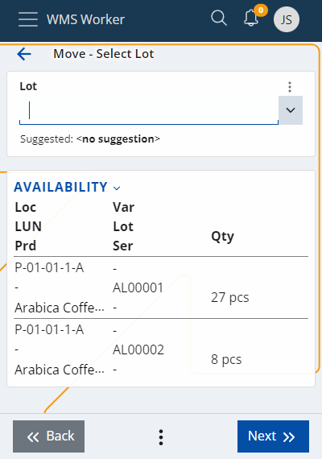

# Move

The <b>Move</b> page allows you to make a warehouse transfer. To move products from one location to another, you must first select or scan:

-	the current location of the product
 

-	the product itself
 

Availability indicates the amount of product available at a location. To transfer the whole quantity or the Lot of one product, you can click on the corresponding row in the Availability table.

-	Lot (you can use the suggested value

-	Quantity and unit
 

To add more products, you need to click the Add More button (from the menu button at the bottom of the page).

If you move several products at the same time, they will all be transferred to the same place.
If you want to transfer them to different places, they must be moved separately.

Press the <b>Move</b> button to finish the process.

The last step is to set the new destination of the products.
 

When you are ready you need to press the  button.

If all the steps are performed correctly, a message will appear confirming that the operation was successful:

