# Orders

This screen gives access to all upcoming warehouse orders that are available for execution.

They are distributed into **five sections** and sorted in an **ascending** order in each.

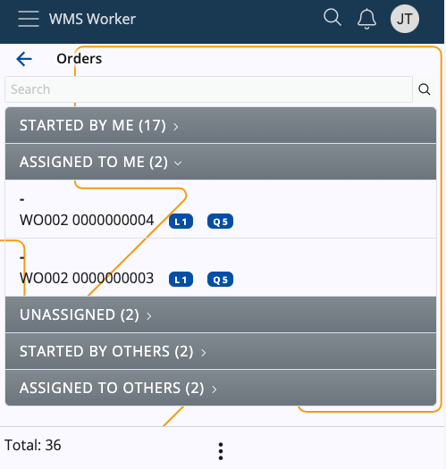

### Search and totals

Above the sections, there is a **search bar** that can be used to filter the existing orders. 

You can search by scanning or entering an order number, a party name (if any), or any information set up by [Order display format](/how-to/other-settings/change-order-display-format.md)

For reference, the **Total** number of orders can be checked at the bottom-left corner of the page.

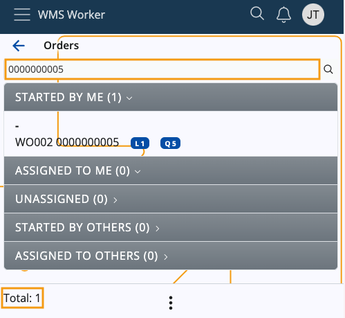

### Context menu

The **Orders** screen features a Context menu, accessible through the three-dot button at the bottom.

It allows you to execute the following actions:

* **Refresh** - When triggered, it will instantly refresh the contents of the page, taking into account orders previously not added and dismissing the ones that have been voided.

  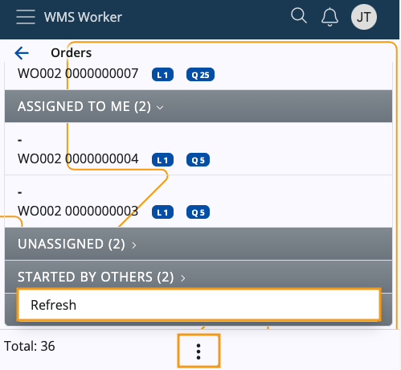

### Order details

Once you open an order, you can see the following details about it:

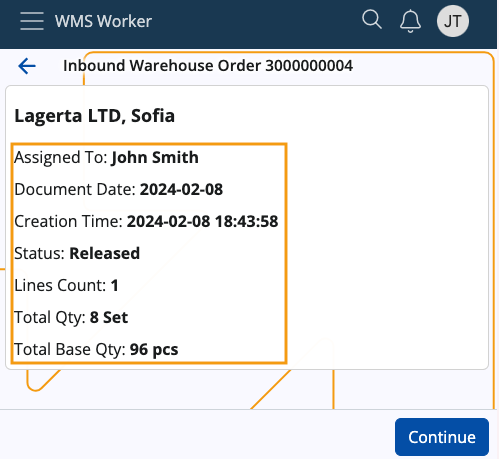

- **Enterprise Company** - name of the associated enterprise company, positioned at the top; if not present, it will be replaced by a dash
-	**Assigned To** - the employee who has to execute the order
-	**Document Date** - the date of the order
-	**Creation Time** - the time and date of creation of the order
-	**Status** - the status of the order
-	**Lines Count** - the rows number in the order table
-	**Total Qty** - the sum of product quantities; if there are lines in different measurement units, there will be separate totals for each unit
-	**Total Base Qty** - the overall quantity of individual products, grouped according to the respective measurement unit (e.g. 8 sets total qty equals 96 pcs base qty).

## Section breakdown

The **Orders** screen consists of the following sections:

#### Started by me

These are all the *Released* warehouse orders which are started by and assigned to the **currently** logged-in user.

#### Assigned to me

Contains orders in states higher than *New* and lower than *Released*. They are assigned to the **currently** logged-in user.

#### Unassigned

Orders with states higher than *New* and lower than *Released*. 

They are **not** assigned to a specific worker and can be executed by anyone who takes them.

#### Started by others

Here, you will find all *Released* orders which are assigned to users **different** from the currently logged-in one.

#### Assigned to others

This section contains orders in states higher than *New* and lower than *Released*.

They are assigned to users **different** from the currently logged-in one.

---

### Action buttons

When accessing an order, different **buttons** will be visualized based on the section you access the order from.

They indicate the **action** you're able to perform. Clicking some of them will result in the order being moved to a different section.

**Started by me**

Accessing an order from here reveals general information about it, as well as a dedicated **Continue** button.

Upon clicking it, you'll **open** the order and will be able to continue with its processing.

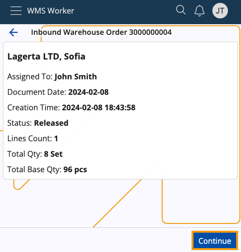

**Assigned to me**

Accessing an order from here reveals general information about it, as well as a dedicated **Start** button.

Upon clicking it, the order will be **released** and **opened**.

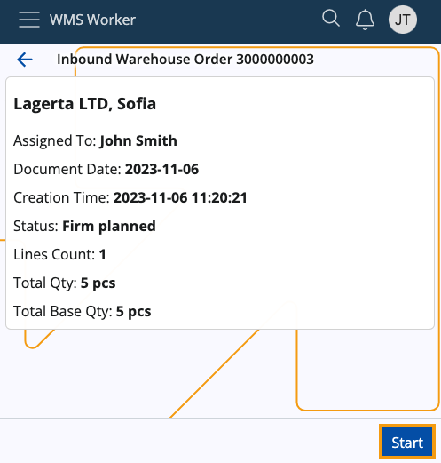

**Unassigned**

Accessing an order from here reveals general information about it, as well as a dedicated **Take & Start** button.

Upon clicking it, the order will be **assigned** to you, **released** and **opened**.

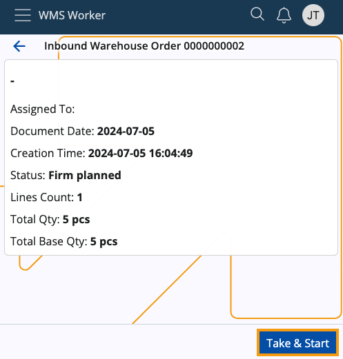

**Started by others**

Accessing an order from here reveals general information about it, as well as a dedicated **Join** button.

Upon clicking it, you'll **open** the order.

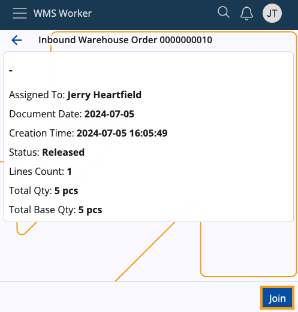

**Assigned to others**

Accessing an order from here reveals general information about it, as well as a dedicated **Take & Start** button.

Upon clicking it, the order will be **re-assigned** to you, **released** and **opened**.

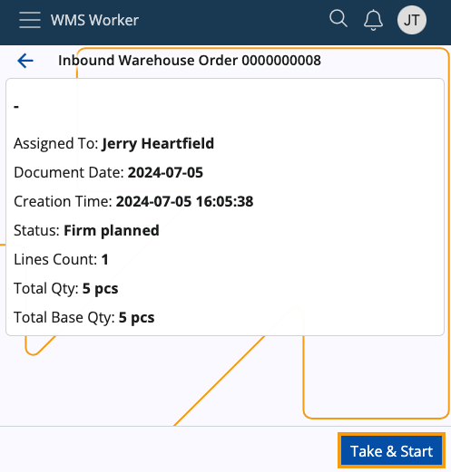

---

### Policies for order section visibility

There are three **[warehouse policies](https://docs.erp.net/tech/modules/logistics/wms/how-to/setup-warehouse/warehouse-policies.html)** determining which sections can be **seen** and which will remain **hidden**.

They apply for the entire **store**, not taking into account any provided zones, products, or other filters.

Here's a brief summary of each:

1. **Unassigned Orders Section Visibility** - covers the "Unassigned" section

   - If set to **True**, the section will be visible for all workers defined for the respective store
   - If set to **False**, it will be hidden from them
   - If a policy is **not specified**, the section will be revealed by default.

2. **Started by Others Section Visibility** - covers the "Started by others" section
   
   - If set to **True**, the section will be visible for all workers defined for the respective store
   - If set to **False**, it will be hidden from them
   - If a policy is **not specified**, the section will be revealed by default.

3. **Assigned to Others Section Visibility** - covers the "Assigned to others" section

   - If set to **True**, the section will be visible for all workers defined for the respective store
   - If set to **False**, it will be hidden from them
   - If a policy is **not specified**, the section will be revealed by default.

> [!NOTE]
> For more information about these policies, please refer to **[Warehouse policies](https://docs.erp.net/tech/modules/logistics/wms/how-to/setup-warehouse/warehouse-policies.html)**.
     
## Order lines

Once an order is taken, started, continued or joined, a summary of its lines will show up:

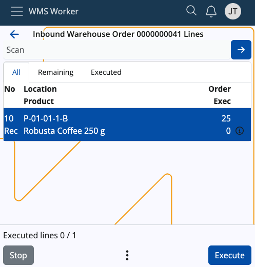

On this screen, you will find three tabs dedicated to line execution:

-	**All** - shows all lines of the order regardless of whether they have been executed or not
-	**Remaining** - shows rows that have not yet been executed
-	**Executed** - shows the rows that have already been executed

All lines contain information about the requested product and its quantity.

-	**No** - shows the line number and its associated task (e.g. Receive)
-	**Location** - shows the location of the product
-	**Product** - shows the product itself
-	**Order/Exec** - shows what quantity of the product needs to be procured compared to what quantity has already been executed

 	A **check mark** will appear on the right of the Order/Exec counter only if the line is fully executed.

More details about each line, e.g. the full name of the product, the ordered lot, variant, serial number, etc. can be accessed via the line's respective **info button**. If an execution has already taken place, the **Info** screen will include details about it as well.

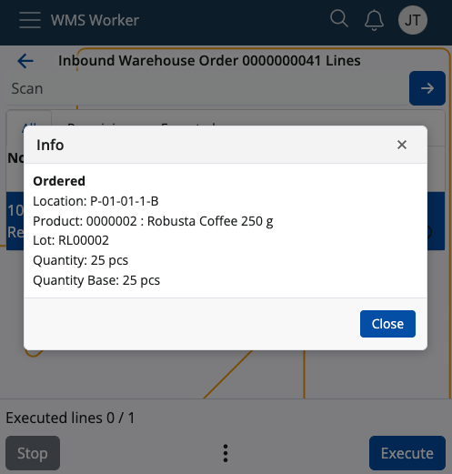

At the top of the screen, there is a general **Scan field**. 

When scanning a value in this field, a matching unexecuted line is searched through the lines list. If such a line is found, its **[execution](https://docs.erp.net/tech/modules/logistics/wms/wms-worker/orders/lines-execution.html)** is started automatically. 

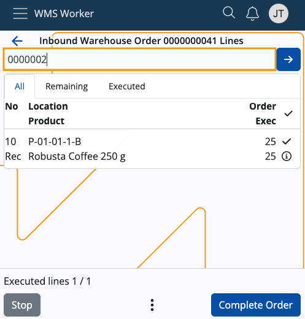

> [!NOTE]
> The scanned value recognition is done by **[Barcode Parsers](https://docs.erp.net/tech/modules/logistics/wms/how-it-works/barcode-parsers/index.html)** such as Product Code and GS1 - Single Product.  
> The list of currently active parsers can be seen by accessing the vertical three-dot **Menu button** at the bottom of the app.

## Order line actions

At the bottom of the screen, there are buttons for managing the order:

- **Stop** - terminates the order 
- **Execute** - allows for **[line execution](https://docs.erp.net/tech/modules/logistics/wms/wms-worker/orders/lines-execution.html)**; will change to **Complete Order** when all lines have been executed
- **Menu** - allows access to several additional functions like:
  
  - **Refresh**, which will instantly refresh the contents of the order
    
  - **[Suggest Routing](https://docs.erp.net/tech/modules/logistics/wms/wms-worker/orders/picking-routes.html?q=suggest%20routing)**
    
  - **[Active Parsers](https://docs.erp.net/tech/modules/logistics/wms/how-it-works/barcode-parsers/index.html?q=active%20parsers)**
    
  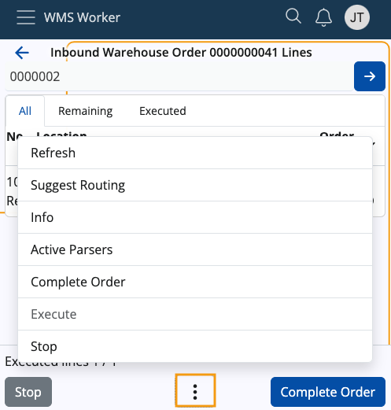
