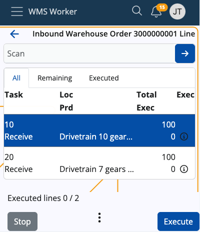
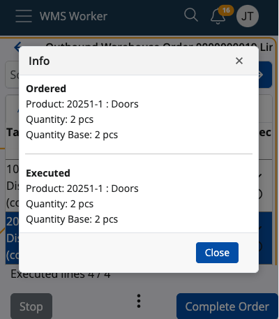
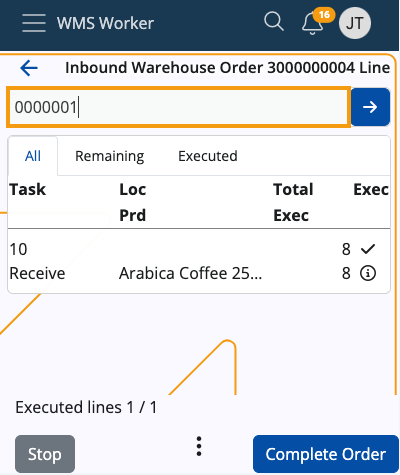
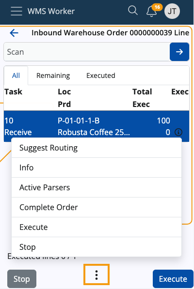

# Orders

This menu provides information on upcoming warehouse orders.

The order navigator is divided into two categories:

-	**ASSIGNED TO ME** - the warehouse worker who is logged into their own account can check the orders they have for execution
-	**UNASSIGNED** - orders that are not assigned to a specific worker and can be executed by anyone who can take them

Above the list is a **search bar** that can be used to filter orders. You can search by scanning or entering an order number, party name (if any), or document type.

The **total** number of orders can be checked at the bottom of the page.

## Order details

Click an order to see more information about it.

The details on the screen include:

-	**Assigned To** - the employee who has to execute the order
-	**Document Date** - the date of the order
-	**Creation Time** - the time and date of creation of the order
-	**Status** - the status of the order
-	**Lines Count** - the rows number in the order table
-	**Total Qty** - the sum of product quantities; if there are lines in different measurement units, there will be separate totals for each unit
-	**Total Base Qty** - the overall quantity of individual products, grouped according to the respective measurement unit (e.g. 8 sets total qty equals 96 pcs base qty).

Click **Start** to open the order.

## Order lines

A summary of the order lines shows up:

The screen has three tabs:

-	**All** - shows all lines in the order regardless of whether they have been executed or not
-	**Remaining** - shows rows that have not yet been executed
-	**Executed** - shows the rows that have already been executed

The lines contain information about the requested product and its quantity.

-	**Task** - shows the main task
-	**Loc** - location of the product
-	**Prd** - shows the product itself
-	**Total** - shows what quantity of the product needs to be procured
-	**Remain** - shows what quantity of the product has already been executed; the remaining quantity that needs to be to be procured is the difference between Total and Remain.
-	**Еxec** - a check mark that shows if the line is fully executed on not

More details about each line, e.g. the full name of the product, the ordered lot, variant, serial number, etc. can be accessed via the line's respective **info button**. If an execution has already taken place, the **Info** screen will include details about it as well.

At the top of the screen, there is a general **Scan field**. 

When scanning a value in this field, a matching unexecuted line is searched through the lines list. If such a line is found, its execution is started automatically. 

> [!NOTE]
> The scanned value recognition is done by **[Barcode Parsers](https://docs.erp.net/tech/modules/logistics/wms/how-it-works/barcode-parsers/index.html?q=barcode%20pars)** such as Product Code and GS1 - Single Product.  
> The list of currently active parsers can be seen by accessing the vertical three-dot **Menu button** at the bottom of the app.

At the bottom of the screen, there are buttons for managing the order.

- **Stop** - terminates the order 
- **Execute** - allows for line execution; will change to **Complete Order** when all lines have been executed
- **Menu** - allows access to several additional functions:

