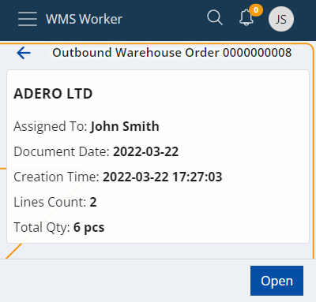
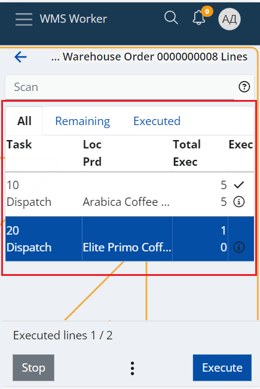
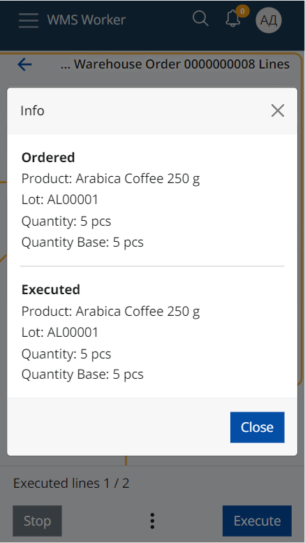
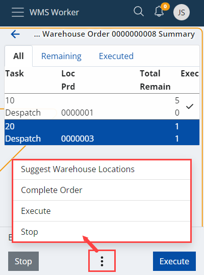

# Orders

The "Orders" menu provides information on upcoming warehouse orders.

The order navigator is divided in two categories:

-	<b>ASSIGNED TO ME</b> - the warehouse worker who is logged into their own account can check the orders they have for execution.
-	<b>UNASSIGNED</b> - orders that are not assigned to a specific worker and should be executed by someone who can take them.

Above the list is a search bar that can be used to filter orders. In it, you can search by scanning or entering an order number, party name (if any) or the document type.

The total number of orders can be checked at the bottom of the page.

## Order details

Click an order to see more information about it.

The details on the screen include:

-	<b>Assigned To</b> - the employee who has to execute the order;
-	<b>Document Date</b> - the date of the order
-	<b>Creation Time</b> - the time and date of creation of the order;
-	<b>Lines Count</b> - the rows number in the order table;
-	<b>Total Qty</b> - the sum of quantities. If there are lines in different measurement units, there will be separate totals for each unit.

Click the <b>Open</b> button to open the order.

## Order lines

A summary of the order lines shows up:

The screen has three tabs:

-	<b>All</b> - shows all lines in the order regardless of whether they have been executed or not
-	<b>Remaining</b> - shows rows that have not yet been executed
-	<b>Executed</b> - shows the rows that have already been executed

The lines contain information about the requested product and its quantity.

-	<b>Task</b> - shows the main task;
-	<b>Loc</b> - stands for Location of the Product.
-	<b>Prd</b> - stands for Product.
-	<b>Total</b> - shows what quantity of the product needs to be procured.
-	<b>Remain</b> - shows what quantity of the product have already been executed. The remaining quantity that needs to be to be procured is the difference between Total and Remain.
-	<b>Еxec</b> - a check mark that shows if the line is fully executed on not.

More details about each line e.g. the full name of the product, the ordered lot, variant, serial number, etc. can be accessed via the <b>Info button</b>.
If the line already has an execution, the Info screen contains more details about it as well.

At the top of the screen there is a general <b>Scan field</b>. When scanning a value in this field, a matching unexecuted line is searched through the lines list. If such a line is found, its execution of the line is started automatically. The scanned value recognition is done by [Barcode Parsers](xref:parsers) (e.g. Product Code parcer, GS1-128 Single Product parcer). The list of currently enabled parsers can be seen in the question mark button.

At the bottom of the screen, there are buttons that help complete the order. On the left side is the button to terminate the order (<b>Stop</b>), on the right is the button that indicates that the employee is ready to start the execution of the order (<b>Execute</b>), and in the middle there is a <b>Menu button</b> that allows access to all functions:

