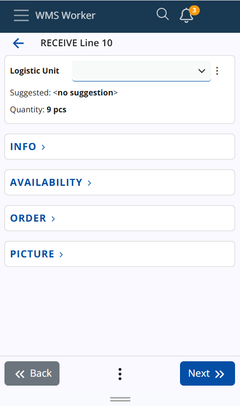

# Lines Execution
Order line execution begins when you press the Execute button in the lines list or scan a code that matches a line.

Before starting, ensure you are familiar with the scanning process.

Once execution starts, you will go through several steps.

## Step 1: Location
The system first prompts you to scan the location of the product. If a suggested location exists, you can either scan the actual location or click Use to apply the suggested one.

If there is a Current Location already stored (as described in the previous documentation), the location screen will be skipped, and the system will automatically apply the stored location to the order.

If there is no suggested location or if you prefer to scan a different one, simply scan the correct location.

## Step 2: LUN (Logistic Unit)
After the location is confirmed, the system will prompt you to scan the Logistic Unit (LUN). If a suggested LUN is available, you can either scan it or click Use to apply the suggested one.

If there is a Current LUN already stored (as described in the previous documentation), the LUN screen will be skipped, and the system will automatically apply the stored LUN to the order.

If there is no suggested LUN or you prefer to scan a different one, simply scan the correct LUN.

## Step 3: Product
After confirming the location and LUN, the system will prompt you to scan the product. If the product is already entered in the SCAN field, the Product screen will be skipped, and the system will automatically apply the scanned or suggested product.

If the product has not been scanned or suggested, you will need to manually scan or select the correct product.

## Step 4: Lot (if applicable)
If the product belongs to a lot, the system will ask for the lot number. A suggested lot might appear, and you can use it by clicking Use, or enter the lot manually if it is not pre-filled or scanned.

You can refer to the Availability screen if you need to check lot details.

## Step 5: Serial Number (if applicable)
For products with serial numbers, the system will request the serial number, which may or may not have a suggestion. You can either scan the serial or use the suggested one.

Once the serial number is confirmed, the Quantity field will be skipped automatically.

## Step 6: Quantity
Next, the system prompts for the quantity of the product. You can either manually enter the quantity or click the arrow button to use the suggested quantity.

If a quantity has already been entered in the SCAN field or if there is an active policy that allows accepting a quantity of one, the Quantity screen will be skipped, and the system will automatically apply the entered quantity.

If necessary, you can also change the unit of measurement for the product.

> [!Note]
> Standard Quantity
> For products with variable measurement ratios, the system will display a standard quantity value. Modifying the base quantity will automatically recalculate the standard quantity, but the standard quantity itself cannot be directly modified.

## Info Panels
The system includes several info panels available on all screens during order execution: Info, Availability, Order, and Picture. These panels display context-specific information, such as stock details by location on the Location screen, by logistic unit on the LUN screen, etc.

The system tracks the last state of each panel (opened or closed). Depending on your usage, the panel will maintain its previous state when you continue with your tasks, streamlining the workflow.

## Complete Order
Once all information is confirmed (location, product, LUN, lot, serial number, and quantity), you can proceed to complete the order. Press the Complete Order button to finalize the process. A confirmation dialog will appear, asking for permission to change the order status to Completed.

After confirming, the system will return you to the main Orders page, where you can select a new order to execute.

## Conclusion 

As in previous versions, you can also scan or enter a product directly into the SCAN field. If a location, product, and logistic unit (LUN) are all scanned, followed by a quantity, and no additional information such as lots or serial numbers is required, the system will skip the usual execution steps for that line. Instead, the line will be automatically executed with the scanned or entered data, including the location, product, LUN, and quantity, without the need to go through the individual screens for each step.
