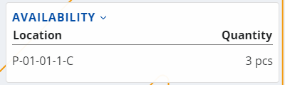
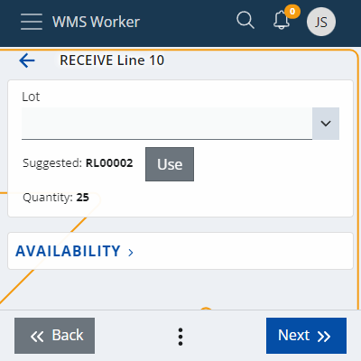
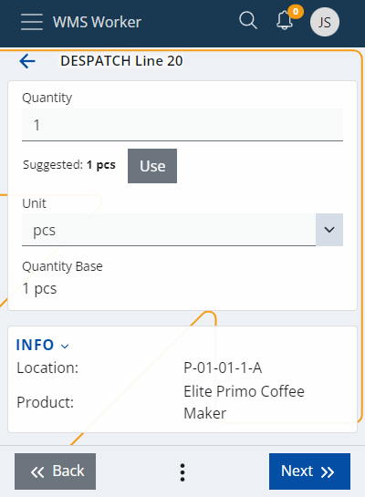
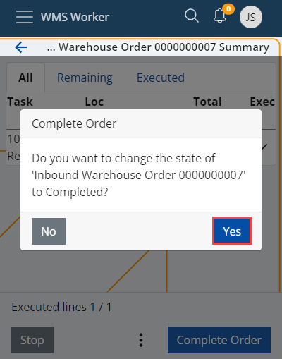

# Lines Execution

The line execution starts when we press the <b>Execute</b> button in the lines list or when we Scan a code and a matching line is found.
The execution guides the worker trough the applicable screens. The applicable screens are ....

## Location

The option to scan the location of the product will appear. There is already a suggested location that can be used if needed by clicking the <b>Use</b> button next to it:

## Availability

<b>AVAILABILITY</b> is a reference through which the quantity of the product can be checked at different locations. The availability option is usable when the product has a Lot. Click to expand and see the availability for the specific product:

Click on the desired location to make the selection.

## LUN

## Product

After selecting the location, a field for scanning the Product will appear. You could use the product suggested by the system by clicking the <b>Use</b> button. The interface allows for the product to be replaced if needed.
Even if the product is not replaced, it still needs to be scanned.

## Variant

## Lot

If the product has a Lot, the system will ask you to enter it. There could be a suggestion you can use again. The Lot can be scanned. However, if it does not have a barcode, it can be entered manually as long as it already exists in the system. You can check the AVAILABILITY section as well, if needed:

## Serial

Depending on the product, you might be asked for its serial number, with or without suggested value to use and with AVAILABILITY section again:

Once the serial number is selected, there is no need to fill in the Quantity field and it can be skipped.

## Quantity

The Quantity field allows the employee to select the unit and quantity of the product:

You can make the quick suggested action with the <b>Use</b> button or enter it manually. The <b>INFO</b> section underneath summarizes your previous selections.

## Destination

## Complete

When you are done with the execution of the order, press <b>Complete Order</b>.
A pop-up window will appear asking for permission to change the status of the order to Completed.

After clicking Yes, you will be returned to the main Orders page and will be able to pick a new order to complete.

The execution of the order is reflected in the total number of orders left at the bottom of the screen.
