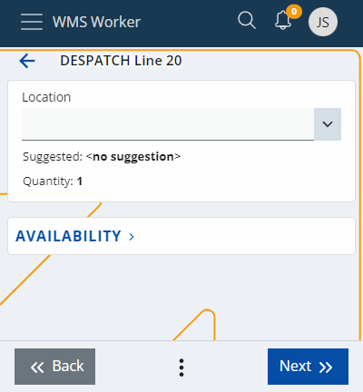
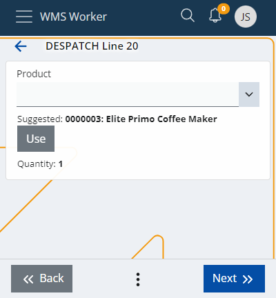

# Lines execution

The order line execution starts when you press the **Execute** button in the lines list or when you **scan** a code and a matching line is found.

Before you begin, make sure you are familiaized with the **[scanning process](https://docs.erp.net/tech/modules/logistics/wms/wms-worker/orders/scanning.html)** first.

Once the execution begins, it guides you through several screens.

## Location

The option to scan the location of the product will appear first. 

There is already a **suggested** location that can be used if needed. Click the <b>Use</b> button to apply it:

## Availability

This screen is a reference through which the quantity of the product can be checked at different locations. 

It is used when the product has a **lot**. Click to expand and see the availability for the specific product:

Then, click the desired location to make the selection.

## LUN

To be updated.

## Product

After selecting the location, a field for confirming the scanning of the product will appear. 

You can use the product **suggested** by the system by clicking the <b>Use</b> button. 

The system allows for the product to be replaced, if needed. Even if the product is not replaced, it still needs to be scanned.

## Variant

To be updated.

## Lot

If the product has a **lot**, the system will ask you to enter it. 

There could be a **suggestion** again. However, if it does not have a barcode, it can be entered manually as long as it already exists in the system. You can check the **Availability** section as well, if needed.

## Serial

Depending on the product, you might be asked for its serial number, with or without a suggested value, and with the **Availability** section again:

Once the serial number is selected, there is no need to fill in the Quantity field and it can be skipped.

## Quantity

This screen allows employees to select the unit and quantity of the product:

You can take **suggested** values quickly with the help of the **arrow** button, or enter the quantity manually, including changing its **measurement unit**, if necessary.

### Standard quantity

The Quantity screen includes a dedicated **standard quantity** value for products with changeable metric units. 

If you modify the quantity base, the standard one will also undergo automatic recalculation. However, you cannot modify it on its own.

## Info

This section summarizes your previous selections.

## Destination

To be updated.

## Complete

When you are done with the execution of the order, press the <b>Complete Order</b> button.

A pop-up window will appear asking for **permission** to change the status of the order to Completed.

After clicking **Yes**, you will be returned to the main **Orders** page and will be able to pick a new order to complete.

The execution of the order is reflected in the **total number of orders** at the bottom of the screen.
