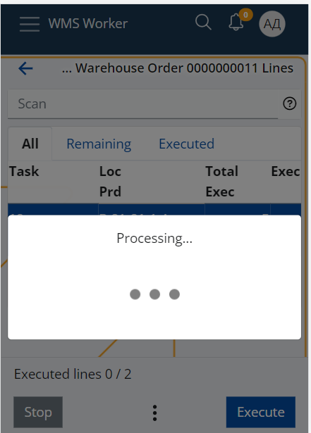
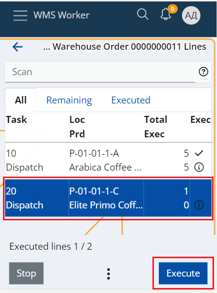
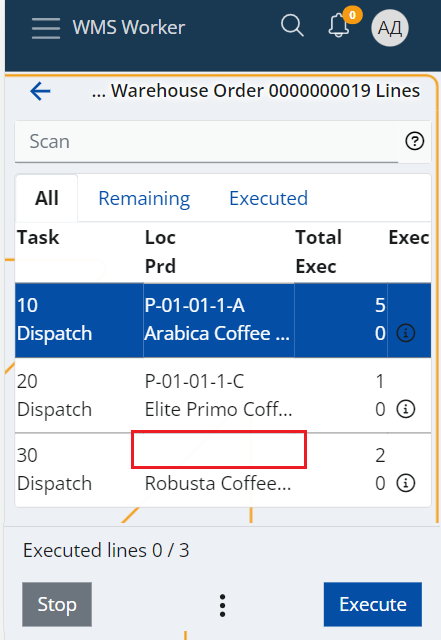
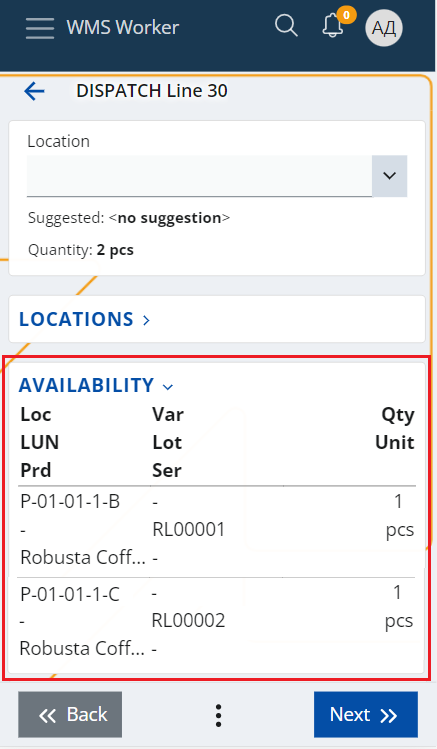

# Picking routes
Workers who physically pick items for the warehouse orders use picking routes to guide them through the process.
The route is calculated using the "Suggest warehouse locations" function that is available in the Orders menu of WMS worker. The picking route takes into account the different parameters that are set up for the warehouse, such as:
- The Zones specified as picking zones through the "Zone Type" policy;
- The Locations addresses that are used to calculate the best route through the warehouse;

as well as other factors, such as:

- the availability in the different locations – suggests the location with the smallest availability that is enough to fulfill the order;
- and the lot’s Expiry Date.

> [!NOTE]
> The Pick task type is not yet supported by the system. Is is replaced by the Dispatch task type, which directly issues the product from the Warehousе.

Currently, the function can only be used for dispatch Warehouse Orders i.e. Warehouse Orders whose lines are only with Dispatch or Comp-dispatch task type.

## How to use it?

Open the **Orders** menu of WMS Worker.

This takes you to a list of the orders that are available for execution for the current worker.
Click on the outbound order you would like to execute.

This will open a screen containing the lines of the order and their details.

At the bottom of the screen, you will find a three-dot button, from which you can access the **Suggest Warehouse Locations** function:

This will start the processing of the lines and the calculation of the function.

When the processing is done, the function will load all Locations that were successfully determined in the **Loc** column and will automatically sort the lines ascending by the location's address.

This will form the route that the worker needs to follow to sequentially collect all products from the order.

The worker can start following the route by clicking the **Execute** button. This will display the first screen which contains the information about the suggested Location and will lead the worker to it.

When the worker reaches the Location, he has to scan the Location and perform the rest of the line execution as usual.

Once the execution of the first line is finished, the system will bring the worker back to the lines menu and will automatically select the next line that is available for execution and by this, will lead the worker to the next Location of the route.

### What if the function could not suggest a location for all lines?
The order lines for which the system could not find a suitable Location to suggest will be sorted last - after all lines with successfully suggested locations.

This way, when the worker finishes following the suggested route, he can still execute the remaining lines without suggestions.

The system will not guide the worker to a particular location, but the Location screen during the line execution contains provides convenient panels e.g. the Availability panel, which the worker can use to find a location from where he can still pick the product.

