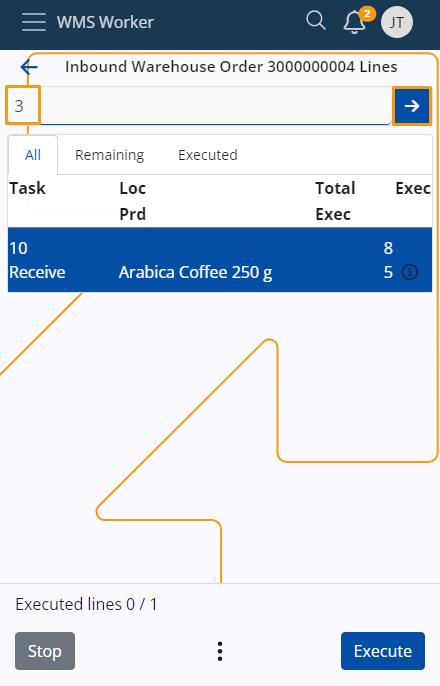
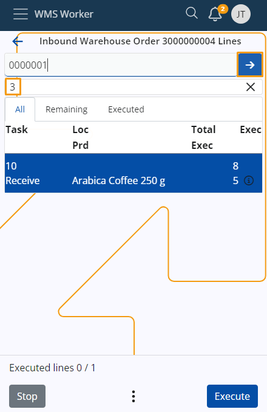
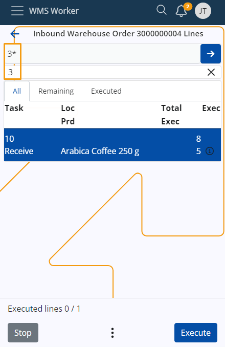

# Scanning

Each time you wish to **[execute](https://docs.erp.net/tech/modules/logistics/wms/wms-worker/orders/lines-execution.html)** lines of an order, you must first scan the corresponding products the necessary number of times.

## Single scan

To scan a product once, simply enter its code into the **Scan** field, then click or tap the **blue arrow** button.

> [!NOTE]
> 
> You will be taken to the Quantity screen where you need to specify the **Location**, **Lot** and **Quantity** of the product.
 
## Multiple scans

To scan a product multiple times, input the desired quantity into the **Scan** field, optionally followed by a **"*"** operator, and then click or tap the **blue arrow** button.

The quantity you input will be displayed in a **separate field** under the main **Scan** field. 

You need to enter the product code into the **Scan** field to scan it the desired number of times. 

## Add and see total entered quantity

When scanning a product multiple times, it might sometimes be more convenient to input the quantity several times.

To do that, enter a number in the **Scan** field and click the **blue arrow** button. Then, repeat the operation as many times as needed. 

The provided numbers will be **summed together**, and you can see the total quantity for scanning the product.

> [!NOTE]
> 
> Example:
>
> Entering "1*", then "2*", then "3*", and clicking the **blue arrow** button after each number will result in a final quantity of 6 in the quantity box.
