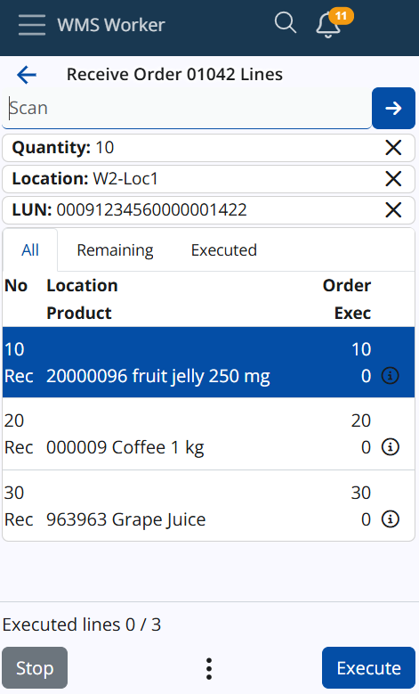

## Single Scan

To scan a product once, simply scan or manually enter its product or additional code into the SCAN field and tap the blue arrow button. This will initiate the execution of the line for that product. During execution, the system will guide you through the necessary screens for Location, Lot, Logistic Unit, and any other required information. After completing these steps, you will be prompted to enter the Quantity.

> [!Note]
> This topic is only for scanning simple codes, if you want to read about GS1 or SSCC codes, click here: [GS1 Barcodes](../wms/gs1-barcodes.md)

## Work with quantity, current location, and currnet logistic units (LUNs):

> [!Note]
> Next functionalities correspond to Parsers (P04, P05, and P06). If you'd like to learn more about barcode parsers, click here: [Barcode Parsers](../how-it-works/barcode-parsers/index.md)

## Multiple Scans
To scan a product multiple times, scan or manually enter the desired quantity into the SCAN field and tap the blue arrow button to confirm. Quantities over 999 must be followed by ("*"), while for quantities up to 999, the asterisk is optional. If the asterisk is omitted for smaller numbers, the system will still recognize it as a quantity.

For example, scanning or entering "200" will be understood as a quantity of 200, and "200*" is also valid.

The quantity entered will be displayed in a separate field under the main SCAN field, and this quantity will apply to the product scanned after it.

## Current Location

The SCAN field recognizes locations. When scanning a valid location from the Logistics.Wms.WarehouseLocations entity (ERP.net Domain Model), the location will appear as a line under the SCAN field, similar to how quantities are displayed. The location line will appear below the quantity line.

Once a location is scanned, it will be stored in the WMS Worker’s memory until another location is scanned or it is removed by clicking the X. If a location is scanned and then a product from the list is scanned, both the location and product screens will be skipped, taking you directly to the quantity screen (unless there are lots, serial numbers, etc.). After completing a line, the worker will return to the line list, with the current location remaining. If another product is scanned, the same process will repeat. If there is a current location and you execute a line instead of scanning a product, the location screen will be skipped, and the stored location will be automatically applied to that line.

## Current Logistic Unit

The SCAN field supports scanning Logistic Units (LUNs) that are not in SSCC format. When a valid LUN is scanned, it will be displayed as a line under the SCAN field, following the same structure as quantities and locations. The LUN line will appear below both the quantity and location lines.

Once a LUN is scanned, it will remain stored in WMS Worker’s memory until another LUN is scanned or the current LUN is removed by clicking the X. If a LUN is scanned followed by a product from the list, the LUN screen will be skipped. If there is also a current location, both the location and product screens will be skipped, and the user will go directly to the quantity screen (unless there are lots, serial numbers, etc.).

After completing a line, the worker will return to the line list, and the current LUN will remain. If another product is scanned, the same process will repeat. If a current LUN is stored and a line is executed without scanning a product, the LUN screen will be skipped, and the stored LUN will be automatically applied to that line.

## Updated Scan Priorities
The updated scanning priorities are as follows (from highest to lowest): Quantity, Location, LUN, Product. If the same code is used for both a location and a LUN (which is rare), the scan will be treated as a location.

If the scanned code is not recognized as a quantity, location, LUN, or product, an error message will be displayed:

EN: "No location, LUN, or product was found with the scanned code."
