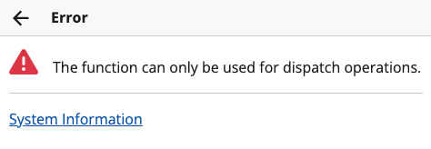
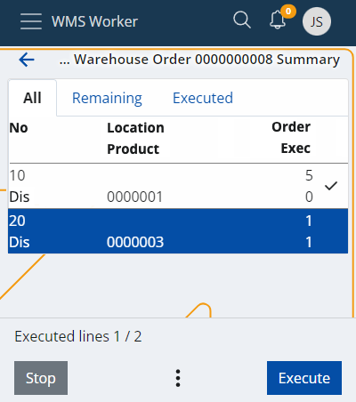
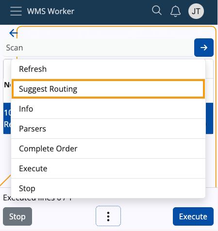
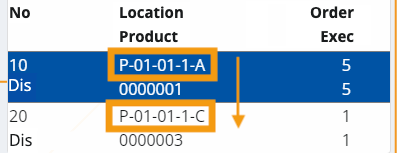
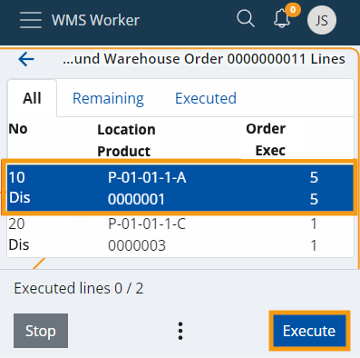
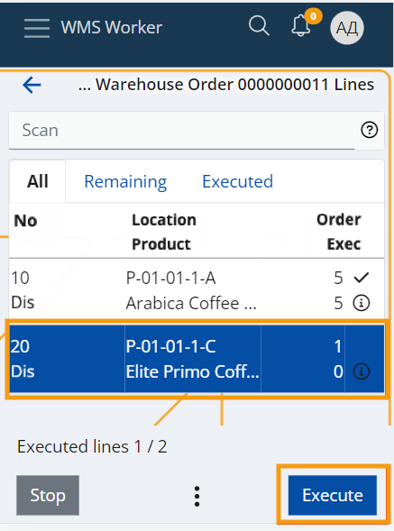
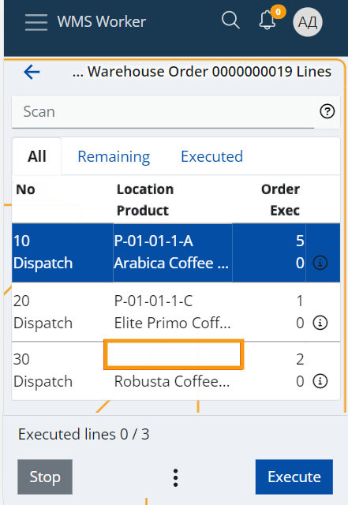

# Suggest Routing

Workers who physically pick items for warehouse orders utilize **picking routes** to be navigated the process efficiently. Such routes are calculated using the **Suggest Routing** UI function, accessible in the **Orders** menu of the **WMS worker**.

### Parameters to consider

A picking route considers various parameters configured for the warehouse, including:

- **Zones**: These are designated as picking zones through the "Zone Type" policy. 

  _To properly use the function, ensure that "TaskType == Dispatch" and "ZoneType = picking"._

- **Location Addresses**: These addresses are essential for calculating the optimal route through the warehouse.

  For each address, ensure that _"ZoneType == Picking"_.

- **Availability**: The system suggests locations with enough availability to execute the respective order lines.

  However, this can be **disabled** in favor of a more custom setting, where locations are suggested as **strings** based on their **Address** or the user-defined value specified in the **[CustomRouting policy](https://docs.erp.net/tech/modules/logistics/wms/how-to/setup-warehouse/warehouse-policies.html)**.

  In all cases, only locations with availability greater than zero are suggested.
  
- **Lot Expiry Date**: This ensures that items nearing expiration are prioritized.

> [!Important] 
> The "Pick" task type is **not** currently supported by the system.   It has been replaced by the "Dispatch" task type, which directly issues products from the warehouse.    
> Therefore, at present, the **Suggest Routing** function can only be utilized for **dispatch warehouse orders**, specifically those whose lines consist solely of "Dispatch" or "Comp-dispatch" task types.    
> You will get an **error** if you attempt to execute the function on an order with a different task type.   
> 

### Policy

The **Suggest Routing** function follows a specific **[RoutingAlgorithm policy](https://docs.erp.net/tech/modules/logistics/wms/how-to/setup-warehouse/warehouse-policies.html)** through which it calculates how to suggest locations. 

This policy allows users to define their own routes for collecting warehouse products. It achieves this by assuming the **Code** of a location as its primary value. Therefore, the policy can have one of two values applied:

* **Fixed** - Suggested locations are ordered by the strings of their addresses or by priority values specified in the **CustomRouting** policy. Availability of the locations is not taken into account, except that it must be greater than zero.
  
* **Smart** - Suggested locations are ordered by the strings of their addresses or by priority values specified in the **CustomRouting** policy. Locations must have enough availability to fulfill the specific line in order to be suggested.

* In case **no policy** is defined, the default **Smart** behaviour is applied.

Upon identifying whether the policy is Fixed or Smart, the **Suggest Routing** function is able to return the appropriate location(s).

> [!NOTE]
> If a **Fixed** _RoutingAlgorithm_ policy is applied, it will come into effect in  the **WMS Worker** and the **warehouse order definition**, as they both can utilize the Suggest Routing function.

## Using the function

1. Start by opening the **Orders** menu of **WMS Worker**. 

    This takes you to the list of orders that are available for execution for the current worker.

    

2. Click on the **outbound order** you would like to execute.

    This will open a screen containing the lines of the order and their details.

    

3. At the bottom of the screen, you will find a three-dot button, from which you can access the **Suggest Routing** function.

   This will start the processing of the lines and the calculation of the function.

    

4. When the processing is done, the function will load all **Locations** that were successfully determined in the **Location** column. This will form the **route** that you need to follow sequentially to collect all products from the order.

   The lines will be automatically sorted by the location address or user-defined values specified in the ***CustomRouting*** policy. If defined, the _**RoutingAlgorithm**_ policy will determine whether locations with enough availability or any availability greater than zero are shown.
   
    

5. To begin following the route, click the **Execute** button.
  
   This will lead you to the first screen which contains information about the suggested Location.

    

6. When you reach the Location, **scan** it and perform the rest of the line execution as usual.

7. Once the execution of the first line is finished, the system will bring you back to the lines menu.
   
    The next line will be automatically selected and available for execution, thus leading you to the **next** Location of the route. 

    

### Incomplete suggestions

Order lines for which the function could not find a suitable Location to suggest will be sorted **last** - after all lines with successfully suggested locations.

This way, when you finish following the suggested route, you can still execute the remaining lines without suggestions.

The system will not guide you to a particular location. However, the **Location** screen during the line execution will contain convenient panels like **Availability**, which you can use to find a location from where you can still pick the product.

