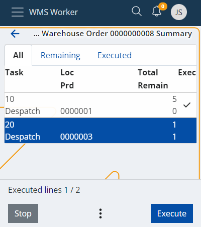
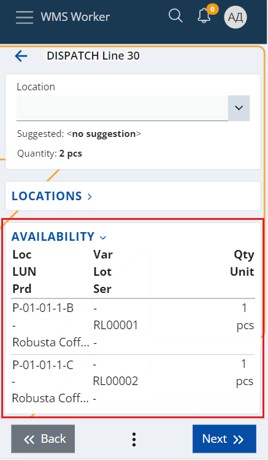

# Suggest Routing

Workers who physically pick items for warehouse orders utilize **picking routes** to navigate through the process efficiently. Such routes are calculated using the **Suggest Routing** UI function, which is accessible in the **Orders** menu of the **WMS worker**.

A picking route considers various parameters configured for the warehouse, including:

- **Zones**: These are designated as picking zones through the "Zone Type" policy. 

  _To properly use the function, ensure that "Policy Kind = Zone Type" and "Value = picking" are set._

- **Location Addresses**: These addresses are essential for calculating the optimal route through the warehouse.

Additionally, other factors are taken into account, such as:

- **Availability**: The system suggests locations with the least availability that can still fulfill the order.
  
- **Lot Expiry Date**: This ensures that items nearing expiration are prioritized.

> [!Important] 
> The "Pick" task type is **not** currently supported by the system.   It has been replaced by the "Dispatch" task type, which directly issues products from the warehouse.    
> Therefore, at present, the **Suggest Routing** function can only be utilized for **dispatch warehouse orders**, specifically those whose lines consist solely of "Dispatch" or "Comp-dispatch" task types.    
> You will get an **error** if you attempt to execute the function on an order with a different task type.   
> 

## Using the function

Start by opening the **Orders** menu of **WMS Worker**. 

This takes you to the list of orders that are available for execution for the current worker.

Click on the **outbound order** you would like to execute.

This will open a screen containing the lines of the order and their details.

At the bottom of the screen, you will find a three-dot button, from which you can access the **Suggest Routing** function:

This will start the processing of the lines and the calculation of the function.

When the processing is done, the function will load all Locations that were successfully determined in the **Loc** column and will automatically sort the lines ascending by the location's address.

This will form the route that the worker needs to follow to sequentially collect all products from the order.

The worker can start following the route by clicking the **Execute** button. This will display the first screen which contains the information about the suggested Location and will lead the worker to it.

When the worker reaches the Location, he has to scan the Location and perform the rest of the line execution as usual.

Once the execution of the first line is finished, the system will bring the worker back to the lines menu and will automatically select the next line that is available for execution and by this, will lead the worker to the next Location of the route.

## Possible incomplete suggestions

The order lines for which the system could not find a suitable Location to suggest will be sorted last - after all lines with successfully suggested locations.

This way, when the worker finishes following the suggested route, he can still execute the remaining lines without suggestions.

The system will not guide the worker to a particular location, but the Location screen during the line execution contains provides convenient panels e.g. the Availability panel, which the worker can use to find a location from where he can still pick the product.

