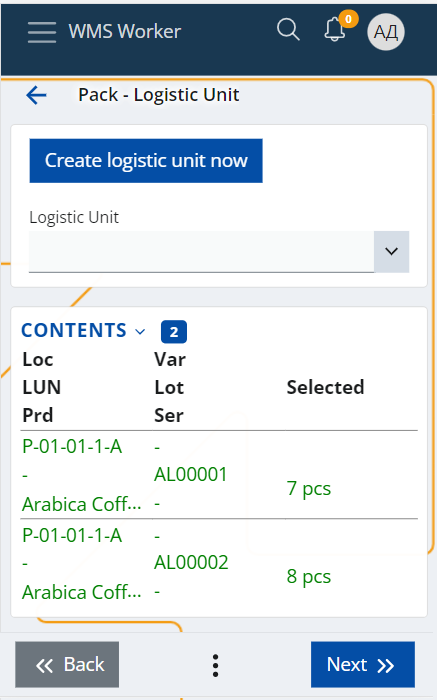
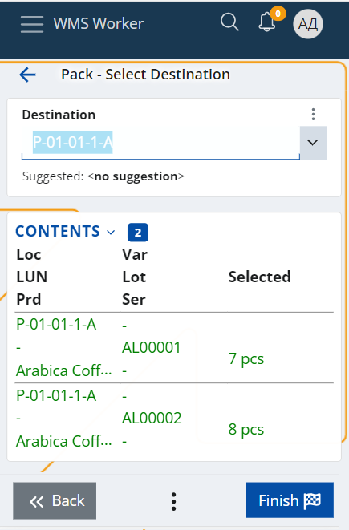

# Pack 
The **Pack** menu allows you to add Contents to a [Logistic Unit (LU)](xref:LU).
Using this menu, you can either create a new Logistic Unit or choose to add the contents to an existing one. If you are creating a new LU, then the system will automatically assign an SSCC code, and fill in the Contents and the applicable Specifications.

To Pack the contents, first, select or scan the Location where they are contained:

The system will open a screen with a list of the Location’s content that is available to pack.

There you can:
* Scan each Product you want to pack and specify its Lot, Variant, Serial (if applicable), and Quantity
* Click on any of the lines of the content to select it and specify the quantity you want to pack
* or if you want to pack all of the Location’s contents, you can simply choose the **Select All** option in the buttons menu.

Once, you have selected the desired content, press the Pack button.

This will show a screen where you need to choose the logistic unit you want to pack the Contents – you can either create a new one or select an existing LU.

- You can create a **new LU using** the **Create logistic unit now** button. 

 

This will automatically assign/create a new LU with a new **SSCC code**, and fill in the **Contents** and the applicable **Specifications**.

The **SSCC code** is calculated according to the algorithm specified [here.](https://docs.erp.net/tech/modules/logistics/wms/logistic-units/index.html#serial-shipping-container-code-sscc)

The **Contents** panel of the new LU is filled in with the selected content during the Pack, which can be reviewed in the Contents table on the current screen.

The **Specifications** are filled in according to the following criteria:

| Code | Name | Value | Applicable |
| ------ | ------ | ------ | ---------- |
| 00 | SSCC | LogisticUnit.SerialCode | Always |
| 02 | CONTENT | Product’s GTIN* | Only if the LU has 1 content |
| 10 | LOT | CONTENT.Lot | Only if the LU has 1 content |
| 17 | EXPIRY | CONTENT.Lot.ExpiryDate | Only if the LU has 1 content |
| 20 | VARIANT | CONTENT.Variant | Only if the LU has 1 content |
| 21 | SERIAL | CONTENT.Serial | Only if the LU has 1 content |
| 37 | COUNT | CONTENT.Quantity| Only if the LU has 1 content AND CONTENT.Quantity is integer|

\*Product’s GTIN – If there is a CodingSystem with the Name “GTIN” and it contains a Product Code for this product, then it is taken. Else take the CONTENT.Product.PartNumber.

- If you want to select an **existing LU** you can scan it in the Logistic Unit field or to choose it from the dropdown list. Note that in this case the LU's Contents and Specifications will not be updated automatically.

 
 
The last step is to select the new **Destination** location of the LU and press the **Finish** button to complete the process.

If all the steps are performed correctly, a message will appear confirming that the operation was successful:

