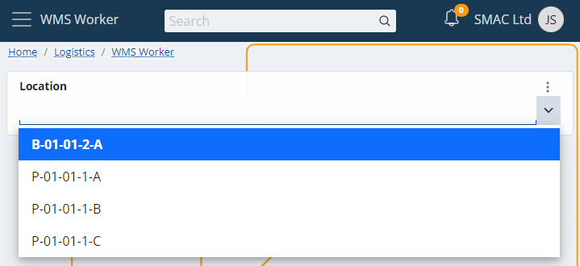
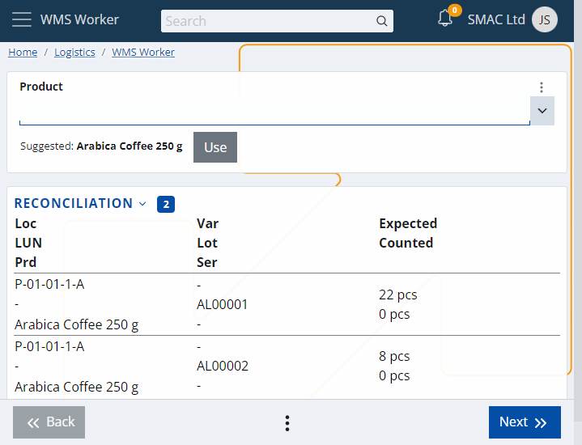
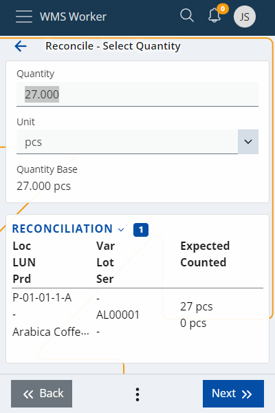
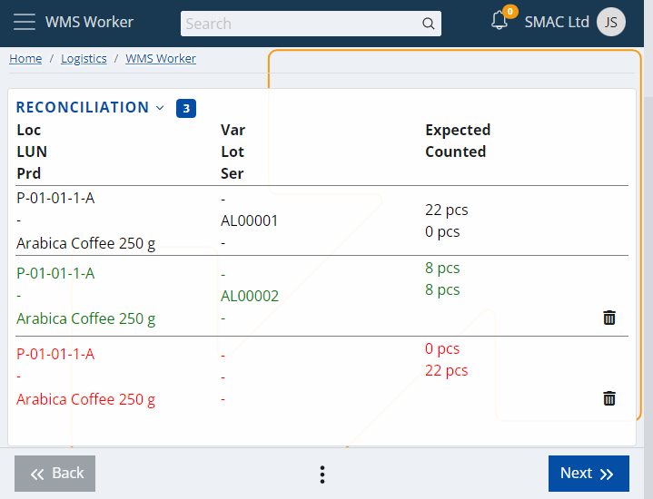

# Reconcile

The <b>Reconcile</b> menu allows you to make a comparison between the quantity of the product counted by the employees and the expected availability. This happens in real-time by Lots and Serial numbers. 

The location barcode must be scanned (by scanning Product, Lot, Serial, etc) or selected from the drop-down menu first:

 
The system will give you a summary of the information it has for that product:

 

The last column in the table shows the Expected availability compared to the one counted by the employee (Counted).

When you have counted the quantity of a product, you can enter it in the Quantity field (either click on the row in the table or click Next until you are asked for the quantity):
 

After clicking the Next button, the corresponding row in the table will be colored. If Expected and Counted are equal, the row will be colored green, but if the numbers are different, it will be colored red, indicating an error:

If the Counted data needs to be deleted, this can be done by clicking on the Recycle bin icon on the right.

When the counting is complete, you can see a Review of all rows in the table with their matches and differences. If there are rows in which no counted information is entered, they will be displayed with negative values of the expected quantity.
This means that these products may have been available, but since they were not reported, they are recorded as missing.

Review shows the results of the counting and in that sense - the Reconcile of the whole location.

Total difference shows the reported differences at this Location.
 

The   button means that the counting is complete, and you are ready to save the data to the system. 

If all the steps are performed correctly, a message will appear confirming that the operation was successful:

