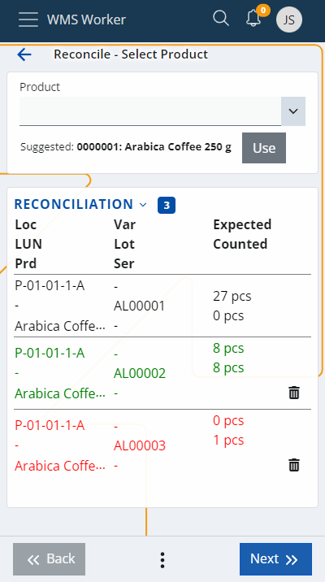

# WMS Worker - Reconcile Menu

The Reconcile menu allows you to make a comparison between the quantity of the product counted by the employees and the expected availability. The final records for any discrepancies are saved when the **Finish** button is clicked.

## Reconcile by Location or Logistic Unit (LUN)

You can choose to perform the reconcile by **Location** or by **Logistic Unit (LUN)**:

- **Reconcile by Location**: If you scan or select a **Location**, the system will then ask you to enter the **Logistic Unit (LUN)**. After selecting the LUN, the system will proceed to the next screen, where a list of products contained within that LUN is displayed.

- **Reconcile by LUN**: If you enter or scan a **LUN** directly, the system will automatically identify the associated Location and skip asking for it. You will be taken directly to the list of products contained in that LUN.

 
 
## Product Information

The system will give you a summary of the information it has for that product:

 

The last column in the table shows the Expected availability compared to the one counted by the employee (Counted).

## Entering Quantities

When you have counted the quantity of a product, you can enter it in the Quantity field (either click on the row in the table or click Next until you are asked for the quantity):
 

After clicking the Next button, the corresponding row in the table will be colored. If Expected and Counted are equal, the row will be colored green, but if the numbers are different, it will be colored red, indicating an error:

## Deleting Counted Data

If the Counted data needs to be deleted, this can be done by clicking on the Recycle bin icon on the right.

## Review and Total Difference

When the counting is complete, you can see a Review of all rows in the table with their matches and differences. If there are rows in which no counted information is entered, they will be displayed with negative values of the expected quantity.
This means that these products may have been available, but since they were not reported, they are recorded as missing.

Review shows the results of the counting and in that sense - the Reconcile of the whole location.

Total difference shows the reported differences at this Location.
 

## Auto-accepting non-counted products

If you click the Accept Non Counted button during reconciliation, all products at the current location that were not counted will be automatically accepted as correct with their expected quantities.

This action will also set the IsAutoAccepted flag in the corresponding WarehouseTransactions, marking that the uncounted differences were accepted for this location.

## Finish and Save

The   button means that the counting is complete, and you are ready to save the data to the system. 

If all the steps are performed correctly, a message will appear confirming that the operation was successful:

## Auto-accepting non-counted products
During reconciliation, the context menu includes an option called Accept Non Counted.

When selected, the system automatically accepts all products at the current location that have not been physically counted, treating them as counted with their expected quantities.

#### What happens when the button is pressed:
All uncounted products (displayed in black) are automatically marked as counted with zero difference. They will immediately turn green in the list, as if counted and matching the expected quantity.

In the Review screen, these products will not appear, since only products with differences are shown.

When clicking Finish, a Warehouse Transaction is created for each of these products:

- TaskType = Count
- Direction = IN
- Quantity = 0
- IsAutoAccepted = True

The IsAutoAccepted field is a boolean indicator in the Warehouse Transactions, showing that the product was accepted without being physically counted.

If any of the automatically accepted products are later edited (e.g. counted manually or deleted with the bin icon), the system considers them as manually counted instead. In this case:

The IsAutoAccepted value is set to False

The previously accepted quantity is reset to zero, to avoid duplication. The product must then be counted again from scratch.

This feature is designed to speed up the reconciliation process and to provide a clear distinction between physically verified quantities and those accepted based on system expectations.
It also serves as a control mechanism for the reconciliation process and the employees performing the inventory.
