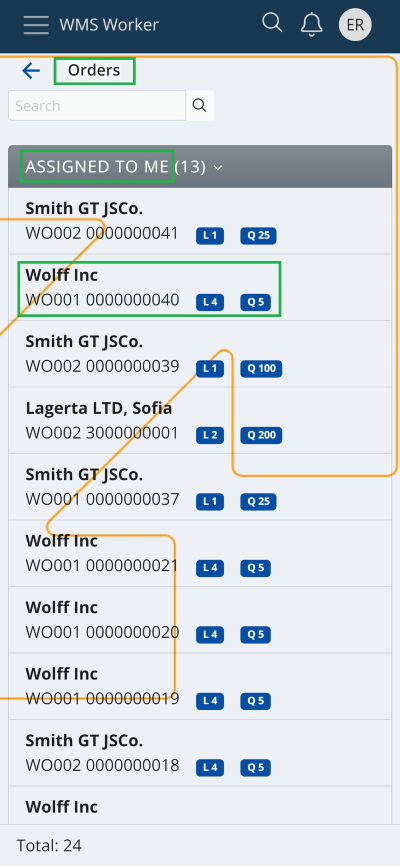
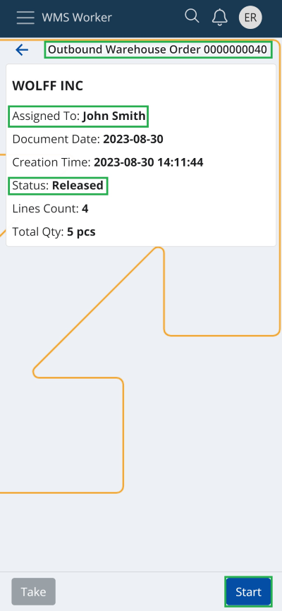
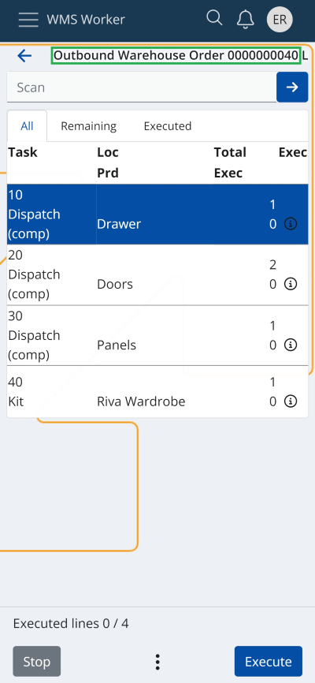

# Start

The <b>"Start"</b> function allows the warehouse worker to initiate work on a selected Warehouse Order (WO) from his „ASSIGNED TO ME“ task list.

After clicking on the WO, a window containing general information about it opens, and in the lower right corner of the window, you will find the <b>"Start"</b> button.

By clicking the <b>"Start"</b> button, the order execution window is automatically loaded, enabling work to begin immediately.

