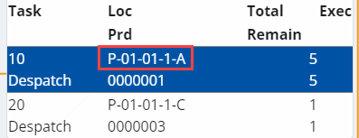
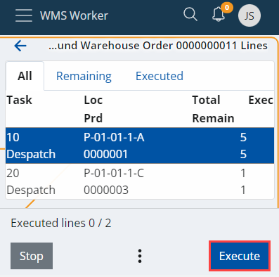
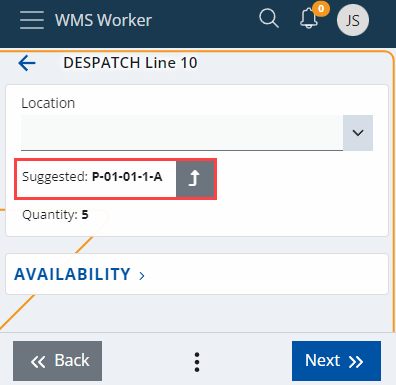

# Suggest warehouse locations

Coordinates are used to mark exactly where specific products are positioned within a given warehouse. When it’s time for a product to be released, it usually takes time to navigate to its location without any form of guidance. With the Suggest Warehouse Locations feature, you can get an instant suggestion about where you should go. 

> [!NOTE] 
> 
> Warehouse location suggestions are only compatible with lines which are ready for release. They wouldn’t work with mixed lines, or any other types of lines.

## Using suggested warehouse locations

To begin, click the **Orders** panel.

 
This takes you to a list of assigned and unassigned orders. 
Proceed by clicking and opening the order that you need to perform.

 
Below, you‘ll find a three-dot button, from which you can access the **Suggest Warehouse Locations** feature:

This immediately triggers a suggestion for warehouse locations from which you can release the product.   It can be found within the _Loc_ column:

In this case, the suggested location for product line 0000001 is “P-01-01-1-A”. You can take the product assigned for release directly from here.
To proceed with the selected line, click the **Execute** button.

This takes you to the first screen for dispatching the product. Here, you’ll find more information about the suggested warehouse location, as in how many instances of the product should be released from there.

To apply the warehouse location suggestion, click the **Use** button. 
This pastes the coordinates in the _Location_ field and takes you to the next step – selecting the product which will be released.

 
## Specifics

The function checks whether all warehouse order lines have _Task Type == Despatch_. If this is false, then an error message appears:

_The function can only be used if the task type of all lines is "Despatch"._

For each warehouse order line in a given document, where _WarehouseOrderLine.WarehouseLocation == null_, are loaded the lines from the Warehouse Availability View, where:

- _Warehouse = WarehouseOrderLine.WarehouseOrder.Warehouse_
- _Product = If ( WarehouseOrderLine.Product != null)_,  
           then _Product == WarehouseOrderLine.Product_,  
           else skip this line and return _WarehouseLocation = null_  
- LogisticUnit = _if ( WarehouseOrderLine.LogisticUnit != null)_,  
           then _LogisticUnit == WarehouseOrderLine.LogisticUnit_,  
           else get the lines for all _LogisticUnits_  
- Lot = _if ( WarehouseOrderLine.Lot != null)_,  
           then _Lot == WarehouseOrderLine.Lot_,  
           else get the lines for all _Lots_  
- ProductVariant = _if ( WarehouseOrderLine.ProductVariant != null)_,  
           then _ProductVariant == WarehouseOrderLine.ProductVariant_,  
           else get the lines for all _ProductVariants_  
- SerialNumber = _if ( WarehouseOrderLine.SerialNumber != null)_,  
           then _SerialNumber == WarehouseOrderLine.SerialNumber_,  
           else get the lines for all _SerialNumbers_  
- _QuantityBaseAvailable != 0_ 
