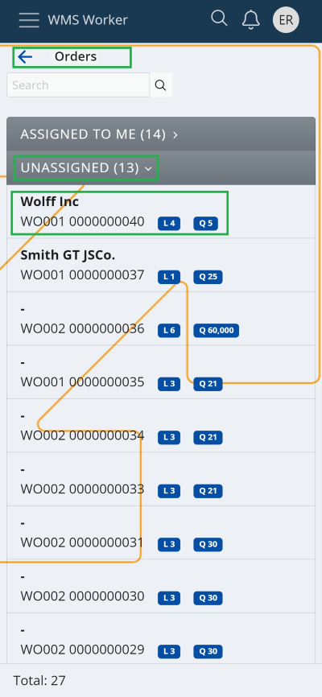
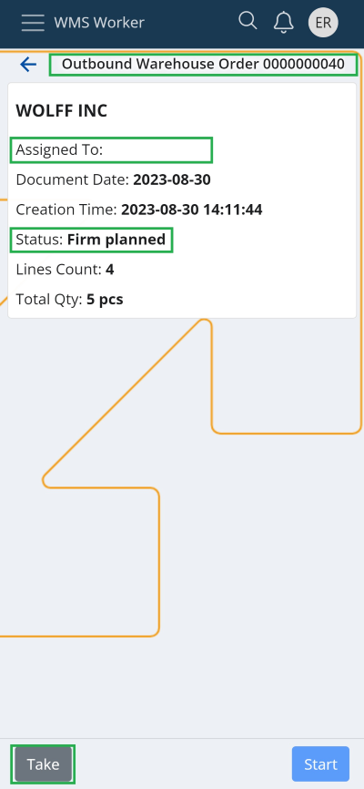
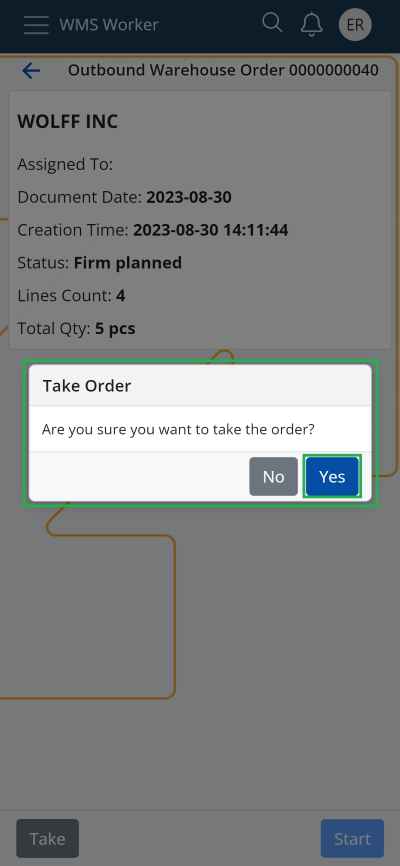
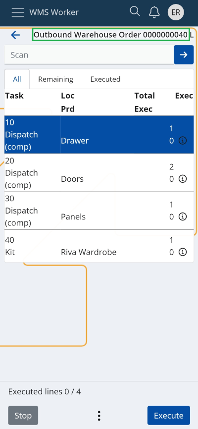
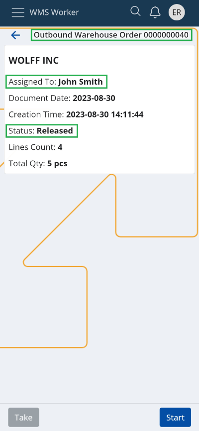

# Take

In the "Orders" menu of the WMS Worker, two categories are displayed: „ASSIGNED TO ME“ and “UNASSIGNED”.

The <b>“Take”</b> function allows the warehouse worker to select a Warehouse Order (WO) from the “UNASSIGNED” list and assign it to himself. The WO will quickly and easily appear in their „ASSIGNED TO ME“ task list for execution.

> [!NOTE]
> All Warehouse Orders in the "UNASSIGNED" list are in "Planned" or "Firm planned" state.

From the order navigator, by pressing the <b>“Take”</b> button in the bottom left corner of the screen of the corresponding WO, the warehouse worker takes the chosen unassigned order.

After confirmation, the window for execution the order automatically opens, allowing him to start working on it immediately.

The "Assigned to" field is automatically filled with his own name, the state of the Warehouse Order is changed to "Released", and it becomes visible in his "ASSIGNED TO ME" tasks list.

