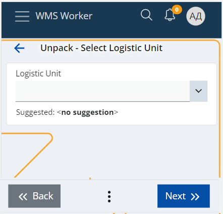
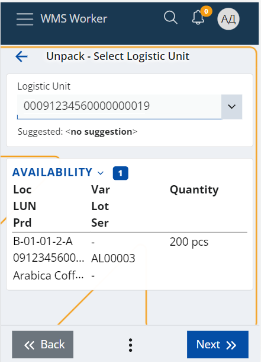
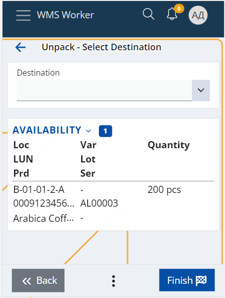

# Unpack 

The **Unpack** menu allows you to unpack the Contents of an [Logistic Unit (LU)](xref:LU).

Note that this menu is used to unpack the entire LU. If you want to unpack only part of the LU contents, you can use the Move menu, where you can uncheck the "Move the whole logistic unit" option.

To Unpack a LU, first, select or scan the desired Logistic Unit:

The system will list of the availability in this LU.

The last step is to select the new **Destination** location of thе unpacked contents and press the **Finish** button to complete the process.

If all the steps are performed correctly, a message will appear confirming that the operation was successful:

