# My Calendar

The @@name Calendar is a powerful time-management tool, allowing you to efficiently organize, monitor and synchronize your events and tasks. Its features include previewing and creating **activities**, applying different **views**, navigating across various **time periods**, as well as accessing any type of **scheduled event** easily.

It also sums up group activities from the **[social groups](https://docs.erp.net/tech/modules/my/groups/features-in-groups.html#calendar)** you take part in.

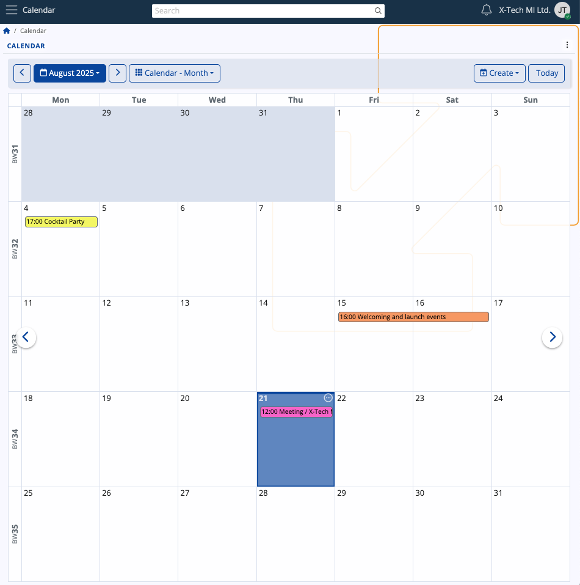

## Interface

### Views

The Calendar has several **views** allowing you to narrow down your activities to the ones you have for the current day, week, or month(s), or even see them spread across the year's quarters. 

By default, the **Month** view is applied, showing the days of the current month and the activities in it. 

You can change this at any time by clicking the respective dropdown menu and selecting one of the other views.

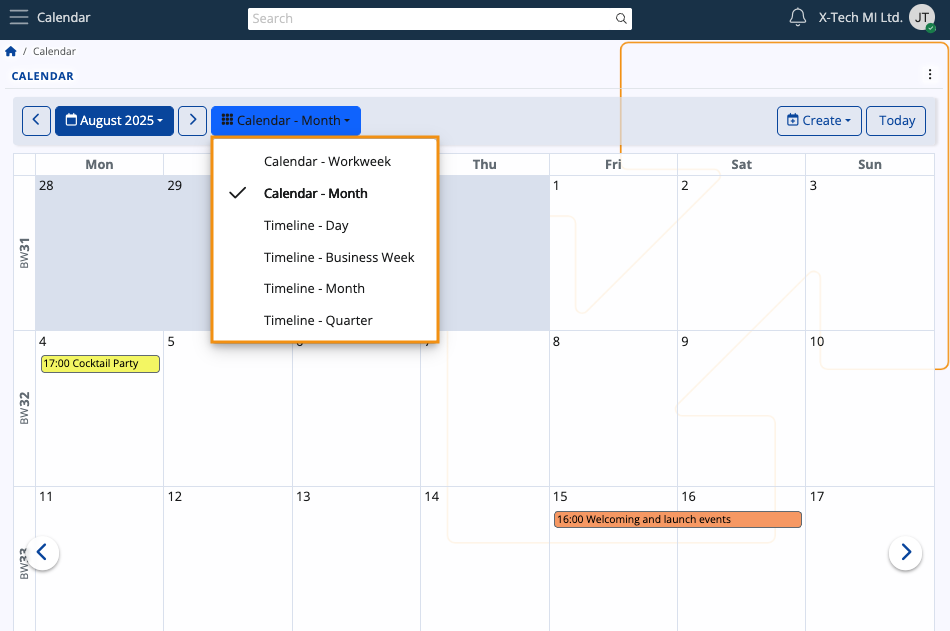

### Navigation

Using either the **left (previous)** or **right (next)** arrows, you can navigate across quarters, months, weeks and days. 

This allows you to revisit past activities or preview incoming ones.

Depending on your current view, you can navigate to a **specific week or month** from the blue-colored menu.

Use the **date picker** to select any given date, month, or year. 

If you've navigated too far away and wish to quickly go back to the present date, simply click **Today**.

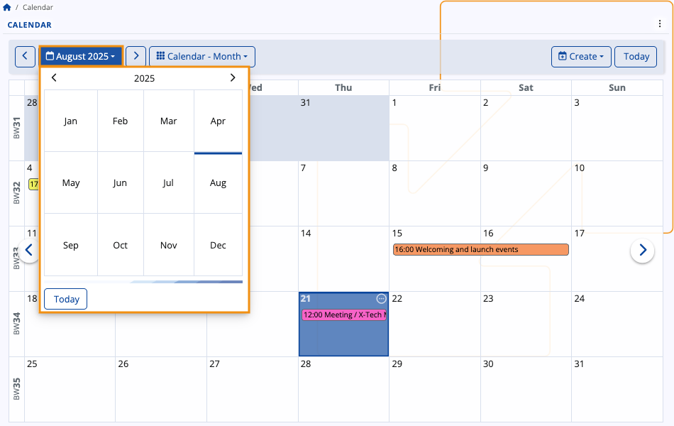

> [!Tip]
> You can also change the Calendar display view from the **three-dot menu** at the upper-right part of the page.

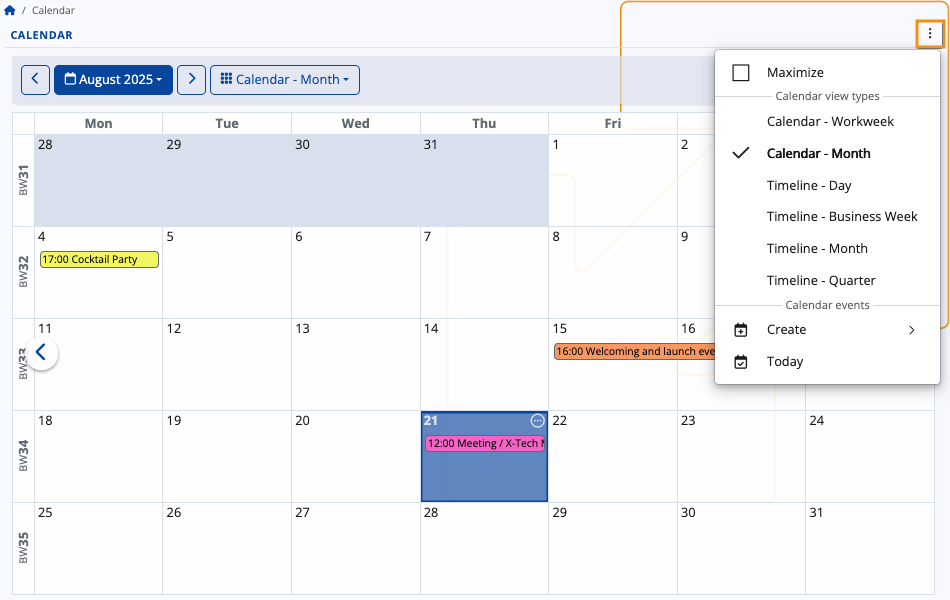

## Business week numbering

The @@name Calendar uses the **[ISO 8601 standard](https://en.wikipedia.org/wiki/ISO_8601)** for tracking the number of weeks in a calendar year: 

- All weeks are counted **chronologically** (e.g. week 42 of 2022 corresponds to the 42nd week of that year)
- The first week of a year is **always marked with the number corresponding to that year** (e.g. week 1 of 2023)
- The last week of a year is **always marked with the number corresponding to that year** (e.g. week 52 of 2024)

However, when the last ISO week of the previous year falls into the first three days of the next year, it is **always marked as week 0 for the new year**. This way, the Calendar treats January 1st as the true beginning of a year, yet still respects the ISO standard from Week 1 onward for compatibility.

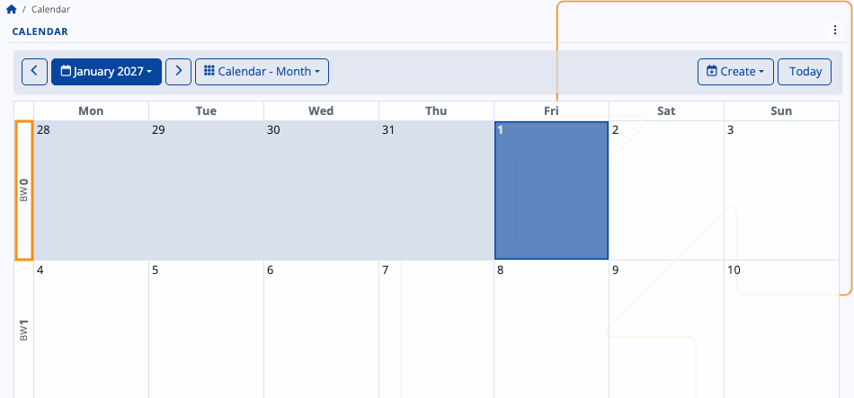

### Monthly and weekly labels

Within the Calendar, you can see each week labeled with its corresponding **BW number**, which stands for "Business Week number".

In **Workweek** view, this label is positioned at the upper-left corner of the Calendar.

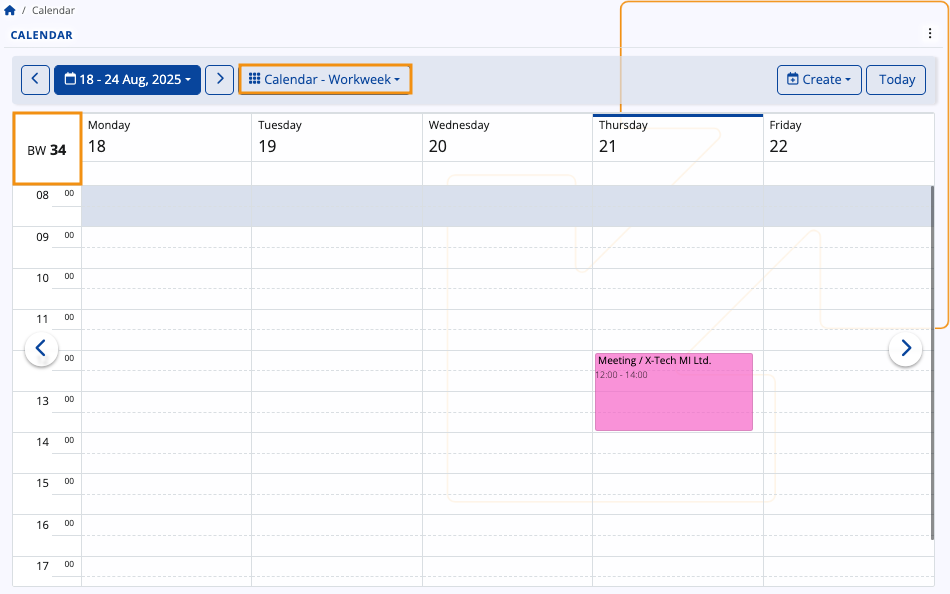

In **Month** view, labels are positioned on the left of the Calendar, and their number depends on how many weeks the month has.

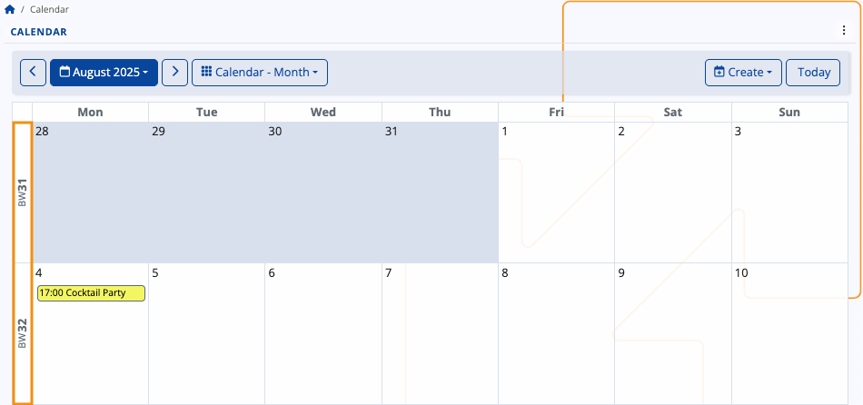

In other Calendar views as well as navigators making use of the **date picker**, you will also find BW labels for convenience.

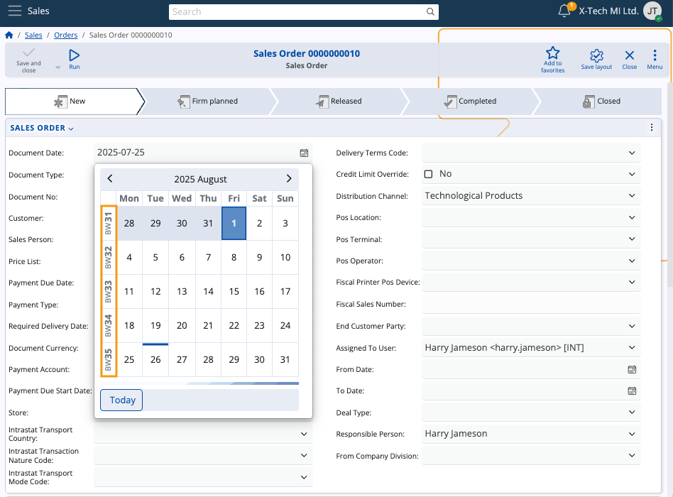

> [!NOTE]
> All @@name navigators with time-based columns like Document Date support **[business week grouping](https://docs.erp.net/webclient/introduction/navigator-features.html?q=features#group-by-intervals)**, which allows you to group any records of documents by the business week they were created in. 

## Activities

Your activities are summarized and displayed within the Calendar, with their titles fitting into the respective time slots.

### Details

If you hover the mouse over an existing activity, you can see more **details** about it in a tooltip.

This includes the Subject, time range, Responsible Party, Target Party, and Document Type. 

If participants are included, up to the first three will be listed under a dedicated "Participants" section.

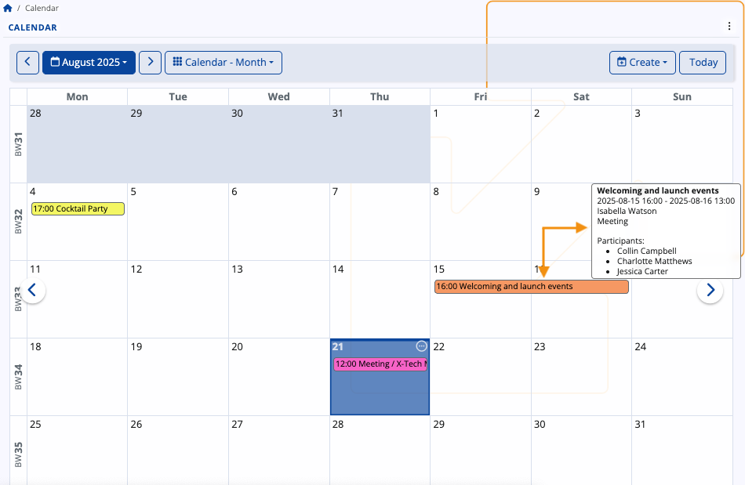

In Month view, the **starting time** of an activity is always shown to the left of its title.

You can also see a **list of all activities** for a given day by clicking the **circular button** at the top-right corner of a date.

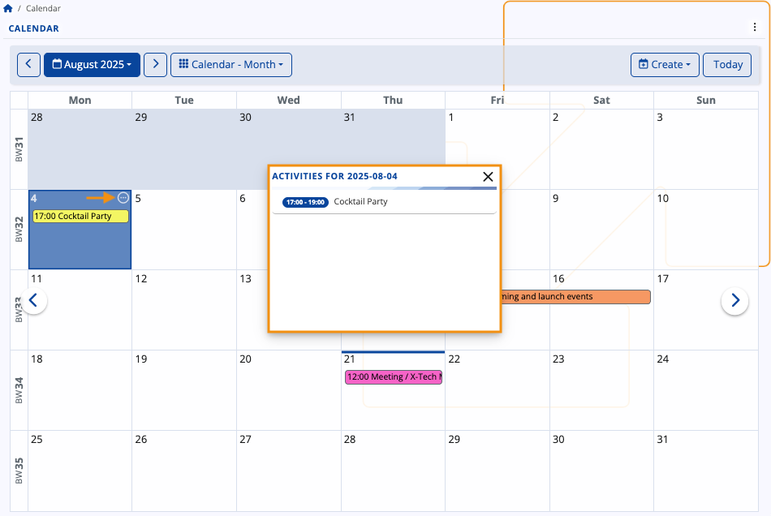

### Scope of activities

As a general rule, the Calendar shows you all activities where you are designated as the **Owner**, **Responsible Party** or a **Participant**.

The Calendar will also display activities from **[social groups](groups/features-in-groups.md)** you take part in. You once again need to be either the Owner, Responsible Party or a Participant. If you're neither of those, you will still see the actvities but only within the **[group-integrated Calendar](https://docs.erp.net/tech/modules/my/groups/features-in-groups.html#activity-access)**.

### Create an activity

To add a new activity from scratch, click on a date and press the **Create** button.

It will expand a dropdown with several options, including a meeting, task, or sick day.

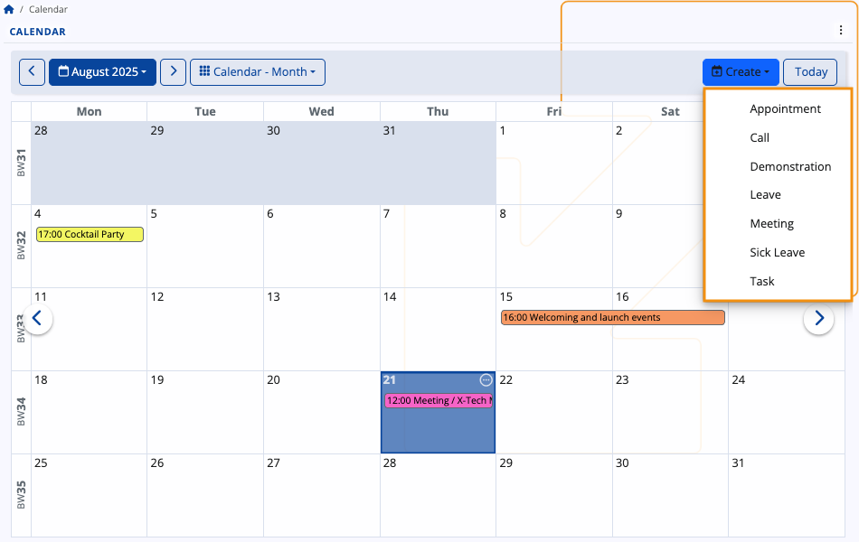

Once you make your choice, you will be taken to the **Activity document form** where you need to fill out all the necessary fields regarding the activity and individuals who may be involved in it.

These fields also serve as crucial piece of data that will appear in all potential participants' Calendars.

#### Responsible Party and Assigned To User 

When a user creates an activity, the **Assigned To User** field is automatically linked to the user associated with the document's **Responsible Party**. If there is no Person associated with the Responsible Party, the Assigned To User field will be left **blank**.

This is ensured with **[business rule R38288](https://docs.erp.net/model/business-rules/R38288.html?q=R38288)**.

You can assign a different user to the document by changing the value of the **Assigned To User** field. This will automatically change the **Responsible Party** field as well, in case there is a Person associated with that user. 

If there isn't one, the **Responsible Party** field will be left **blank**. 

This is ensured with **[business rule R38826](https://docs.erp.net/model/business-rules/R38826.html)**.

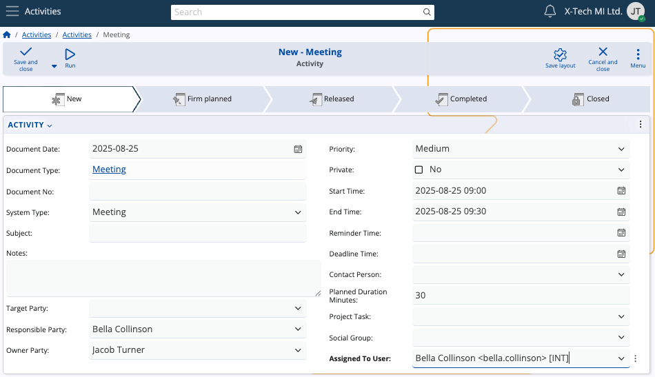

#### Responsible Party different from Owner Party

You can choose a Responsible Party who is **different** from the Owner Party. In that case, the Responsible Party will be automatically included in the Participants list as a **Participant Person**.

This is ensured with **[business rule R38894](https://docs.erp.net/model/business-rules/R38894.html)**, which checks the following:

- If there is **only one** participant present, they are replaced with the new Responsible Party.
- If there is **more than one** participant, the Responsible Party is included as long as they have not been already added. 

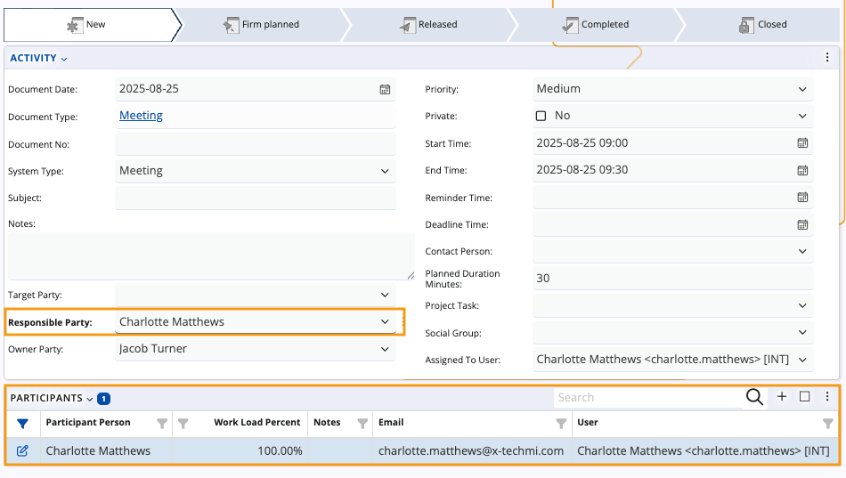

When you're finished, click **Save and reload**, and the activity will be added to your **Calendar**.

 
### Edit an activity

You can open any activity document by clicking on its title. Inside, you can **edit** the subject, date, participants or any other information.

When done, you need to once again click **Save and reload**. Your changes will be immediately reflected in your Calendar.

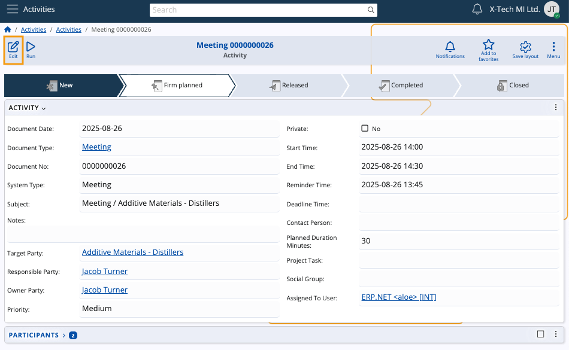

> [!TIP]
> **The Calendar is not tied to one specific location**.  
> Apart from being able to interact with it in a **[group-specific context](https://docs.erp.net/tech/modules/my/groups/features-in-groups.html#calendar)**, you can also integrate it as a panel in the **Dashboard**.

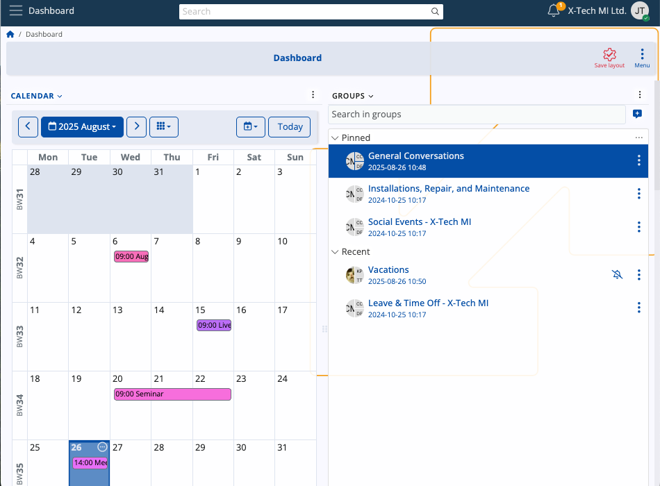

> [!Note]
> The screenshots taken for this article are from v.26 of the platform.
