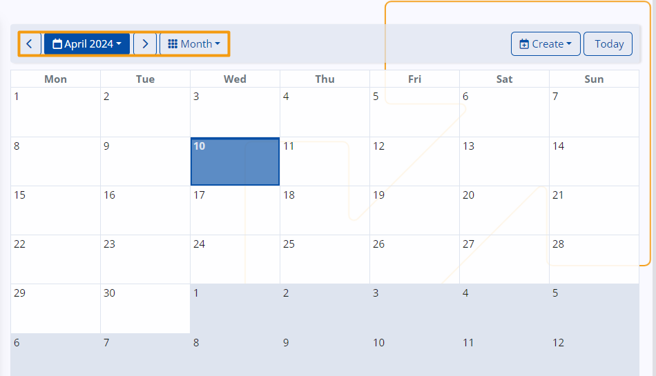
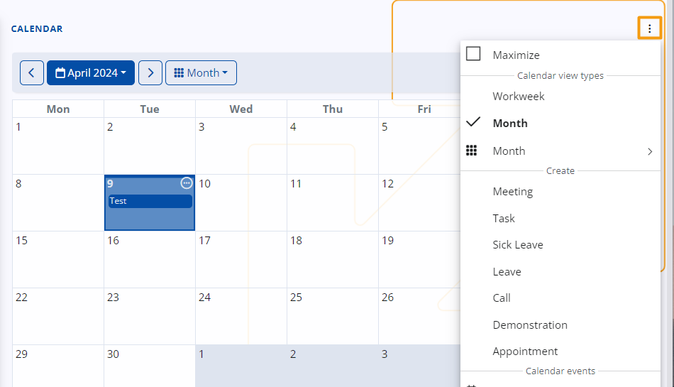
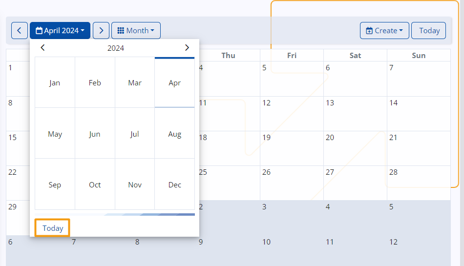
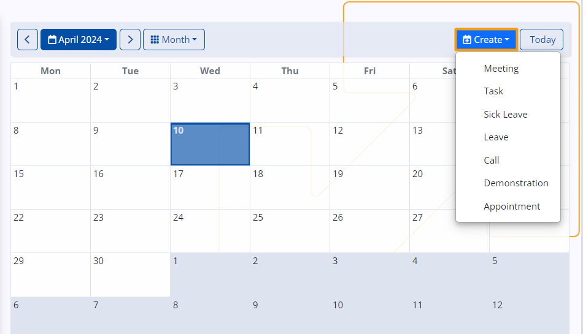

# My Calendar

The **ERP.net Calendar** is a powerful time-management tool, allowing you to efficiently organize, monitor and synchronize your personal activities, events and tasks. 

It also sums up **group** activities from the social groups you take part in, whenever you are marked as the responsible person, organizer, or a participant. 

## Navigation 

You can find your personal **Calendar** in the **My** module.

## Time period

The **Calendar** allows users to specify custom time periods, such as specific hours within a day or a range of dates spanning multiple days, weeks, months, or years, depending on their scheduling needs.

To change the calendar's display, access the dropdown menu at the top left of your page and select either **Month** or **Workweek** views.

> [!NOTE]
> You can also adjust the **Calendar display view** from the **Panel menu** of the **Calendar page**.

 
To revisit past events or navigate to a specific week or month, use the arrow buttons. Depending on whether you're in the **Month** or **Week** view, this will adjust the calendar accordingly.

 
Depending on your current view, you can select a specific week or month from the blue-colored menu.

Use the mini-calendar to select a specific date, month, or year. If you've navigated away and wish to return to the present date, simply click **Today**.

 
## Create an event

Your events are summarized and displayed within the **Calendar**, with their titles fitting into the respective time slots, covering activities where you are designated as assigned owner status, or added as a participant.

To start creating an event, you have to click on the date and press the **Create** button.

With this button you can choose to create meeting, task or to mark the day as a sick day.

This action will lead you to a dedicated page where you can provide necessary information regarding the activity and individuals who may be involved.

Another way is to doble click on the selected date and you will find yourself on the **New Activity** creation form, where you can fill in basic information for the meeting, task or reminder you want to set.

In the process of event creation it is important to fill the filds that will provide the information about the event.

These fields serve as crucial conduits for relaying essential information to all intended participants.

You can add the name of the document, of the subject you wish to discuss, priority level of the meeting and responsible person for the task.

When you're finished, click **Save and reload**, and the activity will be added to your **Calendar**.

 
You can also create events from the **Panel menu** of the **Calendar page**.
When you click on the selected date and click **Panel menu** that will give you the chance to create event.

 
## Access an event

If you want to check a specific information about your event you can access it through the calendar. 
 
When you click on a date containing an event, a circular button will emerge at the top-right corner, giving you access 
to more details, like the event's scheduled hours.

 
## Edit Event

You can open the event by clicking on its title, which will display all its details and list of potential participants. If you wish to edit any aspect, such as the subject, the date or any other aspects you can click the edit button on the top left corner. Upon saving the changes, they will be immediately reflected in the **Calendar**.

## Panel menu 

In the **Panel menu** you can maximize your screen, adjust **Calendar view types** and create events.

The Calendar is not confined to a single location. Upon accessing your personalized **Dashboard**, you will find it integrated as a panel, accessible whenever needed. Here, all its features are centralized alongside other vital ** My** components, offering a cohesive user experience. Additionally, you have the freedom to rearrange the Calendar panel by opening the **Customize window** of the **Dashboard** and dragging it to your preferred position.
