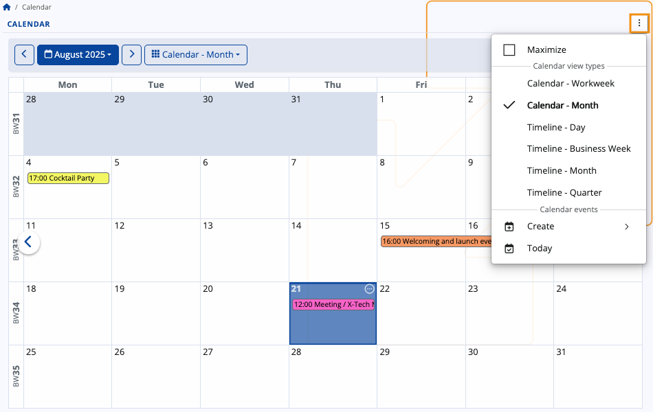
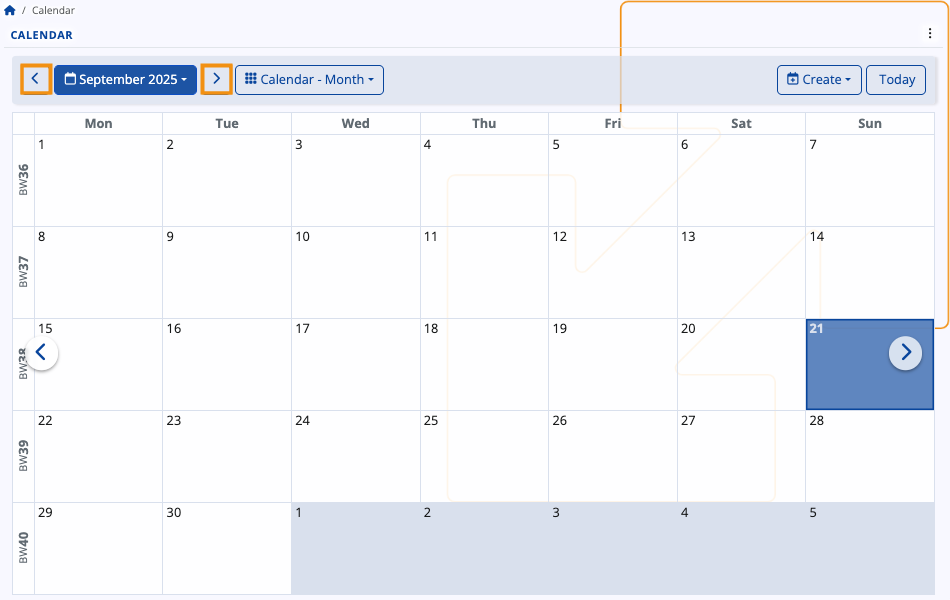
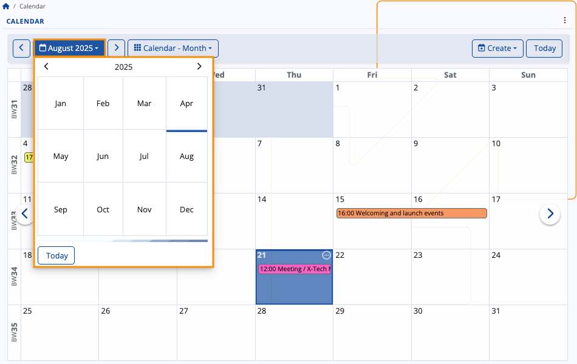
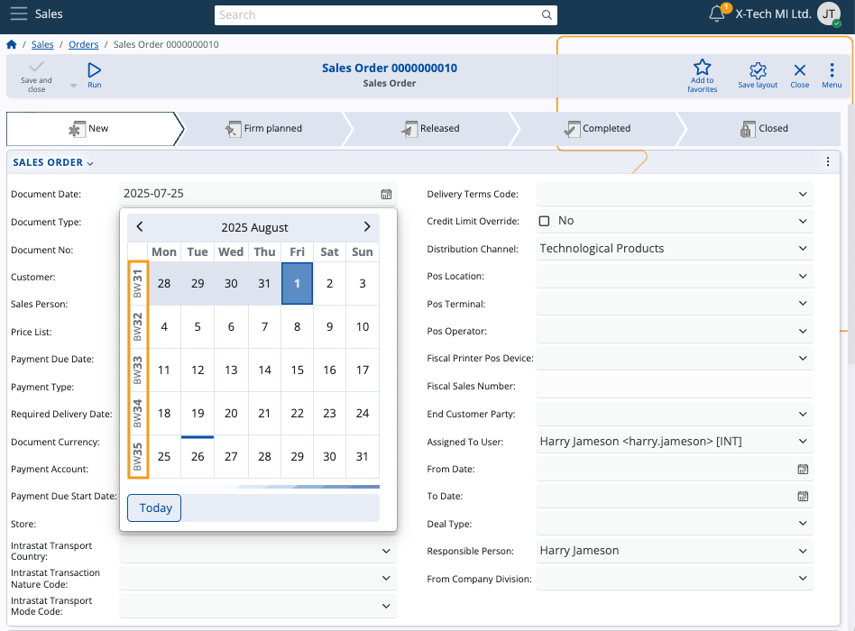
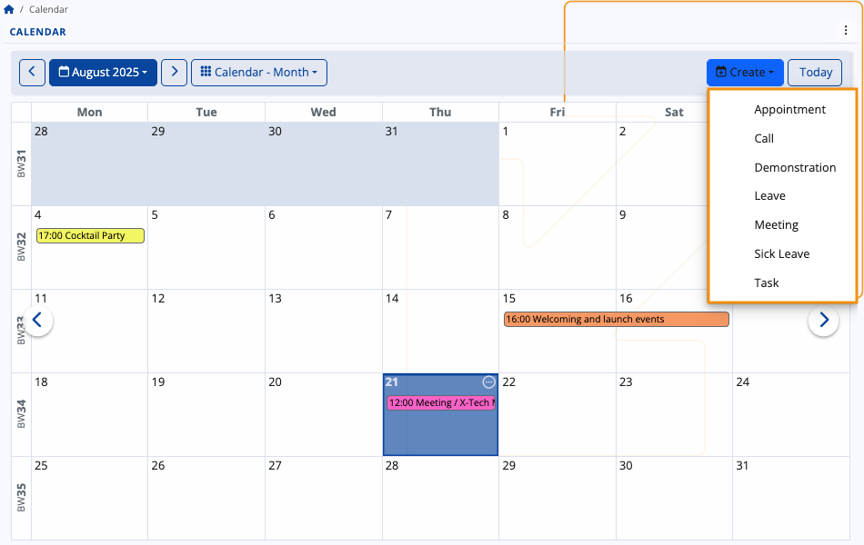

# Calendar

The @@name Calendar is a powerful time-management tool, allowing you to efficiently organize, monitor and synchronize your events and tasks. Its features include previewing and creating **activities**, applying different **views**, navigating across various **time periods**, as well as accessing any type of **scheduled event** easily.

It also sums up group activities from the **[social groups](https://docs.erp.net/tech/modules/my/groups/features-in-groups.html#calendar)** you take part in.

## Interface

### Views

The Calendar has several **views** allowing you to narrow down your activities to the ones you have for the current day, week, or month(s), or even see them spread across the year's quarters.

You can **change** your view at any time by clicking the respective **dropdown menu** and selecting one of the other views.

Alternatively, you can do so from the **three-dot menu** at the upper-right part of the page.

#### Month

By default, the **Month** view is applied, showing the days of the current month in squares fitting the activities in each. 

Each week is labeled with its corresponding **[Business Week (BW) number](https://docs.erp.net/tech/modules/my/calendar.html#business-week-number)**.

#### Workweek

The **Workweek** view lists all activities for all days of the current week. 

Each week is labeled with its corresponding **[Business Week (BW) number](https://docs.erp.net/tech/modules/my/calendar.html#business-week-number)**.

#### Timeline

The **Timeline** view focuses on continuity across multiple time spans. 

It allows you to track activities over longer periods of time and in a linear format, offering visibility of overlapping or consecutive activities.

There are several timeline modes available:

* **Timeline – by Day** – Displays all activities for a single day, as well as for the next up to 11 days.

  

* **Timeline – by Week** – Shows all activities for the current week as well as for the next up to six weeks. Each week is labeled with its **[BW number](https://docs.erp.net/tech/modules/my/calendar.html#business-week-number)**.

  
  
* **Timeline – by Month** – Lists all activities for the current month as well as for the next up to six months.

  
  
* **Timeline – by Quarter** – Presents all activities for the last three months (current quarter) as well as for the next three quarters.

  

### Navigation

Regardless of the Calendar view, using either the **left (previous)** or **right (next)** arrows in the navigation bar, you can navigate across quarters, months, weeks and days. This allows you to revisit past activities or preview incoming ones.

The arrows within the Calendar itself move forward or go back **by a single day** in Month view and **by a single period** in Timeline view.

For example, pressing the **right arrow** advances one business week in **Timeline - by Week**, shifting all the weeks following it by one.

### Date picker

You can navigate to a **specific week or month** from the blue-colored menu.

Use the **date picker** to select any given date, month, or year. 

If you've navigated too far away and wish to quickly go back to the present date, simply click **Today**.

## Business Week number

The Calendar follows the @@name **Business Week (BW) standard** for numbering weeks in a calendar year. This standard is based on **ISO 8601**, but it applies specific improvements to:

- ensure weeks always align with their calendar year
- prevent confusion in reports or documents where dates at the beginning or end of a year may be assigned to a different year.

Here are the two key differences:

| Month    | ISO 8601                                                                 | Business Week                                                                 |
|----------|--------------------------------------------------------------------------|-------------------------------------------------------------------------------|
| January  | The first 1–3 days of January may belong to the last week of the previous year (**e.g. 01.01.2027 → ISO 53/2026**) ⚠️ | These days are assigned to **week 0 of the current year** (**e.g. 01.01.2027 → BW 0/2027**) ✅ |
| December | The last days of December may belong to Week 1 of the next year (**e.g. 31.12.2018 → ISO 1/2019**) ⚠️ | These days remain in the **final week of the current year** (**e.g. 31.12.2018 → BW 53/2018**) ✅|

The BW number **always reflects the actual calendar year of the date**. This avoids mismatches across year boundaries, ensures chronological order, and keeps all documents and reports from a given year grouped correctly.

### Monthly and weekly labels

Within the Calendar, you can see each week labeled with its corresponding **BW number**, which stands for "Business Week number".

In **Workweek** view, this label is positioned at the upper-left corner of the Calendar.

In **Timeline - by Week** view, the label is found at the right end of each week window.

In other Calendar views as well as navigators making use of the **date picker**, you will also find BW labels for convenience.

> [!NOTE]
> All @@name navigators with time-based columns like Document Date support **[business week grouping](https://docs.erp.net/webclient/introduction/navigator-features.html?q=features#grouping)**, which allows you to group any records of documents by the business week they were created in. 

## Activities

Your activities are summarized and displayed within the Calendar, with their titles fitting into the respective time slots.

### Details

If you hover the mouse over an existing activity, you can see more **details** about it in a tooltip.

This includes the **Subject**, **time range**, **Responsible Party**, **Target Party**, and **Document Type**. 

If participants are included, up to the first three will be listed under a dedicated "**Participants**" section.

In Month view, the **starting time** of an activity is always shown to the left of its title.

You can also see a **list of all activities** for a given day by clicking the **circular button** at the top-right corner of a date.

### Scope of activities

As a general rule, the Calendar shows you all activities where you are designated as the **Owner**, **Responsible Party** or a **Participant**.

The Calendar will also display activities from **[social groups](groups/features-in-groups.md)** you take part in. You once again need to be either the Owner, Responsible Party or a Participant. If you're neither of those, you will still see the actvities but only within the **[group-integrated Calendar](https://docs.erp.net/tech/modules/my/groups/features-in-groups.html#activity-access)**.

### Create an activity

To add a new activity from scratch, click on a date and press the **Create** button.

It will expand a dropdown with several activity types.

Once you make your choice, you will be taken to the **Activity document form** where you need to fill out all the necessary fields regarding the activity and individuals who may be involved in it.

These fields also serve as crucial piece of data that will appear in all potential participants' Calendars.

### Edit an activity

You can open any activity document by clicking on its title. Inside, you can **edit** the subject, date, participants or any other information.

When done, you need to once again click **Save and reload**. Your changes will be immediately reflected in your Calendar.

> [!TIP]
> **The Calendar is not tied to one specific location**.  
> Apart from being able to interact with it in a **[group-specific context](https://docs.erp.net/tech/modules/my/groups/features-in-groups.html#calendar)**, you can also integrate it as a panel in the **Dashboard**.

> [!Note]
> The screenshots taken for this article are from v.26 of the platform.
