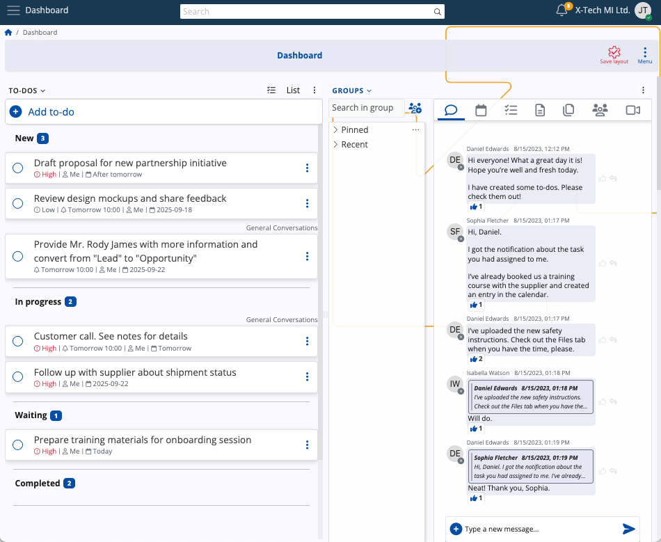

# Dashboard

> [!IMPORTANT]
> 
> **The information presented in this article is relevant for ERP.net v.24** **and may be incomplete or outdated**.

---
The Dashboard is a customizable workspace designed to centralize access to system modules and streamline daily operations. Each element is displayed as a panel (or widget) that can be added, removed, or rearranged to match user preferences.

The Dashboard consolidates actionable items, communications, and schedules into a single view. By embedding live modules, all actions performed through Dashboard panels (e.g., marking a task complete, posting in a group chat) are immediately reflected in the corresponding system app.

