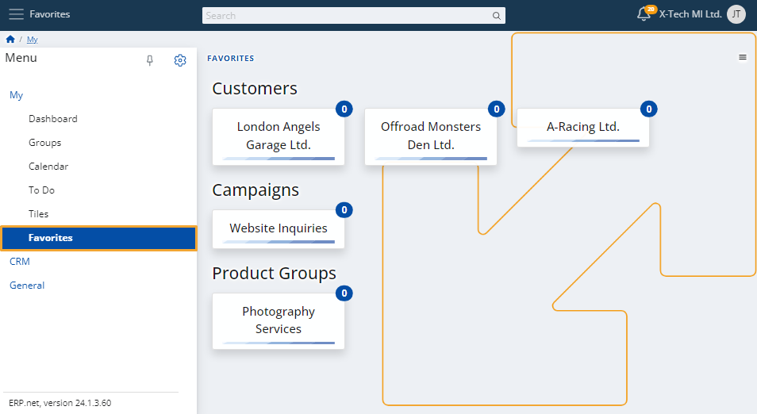
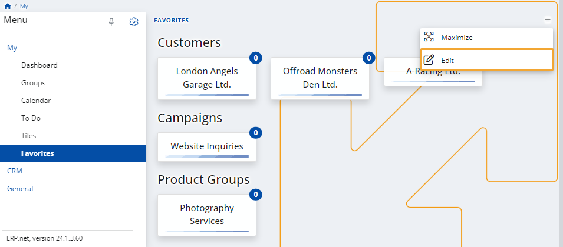

# Favorites

The Favorites screen allows users to build a personalized list of frequently accessed entities within @@name. This includes customers, campaigns, product groups, documents, or any other business entities. By marking items as favorites, you can easily access them from one place and receive notifications about relevant updates or events.

Favorites are context-aware and can include both top-level entities (e.g., Customers or Campaigns) as well as individual records (e.g., specific companies, opportunities, or documents).

## Key features

### Centralized access

All marked favorites are displayed in the **Favorites** page, providing a unified view of the items you follow.

### Notifications

When an entity is added as a favorite, you will automatically receive **system notifications** about related updates and activities. For example, marking a customer as favorite may trigger notifications for new opportunities, campaigns, or communications linked to that customer.

### Automatic inclusion of related documents

Marking a document (e.g., an order, invoice, or contract) as a favorite will **automatically include its related documents** in the favorites list. This ensures that you stay informed of all dependent workflows and actions connected to the original document.

### Categories in Favorites

Favorites are grouped automatically by entity type. Common categories include:

- **Customers** – e.g., companies, organizations, or accounts you follow.
- **Campaigns** – marketing or sales campaigns you track.
- **Product Groups** – collections of products or services.
- **Other entities** – these may include  include leads, opportunities, sales order, or other business entities.

This categorization ensures that items remain organized and easy to navigate even if you track a large number of records.

## Add a favorite

To add a new item to your favorites:

1. Open the entity page (e.g., a customer record, campaign, or document).

2. Click the **star icon** at the top-right corner of the screen.

3. The item will now appear under the **Favorites** section of your My menu.

## Remove a favorite

To remove any of your existing favorites, click the **Menu** button (three vertical dots) at the top-right corner and select **Edit**.

This toggles **edit mode** and displays controls for each favorite item. Click the **cross button** of a favorite to remove it from the list.

> [!NOTE]
> 
> The screenshots taken for this article are from v24 of the platform.
