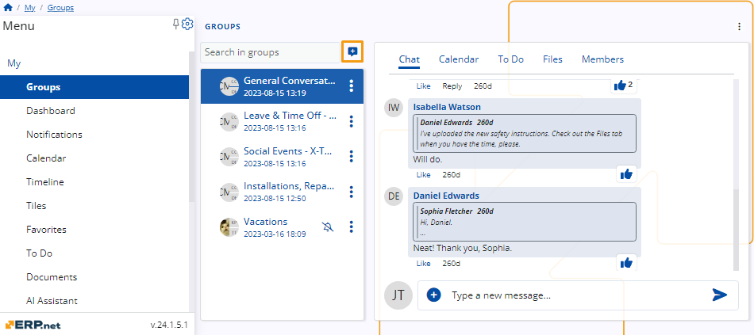
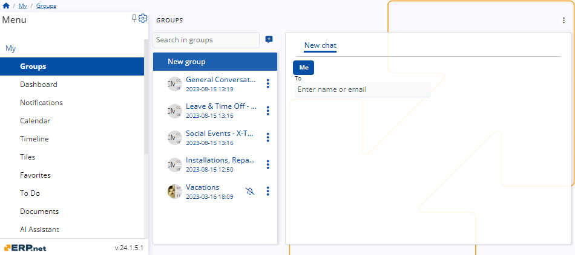
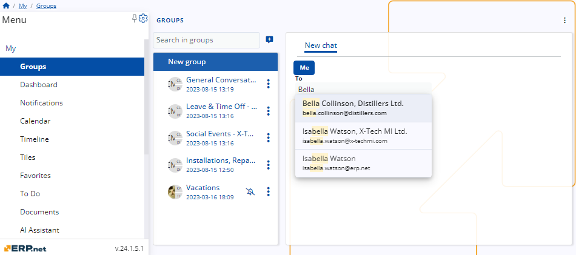
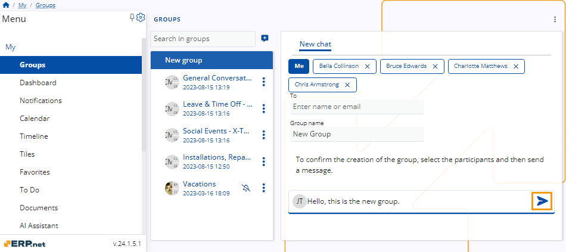

# A step-by-step guide on how to create a group 

Here, you will find a detailed guide on how to create a new group **ERP.net**. 

## Creation process 

Access **Groups** by first navigating to the **My** section in the menu, then selecting **Groups**.

To create a group, click the icon on the top right of the group list. 

 

Then, a new tab will open where you can add the users you wish to include in the new group and provide a name for the group.

 

As you begin typing a user's name, the platform will offer suggestions to streamline the process.

 

Following this, you'll need to compose the first message for the group and send it. This action will complete the creation process.

 
