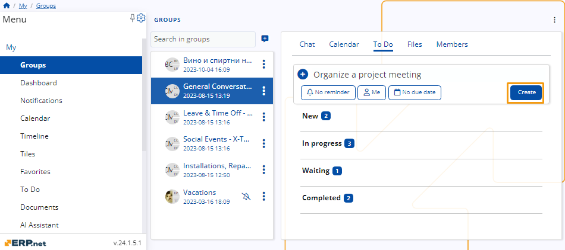

#  Features in Groups

Groups is a sub-section of **My** that provides a convenient platform for effortless communication, document exchange, task scheduling, and assignment among you and your colleagues. 

Groups are created by an **Admin** in the platform when they are needed, between people in the same company. 

## Chat 

The **Chat** tab facilitates rapid communication among group participants. 

It offers standard industry features such as message previewing and sending, reacting to and replying to messages from others, and even editing one's messages.

 
## Calendar 

The Calendar tab enables authorized members to create and view a range of events and meetings visible to the entire group. 

Any group activities you create or participate in will also be reflected in your **[Calendar](https://docs.erp.net/tech/modules/my/calendar.html)**. 

 

### Create a new activity 

Use the **Create** button to create a new activity. 

Choose the type of activity you want to create from the dropdown list.

To create a new activity you need to fill a form with information about the activity and the participants in it.  

Once you filled every field, click **Save and reload** and the activity will be added to the calendar. 

 

### Business week labels

The group Calendar makes use of a "Business Week" numbering logic which is used to count the number of weeks in a year through a custom implementation of the **[ISO 8601 standard](https://en.wikipedia.org/wiki/ISO_8601)**.

You can read more about how it works **[here](https://docs.erp.net/tech/modules/my/calendar.html#business-week-numbering)**.

### Activity access

Group activities where you are not a **Participant**, **Responsible Party** or **Owner** will still appear in the Calendar of the group you are a member of, but **NOT** in your **[personal Calendar](https://docs.erp.net/tech/modules/my/calendar.html)**. 

If you're not a member of a group, its activities will not be shown in your Calendar, nor can be accessible in any other way. Even if you once were a member and were subsequently removed from that group, all access to its activities is automatically revoked.

Below, you can see how the **My Calendar** interface looks when group activites are automatically synced from the social group a user is part of. One event in which they are not a Participant, nor an Owner or Responsible Party is missing.

 
 
## To Do 

The **To Do** tab showcases tasks assigned to both yourself and fellow group members, allowing you to mark those ready for completion. 

With **Member** or **Admin** permissions, you can create new tasks and assign them to others. 

Any to-dos added or assigned to you will also be visible in your personal Do space.

 

### Create a task

To create a task click on the circular button with a **+** on it. 

 
  
You can establish both a reminder and a due date for the task.

  

Once you’ve given a name and have set up the reminder, the person it’s assigned to, and the due date, click on the **Create** button to add it to the list of tasks. 

  

Once the task is completed, click on the radio button next to it to mark it as done. 

  

Tasks also offer various statuses like **New**, In** Progress**, or **Waiting** to indicate their progress.

 

## Files

Within the Files tab, you have access to file attachments uploaded by either yourself or other group members. 

Each file includes details such as its format, the name of the author, and the date and time of upload. 

  

### Upload files 

To upload files to the group, click on the cloud icon located at the top left of the screen.

  

Upon doing so, a new window will appear. Here, you have the option to either drag and drop the file you wish to upload or browse your files and select the desired one.

  

### File settings 

To download or delete a file from the group, click on the three-dot button situated on the right side of the file. 

From there, you can select the desired option to proceed.

  
 
## Members 

The **Members** tab contains a list of all members within the current group along with their respective roles. 

Admins have the exclusive authority to add or remove participants and adjust their permission levels as needed.

   

### Admin settings 

Users assigned the **Admin** role within the group possess the authority to add members, modify their roles, and remove them from the group.

#### Add member 

To add a new member to the group, click the **Add member** button in the top left corner. 

   

This action will prompt a new window to appear, where you'll need to input the individual's name or email address and specify their role within the group. 

   

As you begin typing the name or email, a drop-down menu will provide suggestions to assist you in locating the user.

   

After completing the necessary steps, click **OK** to confirm and finalize the process.

   

#### Change role 

To modify a member's role, click on the settings icon located on the right side of the user's profile. 

   

Then, click on the **Change role to** option. This will open the roles drop-down menu, allowing you to select the new role you wish to assign to the member.

   

#### Remove participant 

To modify a member's role, click on the settings icon located on the right side of the user's profile. 

   

Once you’ve done that click the **Remove participant** button.

