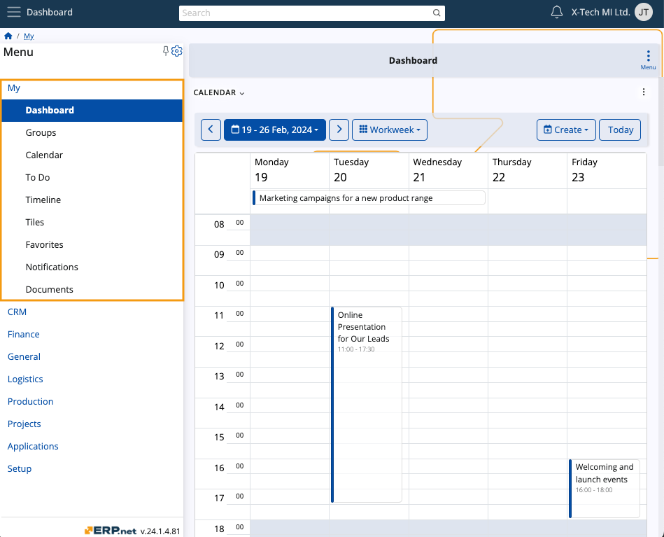

# Overview

The **My** module is a personalized environment housing information that is essential to your day-to-day activities.

It consists of several applications that are simultaneously independent, interconnected, and can also be integrated as panels in other ERP.net modules.

In the **My** module, you can find the following applications:

* **Dashboard** 
* **Groups**
* **Calendar** 
* **To Do**
* **Timeline** 
* **Tiles** 
* **Favorites** 
* **Notifications** 
* **Documents** 

If you want to learn more about them, please refer to their respective technical guides.

> [!NOTE]
> The screenshots taken for this article are from v24 of the platform.
