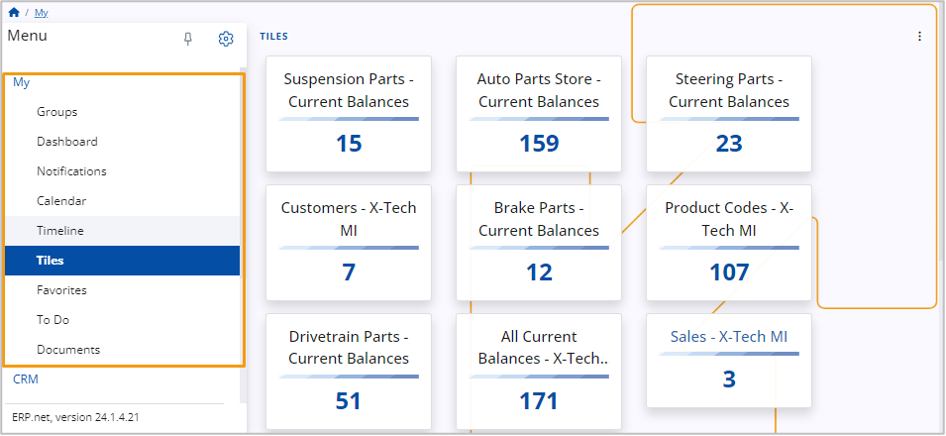

# Overview

**My** is your personalized environment housing all the relevant information essential for your daily routines.

In the My menu, you can find applications like:

•	**Calendar** 
•	**Dashboard** 
•	**Documents** 
•	**Favorites** 
•	**Groups** 
•	**Notifications** 
•	**Tiles** 
•	**Timeline** 
•	**To Do** 

If you want to learn more about them, please refer to their respective technical guides.
