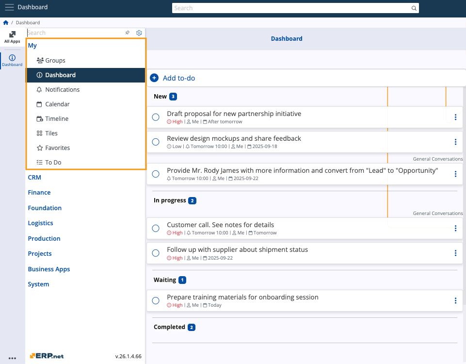

# Overview

The @@name **My** module is a personalized environment housing information that is essential to your day-to-day activities.

It consists of several applications that are simultaneously independent, interconnected, and compatible with other modules.

In the **My** module, you can find the following applications:

* **[Groups](groups/index.md)**
* **[Dashboard](dashboard/index.md)**
* **Notifications**
* **Search** 
* **[Calendar](calendar/index.md)**
* **[Timeline](timeline/index.md**
* **Tiles**
* **[Favorites](favorites/index.md)**
* **[To Do](todo/index.md)**
* **Documents**
* **AI Assistant**
* **Folders**

> [!NOTE]
> 
> The screenshot(s) taken for this article are from v.26 of the platform.
