# Tiles

The Tiles screen provides key operational statistics and quick access to a variety of @@name forms and navigators. It allows you to track the number of objects (entities) relevant to your work, such as the count of all customers, sales orders, or specific product categories. 

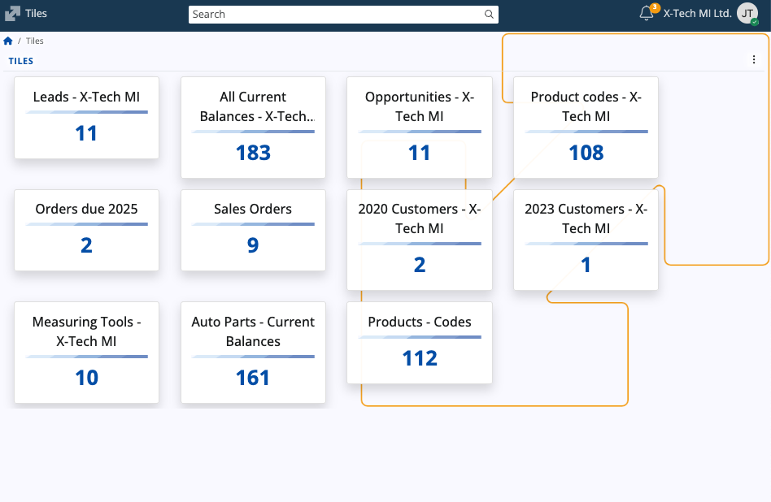

Tiles can be optionally saved with filters applied in order to fit a specific context (e.g., all sales orders with payment due dates in October 2025). This eliminates the need for manual recreation of filters as they can be instantly applied through a shortcut in the Tiles screen.

## Interface

Each tile is a piece of aggregated data, showing just two components:

* **Caption**: A custom title, often indicating the associated enterprise company (e.g., "Product codes - X-Tech MI").
* **Entities count**: Total number of objects that match the tile's underlying repository and filter criteria.

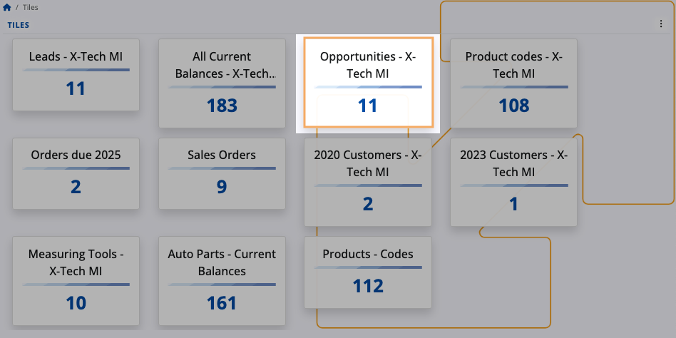

Internally, each tile represents a predefined **repository**. The number it displays is the count of objects within that repository.

Multiple tiles can reference **the same** repository (e.g., the Opportunities navigator) but display **different** counts because specific filters have been applied during their creation.

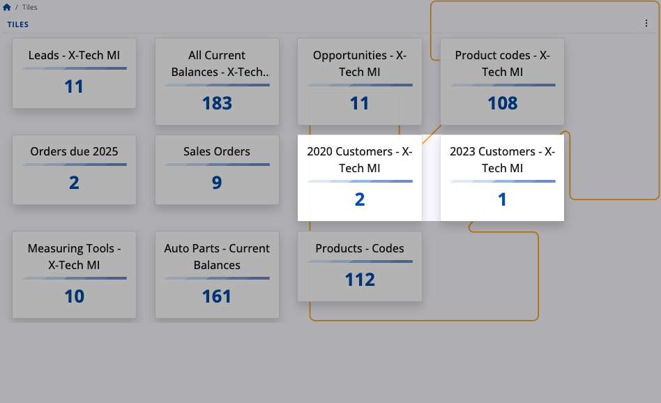

### Navigation

Each tile acts as a **link**. 

Clicking a tile opens its corresponding navigator with the specific filters (if any) that were used when the tile was created, providing immediate access to the source data.

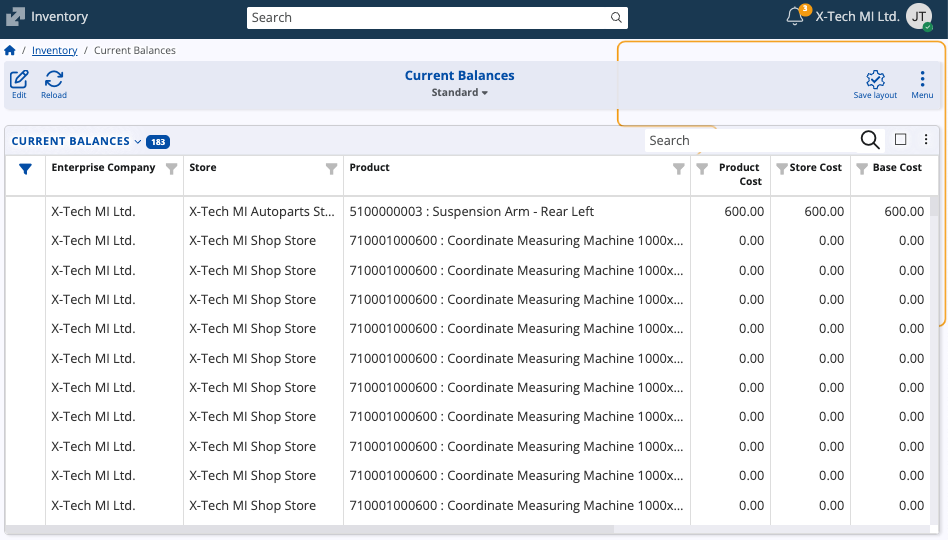

## Actions

The Tiles interface displays all of the tiles that have been created by you. 

Management actions are accessible via the **three-dot menu** in the top-right corner.

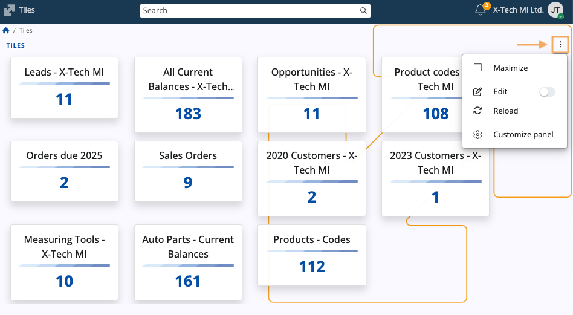

| Menu option | Functionality |
| :--- | :--- |
| **Maximize** | Expands the Tiles view to fill the entire application window. |
| **Edit** | Allows you to remove tiles. |
| **Reload** | Refreshes the information displayed on all tiles to ensure the count data is up-to-date. |
| **Customize panel** | Opens the Tiles Customization window. |

### Edit

When you trigger Edit mode, a **red cross button** appears on the top-right corner of each tile. 

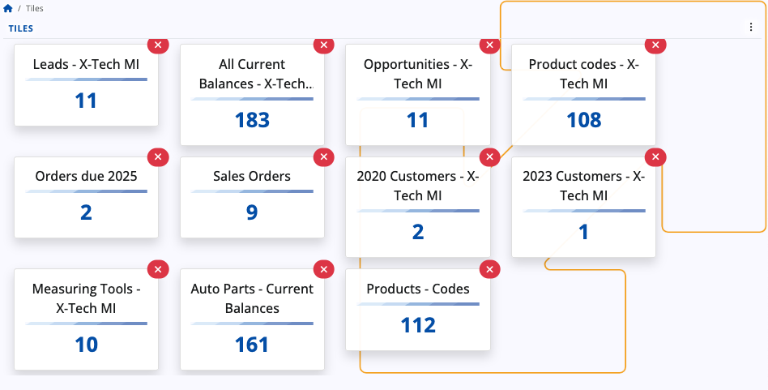

Clicking this button removes the tile after confirmation.

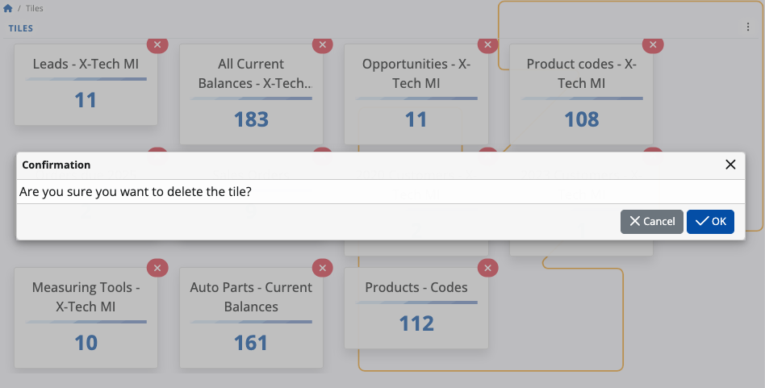

### Customize panel

The **Customize panel** window opens a separate window with two management tabs:

* **Items**: Controls the visibility of tiles. You can click the slider next to a tile's name to hide or reveal the respective tile on the main screen.

  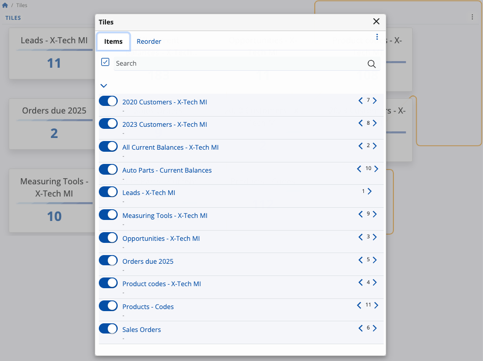

* **Reorder**: Controls the sequence of the tiles. You can drag and drop tile names up and down the list to change the order in which they appear on the Tiles screen.

  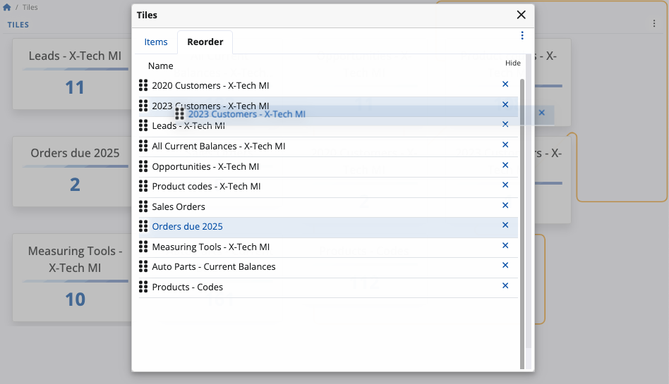

## Create a new tile

Tiles are created from an existing navigator view, allowing the tile to inherit that navigator's applied filters.

To create a new tile:

1. Navigate to a desired data source (e.g., Product Codes) to open its corresponding navigator.

2. Optionally apply filtering using the **Show filter row** option if the tile should track a subset of data.

   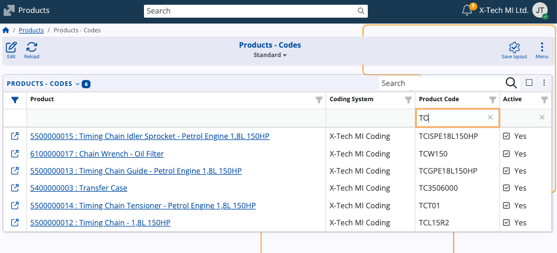

3. Open the form's main menu and select **Create a new tile**.

   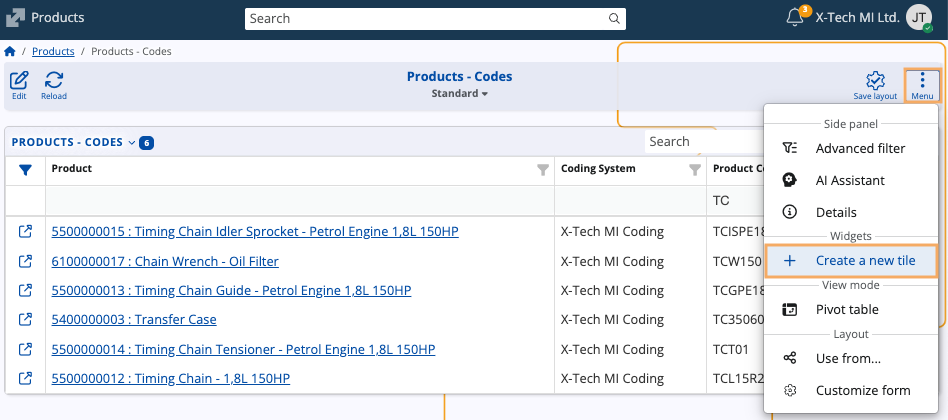

4. A dialog window will open where you must enter the **caption** (title) of the new tile.

   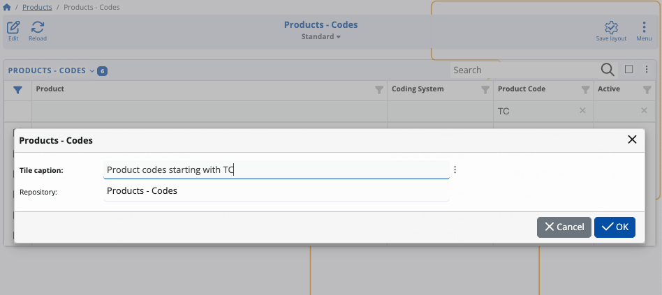

> [!Warning]
> 
> The caption of a tile must be **unique**. Do not use a caption that already exists.

When you click **OK**, the tile will be immediately created and you will be redirected to the Tiles screen.

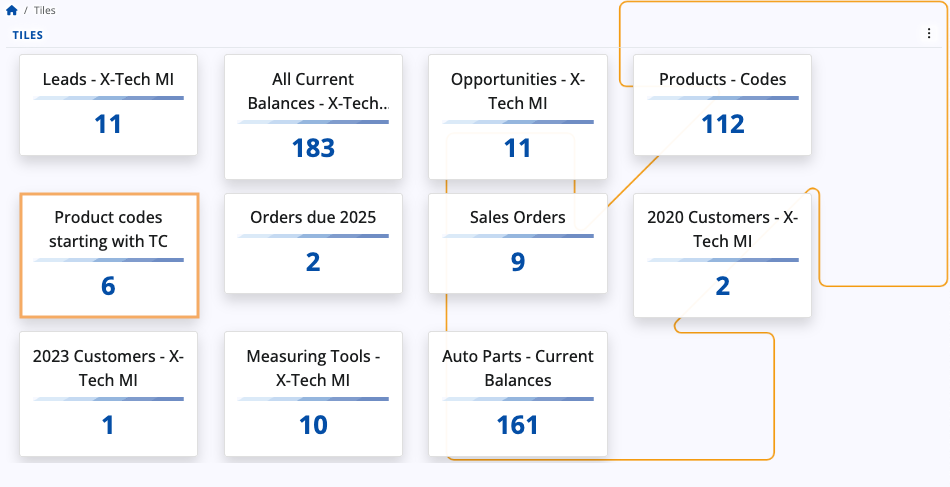

## Integration

The Tiles screen can be integrated as a widget within the **[Dashboard](https://docs.erp.net/tech/modules/my/dashboard/index.html)**, as well as any navigator, form or screen that supports tiles. 

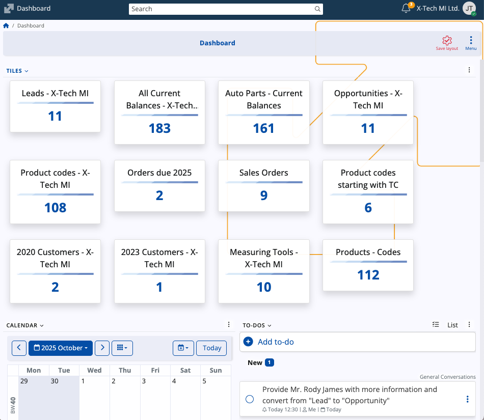

Tiles widgets only display tiles that are **relevant** to the context in which they were created (e.g., a form related to Sales orders will not show Customer related tiles).

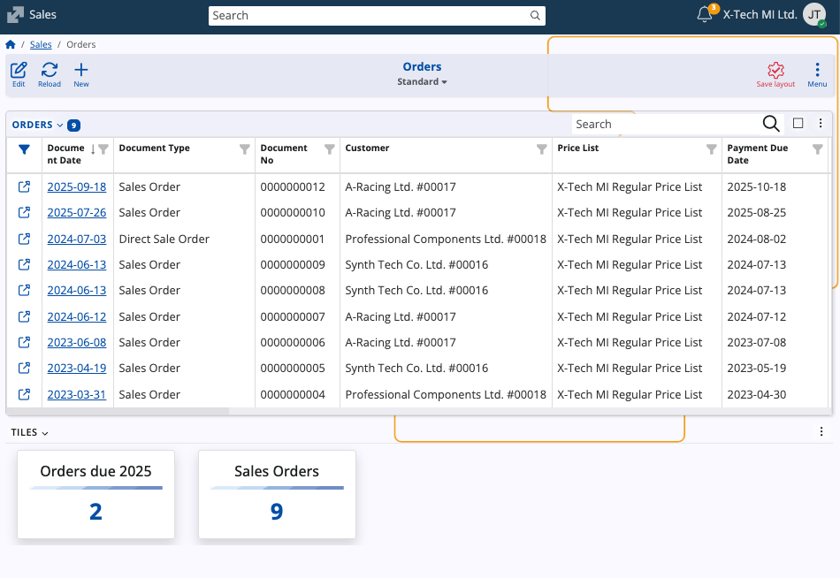
