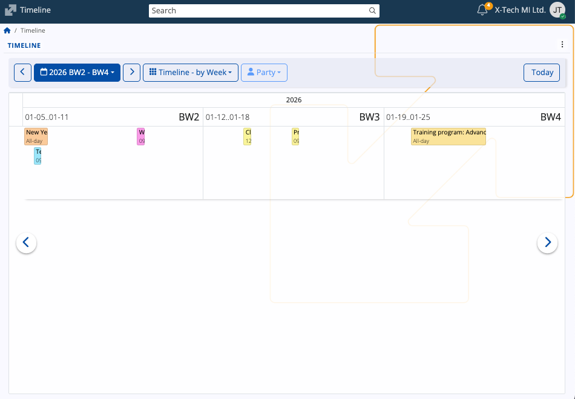
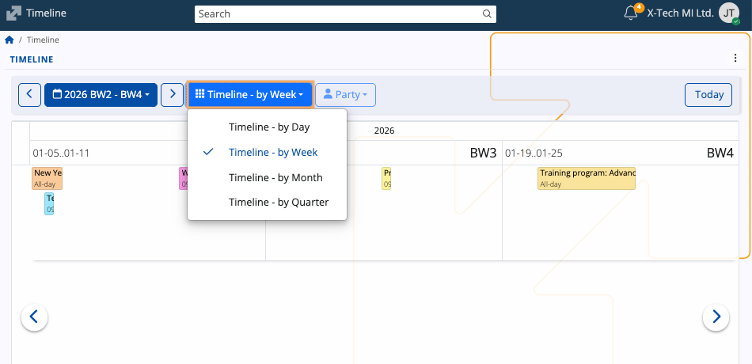
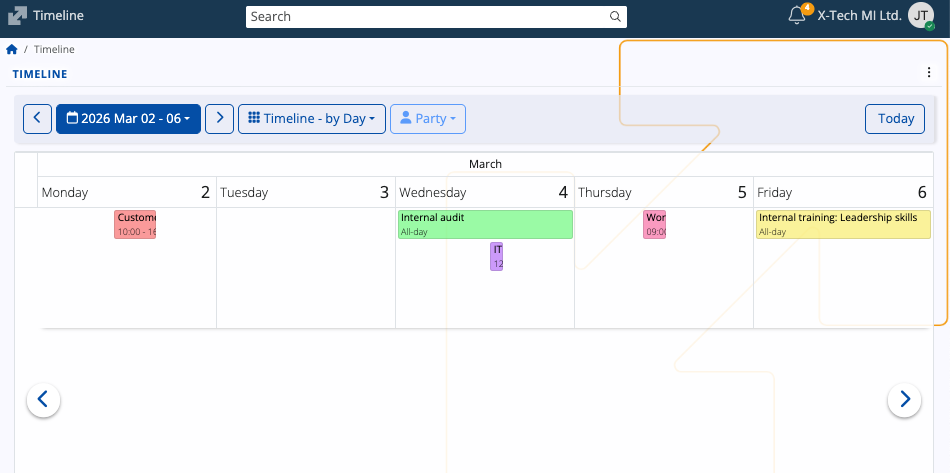
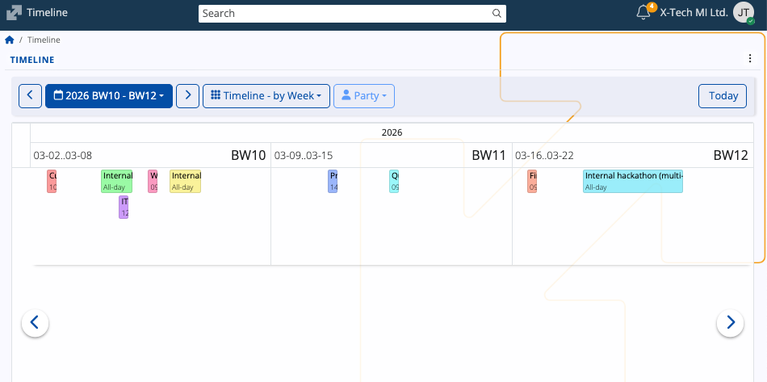
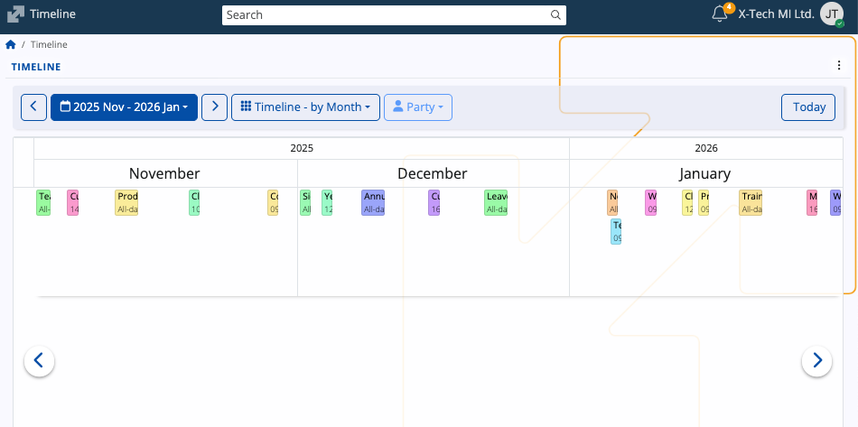
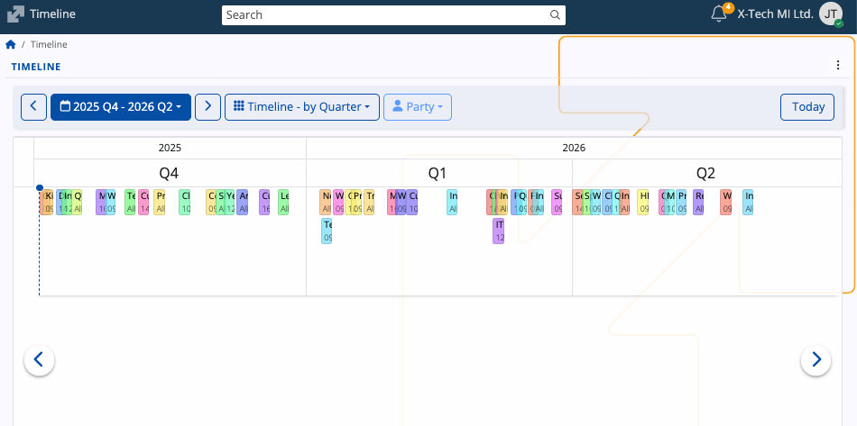
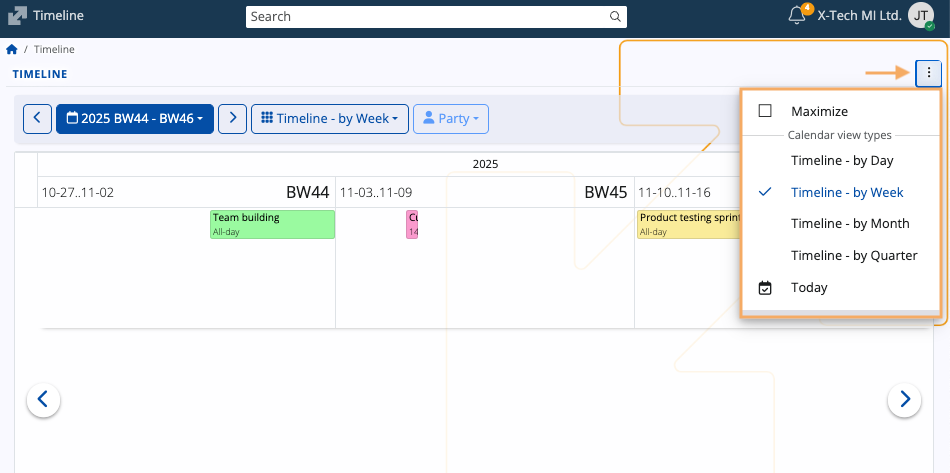
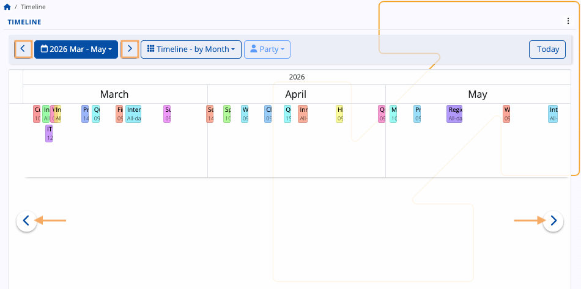
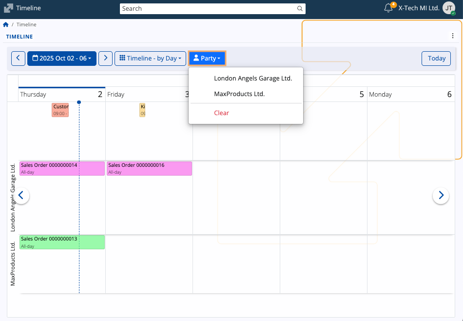
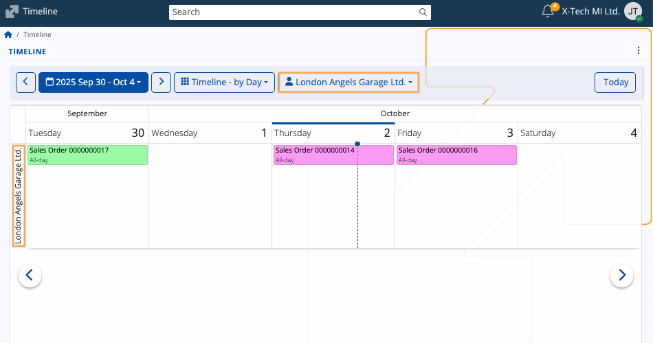

# Timeline

The Timeline screen provides a calendar-based chronological view for tracking **activities** and **documents** over extended periods of time. It emphasizes continuity across multiple time spans and offers a linear format, enabling clear visibility of overlapping or consecutive items.

Timeline exists as one of the main views in the @@name **[Calendar](https://docs.erp.net/tech/modules/my/calendar/index.html#timeline)**.

## Interface

### Timeline modes

The Timeline can be adjusted using the **view selector**, which controls the horizontal time scale displayed for activities and documents.

#### by Day

This mode displays all activities for a single day, as well as for the next up to 11 days.

> [!NOTE]
> 
> "up to" means that the maximum number of days in the timeline can be revealed if the browser window is expanded to full screen.

#### by Week

This mode displays all activities for the current week as well as for the next up to 6 weeks. Each week is labeled with its BW number.

> [!NOTE]
> 
> "up to" means that the maximum number of weeks in the timeline can be revealed if the browser window is expanded to full screen.

#### by Month

Lists all activities for the current month as well as for the next up to six months.

> [!NOTE]
> 
> "up to" means that the maximum number of months in the timeline can be revealed if the browser window is expanded to full screen.

#### by Quarter

Lists all activities for the last three months (current quarter) as well as for the next three quarters.

| Mode | Time span | Use case |
| :--- | :--- | :--- |
| **Timeline – by Day** | Selected day and the following up to 11 days. | Provides a highly granular, short-term activity view. |
| **Timeline – by Week** | Current week and the next up to six weeks. | Weeks are labeled using the **[BW number](https://docs.erp.net/tech/modules/my/calendar.html#business-week-number)** standard for consistent reporting. |
| **Timeline – by Month** | Current month and the next up to six months. | Ideal for mid-range planning and monthly activity reviews. |
| **Timeline – by Quarter** | Last three months (current quarter) and the next three quarters. | Best suited for high-level, long-term strategic reviews and annual planning. |

> [!TIP]
> You can also change your timeline mode from the **three-dot menu** at the upper-right part of the page.

### Navigation 

Using either the **left (previous)** or **right (next)** arrows in the navigation bar, you can quickly navigate across the timeline.

For example, pressing the right arrow advances 7 months in **Timeline - by Month**, shifting all the months by 7.

The arrows inside the timeline itself, however, allow you to move forward or go back just **by a single period**.

For example, pressing the right arrow advances one month in **Timeline - by Month**, shifting all the months by one.

## Party filter

In addition to **activities**, the Timeline also shows **documents** created for the currently logged-in Enterprise company. These documents are further grouped by the **[customer](https://docs.erp.net/tech/modules/crm/sales/customers/index.html)** **(Party)** they are associated with.

The **Party** button allows you to narrow down the timeline to show just the documents associated with one particular customer.

When a party is selected from the dropdown, the Timeline restricts the displayed documents and activities only to those records related to the chosen party.

The filter can be reset to the default "all parties" view by selecting **Clear** from the **Party** dropdown.

> [!NOTE]
> 
> The screenshots taken for this article are from v.26 of the platform.
