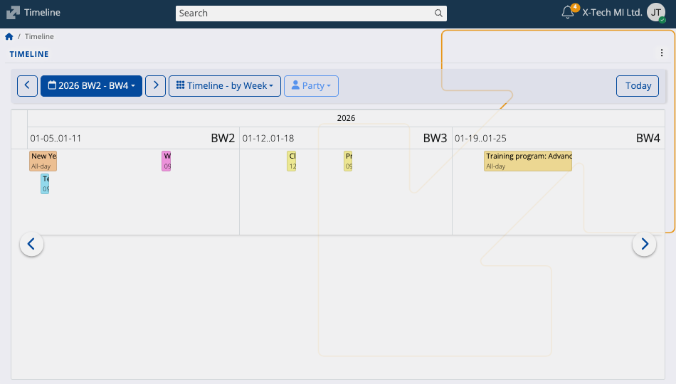
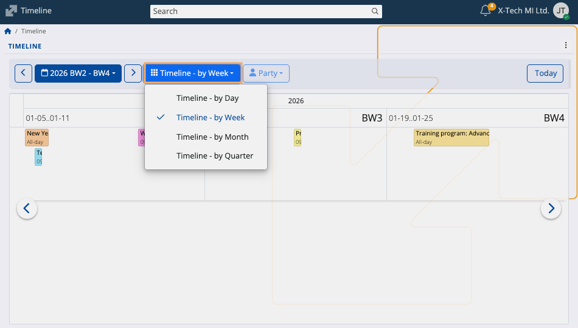

# Timeline

The Timeline screen provides a calendar-based chronological view for tracking activities, events, and related documents over extended periods of time. It emphasizes continuity across multiple time spans and offers a linear format, enabling clear visibility of overlapping or consecutive items.

Timeline exists as one of the main views in the @@name **[Calendar](https://docs.erp.net/tech/modules/my/calendar/index.html#timeline)**.

### Timeline modes

The Timeline Calendar can be adjusted using the view selector drop-down, which controls the horizontal time scale displayed for activities and documents.

| Mode | Time span | Use case |
| :--- | :--- | :--- |
| **Timeline – by Day** | Selected day and the following up to 11 days. | Provides a highly granular, short-term activity view. |
| **Timeline – by Week** | Current week and the next up to six weeks. | Weeks are labeled using the **[BW number](https://docs.erp.net/tech/modules/my/calendar.html#business-week-number)** standard for consistent reporting. |
| **Timeline – by Month** | Current month and the next up to six months. | Ideal for mid-range planning and monthly activity reviews. |
| **Timeline – by Quarter** | Last three months (current quarter) and the next three quarters. | Best suited for high-level, long-term strategic reviews and annual planning. |

## Party filter

By default, the Timeline shows activities and documents for all associated parties, effectively grouping records by the customer or supplier they are linked to along the vertical axis.

A key feature of the Timeline is its ability to filter and organize itself based on **associated @@name [customers](https://docs.erp.net/tech/modules/crm/sales/customers/index.html)**.

The **Party** button allows you to narrow down the view to just the documents associated with one particular customer, spread across one of the 4 main modes.

Clicking the Party button opens a dropdown menu where specific customers (Parties) can be selected.

When a party is selected, the Timeline restricts the displayed documents and activities only to those records related to the chosen parties.

The filter can be reset to the default "all parties" view by selecting **Clear** from the **Party** dropdown.
