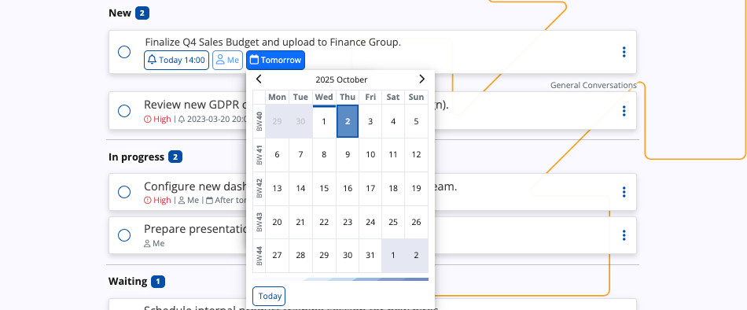

# Overview

The **To Do** screen is a personal task management utility. It allows you to create, track, and manage work-related activities like follow-ups, meetings, or lead conversions, with optional reminders and deadlines in place to help you organize your daily workflow.

## Interface

### States

A task can be in one of the following states:

* **New:** The default state for a newly created task.
* **In progress:** Indicates active work is being performed on the task.
* **Waiting:** Used when the task is currently blocked or awaiting action.
* **Completed:** The final state, indicating the task is finished.

### Views

Tasks can be displayed in two primary formats, selectable via the **view chooser** in the top-right corner.

#### List

**List** is the default view of the To Do screen, providing a linear and categorized breakdown of all tasks.

In this view, tasks are automatically grouped under headings corresponding to their current state.

Each task entry displays the following information:

* A circular radio button used for **quick completion** of the task
* The primary task **description**
* Scheduling details, including the assigned user, **reminder time** (if set), and the **due date**
* The name of the **[group](https://docs.erp.net/tech/modules/my/groups/index.html)**, if the task is associated with one
* A three-dot **action menu** for further task management

#### Kanban

The **Kanban** view transforms the To Do screen into a dynamic visual board for managing the task flow.

Key differences from List view:

* Tasks are displayed as **cards** organized into vertical columns. Each column header corresponds to a task's state.
* You can **drag and drop** task cards between the columns, which automatically updates the task's state.
* A **+ button** can be found at the bottom of each column, allowing newly created tasks to be automatically grouped into a specific state.

## Add a task

### List

In List view, tasks are added using the **+ Add to-do** bar at the top of the screen.

When you click on it, it will expand with several fields:

1. Enter a task description in the input field. This is the only required step.
2. Optionally configure:
   
   * **Reminder:** Sets a specific time for a notification. You can use one of the templates:
     
        * **Late afternoon**
        * **Dinner**
        * **Tomorrow**
        * **Next Monday**
        * **Set custom time** - Allows you to set a specific reminder date and time via the built-in mini calendar.

          
          
   * **Assignee:** By default, the task is assigned to the you, but you can assign it to someone else in your organization.
   * **Due Date:** Sets a deadline for the task. You can use one of the templates:
     
        * **Today**
        * **Tomorrow**
        * **After tomorrow**
        * **Next week**
        * **Set custom date** - Allows you to set a specific deadline date via the built-in mini calendar.

          

3.  Click the **Create** button. This will move the task into the **New** category.

### Kanban 

In Kanban view, tasks are created directly within the columns, allowing them to be categorized immediately by their State.

1. Click the **+ button** located at the bottom of the column corresponding to the desired initial state.

   

2. A dialog box will appear, requiring you to enter the **Title** of the task. You may also enter optional **Notes**.

   

3. Click the **Create** button. This will add the task card to the column.

To define optional properties such as Reminder or Due Date, you must access the task's **three-dot action menu** and select the **Edit** option.

## Actions

The three-dot action menu on the right side of a task provides further management options.

| Menu Option | Action/Purpose |
| :--- | :--- |
| **Open** | Opens a window for changing the title and notes (if any) of the task. |
| **Edit** | Allows for changes of the task description, reminder, assignee, and due date. |
| **Importance** | Sets the priority level of the task. Options include **Low**, **Normal**, and **High**. |
| **State** | Manually changes the task's status. |
| **Delete** | Permanently removes the task from the To Do list. |

### Complete a task

A task can be marked as complete in three ways:

1.  **Quick completion:** In List view, click the circular radio button to the left of the task description.

    

2.  **State change:** In both List and Kanban view, select **Completed** from the **State** sub-menu within the action menu.

    

3.  **Drag and drop:** In Kanban view, drag any task from any state and drop it into the **Completed** column.

    

Completed tasks are automatically moved to the **Completed** category.

> [!NOTE]
> 
> The screenshots taken for this article are from v.26 of the platform.
