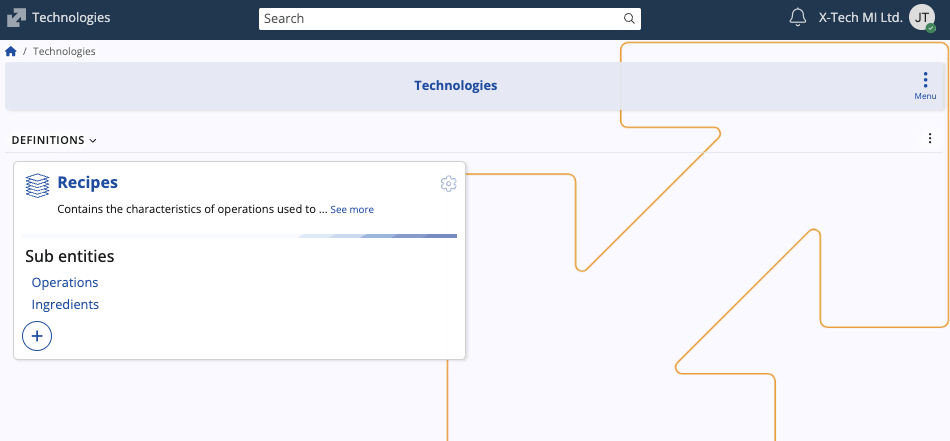
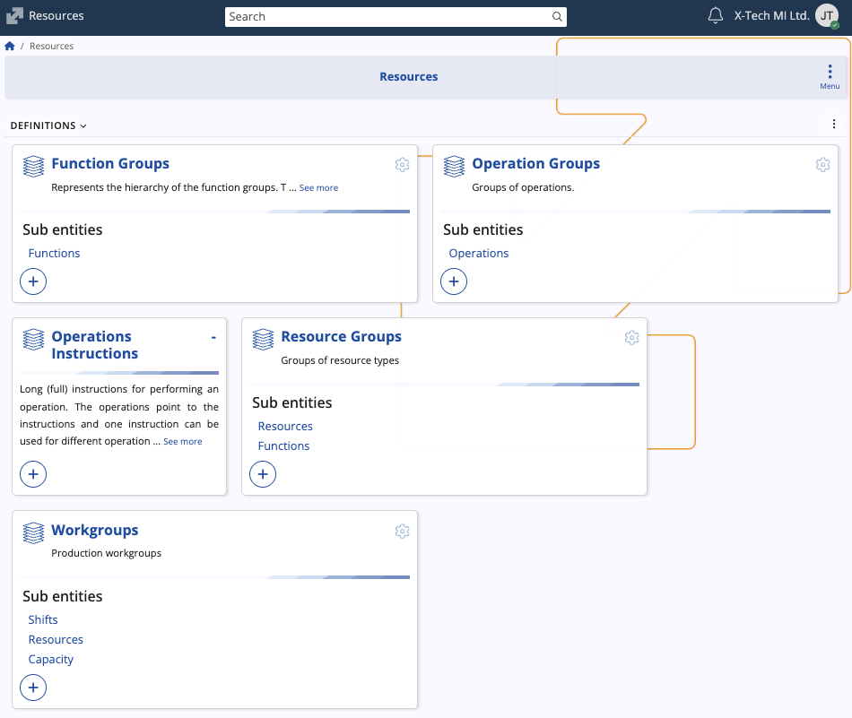
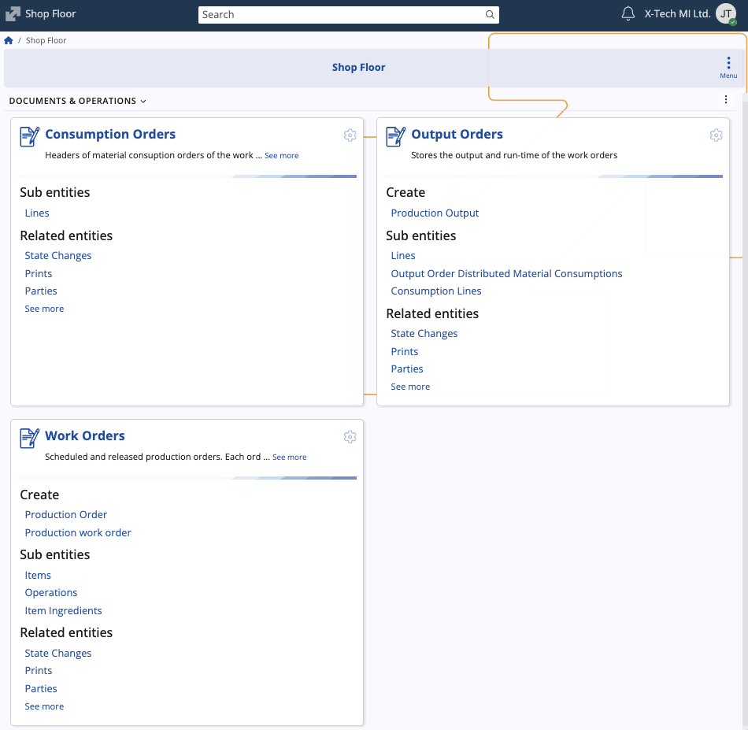

# Production

The Production module is designed to manage, control, and optimize the entire manufacturing process. Its primary function is to define the product structure (**recipes, operations, ingredients**), model the available production capacity (**resources**), and manage the execution and recording of work on the shop floor (**work orders, consumption/output orders**). It ensures traceability and provides the basis for cost accounting of manufactured goods.

## Structure

The Production module consists of several submodules, each managing a distinct area of the production process.

### Technologies

This submodule defines what is produced and how it is produced in the making of a product.

| Entity | Description |
| :--- | :--- |
| **Recipes** | The central definition that contains the characteristics of **operations** and/or **ingredients** used to create products. It links ingredients with a sequence of operations to define the product structure. |
| **Operations** | Sub entities determining the routing (operation list) of a recipe (e.g., aging, mashing). They can be grouped into **operation groups** and carry technical parameters like resource usage and time standards. |
| **Ingredients** | Sub entities determining the materials or components of a specific recipe, defining the material inputs needed for production. |

### Resources

This submodule structures and defines the physical and labor assets available for manufacturing, providing essential data for production scheduling and execution.

| Entity | Description |
| :--- | :--- |
| **Function Groups & Functions** | Represents the resource's specific technical skills or capabilities. Each function is defined with a **primary unit**, allowing the system to quantify and match an operation's required capability to a resource's competence. |
| **Operation Groups & Operations** | Defines the types of work that can be performed. Each operation can specify a **workgroup resource**, the quantity of the resource to be used, and time standards for execution. |
| **Resource Groups** | Aggregates individual resources into logical pools (e.g., Assembly department). Resource groups define available **functions** and set costing parameters for the resources contained within them. |
| **Workgroups** | Production workgroups that define capacity at a granular level, including associated **shifts** and **resources**. |
| **Operations - Instructions** | Detailed instructions for performing an operation. One instruction can be used for different kinds of operations. |

### Shop Floor

This submodule manages the execution cycle, providing the transactional documents necessary to schedule work, record material movements, and track production output on the factory floor.

| Entity | Description |
| :--- | :--- |
| **Work orders** | The core document for production execution. It is a scheduled and released production order, specifying the product, quantity, and linking to the **recipe**. It contains **items** to produce and detailed **item ingredients**. |
| **Consumption orders** | Documents material consumption against a specific **work order**. It records the inventory transaction of issuing materials from storage to the production floor. |
| **Output orders** | Documents the production output (finished goods) and run-time of the work orders. This records the inventory transaction of receiving finished goods into stock and tracks the actual time spent on production. |
