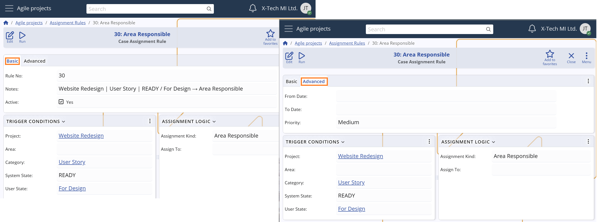
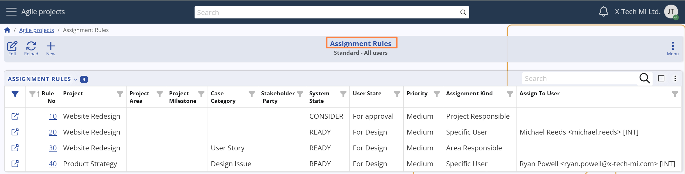
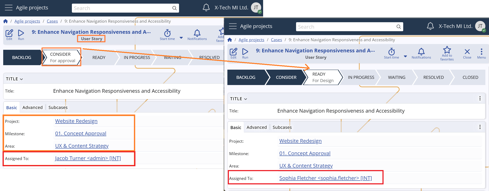

## Assignment rules

Case assignments in **Agile PM** can be managed either **manually** or **automatically**. While manual assignment is always available, organizations can streamline their workflows by defining **Assignment Rules** — a flexible system for automatic case routing based on predefined criteria.

### Rule settings

Assignment Rules are configured in the **Agile PM → Setup → Assignment Rules** section.  

Each rule includes several key fields that define:

**Rule availability (activation conditions)**  
These settings determine whether the rule is eligible for evaluation:

- **Active** – indicates whether the rule is currently enabled. Only active rules are considered by the system.

- **From Date / To Date** – optional start and end dates that define a period during which the rule is valid. Useful for setting temporary or seasonal rules.

**Rule trigger (matching conditions)**  
These fields define when the rule is evaluated and executed:

- **Condition Fields** – define the conditions under which the rule applies.  
  For each of these fields, the system compares the value from the Case with the value from the same field in the rule.  
  If the rule’s field value is empty, it is treated as a match for any value in the Case.  
  The fields include: *Project, Project Area, Project Milestone, Case Category, Stakeholder Party, System State, or User State.*

- **Priority** – defines the importance level of the rule. When multiple rules match, the one with the highest priority is applied.

- **Rule No.** – a unique sequence number used to determine precedence when more than one rule shares the highest priority.  
  The number is auto-generated but can be modified manually if needed.

**Assignment logic (execution behavior)**  
This setting defines who the Case should be assigned to when the rule is triggered:

  - **Assignment Kind** – specifies how the system determines the assignee. The available options include:

  - **Area Responsible** – assigns to the user set as *Primary User* for the **Project Area**.  
    *Suitable for domain-specific team structures.*

  - **Project Responsible** – assigns to the user set as *Primary User* for the **Project**.  
    *Useful for centralized case control or project leadership.*

  - **Case Owner** – assigns to the user set as *Owner* of the Case.  
    *Ensures that the designated responsible party receives it.*

  - **Current User** – assigns to the user performing the triggering change (e.g., status update).  
    *Enables contextual or self-assignment.*

  - **Specific User** – assigns to a fixed, manually selected user.  
    *In this case, the **Assign To User** field becomes mandatory.*

This setup provides flexibility to support both static and dynamic assignment patterns, allowing the system to reflect organizational structure, business rules, and real-time actions.

## Rule logic

Assignment Rules are automatically evaluated whenever a Case is updated and one or more of its Condition Fields change. This enables the system to respond dynamically to changes in the Case’s structure, categorization, or state.

The logic follows these main steps:

### 1. Triggering rule evaluation

When any of the following **Condition Fields** in the Case is changed:
- Project
- Project Area
- Project Milestone
- Case Category
- Stakeholder Party
- System State
- User State

The system begins rule evaluation based on the updated values.

### 2. Rule evaluation

The system evaluates all **active** Assignment Rules and applies the following conditions:
- The rule must be active (`Active = True`)
- The current date must be within the rule’s validity period (`From Date` and `To Date`)
- Each of the Condition Fields in the rule must either:
  - Match the current value in the Case, or
  - Be left empty, which means "applies to all"

If multiple rules match:
- The rule with the highest **Priority** is selected
- If multiple rules share the same priority, the rule with the highest **Rule No.** takes precedence.

### 3. Assignment execution

Once the best-matching rule is identified, the system determines the appropriate user based on the rule’s **Assignment Kind** (e.g., *Area Responsible*, *Specific User*, *Current User*).  
That user is then assigned to the Case by updating its `Assigned To User` field.

#### Example

> A Case is initially created with the following values:  
> - Project = Website Redesign
> - Project Milestone = 01. Concept Approval
> - Project Area = UX & Content Strategy
> - Case Category = User Story  
> - System State = CONSIDER
> - User State = For approval
> - Assigned To User = Jacob Turner
> - Stakeholder Party = *null*
>
> The Case is then updated with: 
> - System State = READY
> - User State = "For Design"
>
> There are four active Assignment Rules in the system:
>
> **Rule №10**  
> - Project = Website Redesign
> - Project Area = *null* (applies to all) 
> - Project Milestone = *null* (applies to all) 
> - Case Category = *null* (applies to all) 
> - Stakeholder Party = *null* (applies to all) 
> - System State = CONSIDER
> - User State = For approval
> - Assignment Kind = Project Responsible //Jacob Turner
> - Priority = Medium
>
>  **Rule №20**  
> - Project = Website Redesign
> - Project Area = *null* (applies to all) 
> - Project Milestone = *null* (applies to all) 
> - Case Category = *null* (applies to all) 
> - Stakeholder Party = *null* (applies to all) 
> - System State = READY
> - User State = For Design
> - Assignment Kind = Specific User
> - Assign To User = Michael Reeds
> - Priority = Medium
>
>  **Rule №30**  
> - Project = Website Redesign"
> - Project Area = *null* (applies to all) 
> - Project Milestone = *null* (applies to all) 
> - Case Category = User Story 
> - Stakeholder Party = *null* (applies to all) 
> - System State = READY
> - User State = For Design
> - Assignment Kind = Area Responsible //Sophie Fletcher
> - Priority = Medium
>
> **Rule №40**  
> - Project = Product Strategy
> - Project Area = *null* (applies to all) 
> - Project Milestone = *null* (applies to all) 
> - Case Category = Design Issue 
> - Stakeholder Party = *null* (applies to all) 
> - System State = READY
> - User State = For Design
> - Assignment Kind = Specific User
> - Assign To User = Ryan Powell
> - Priority = Medium
>
> Rules №20 and №30 both match the current Case values.  
> Since they have the same priority, the rule with the higher **Rule No.** is selected.  
> ➤ The Case is assigned to **Sophie Fletcher**, the Primary User of Project Area "UX & Content Strategy".

