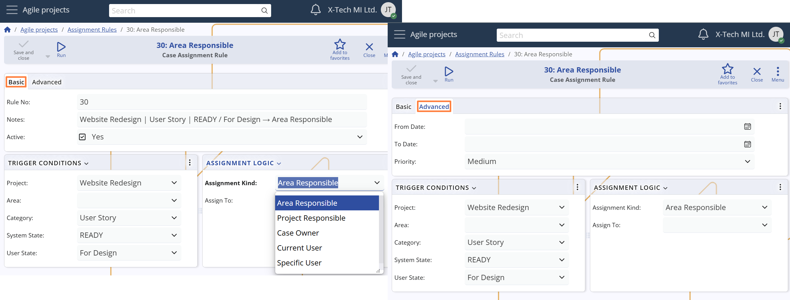
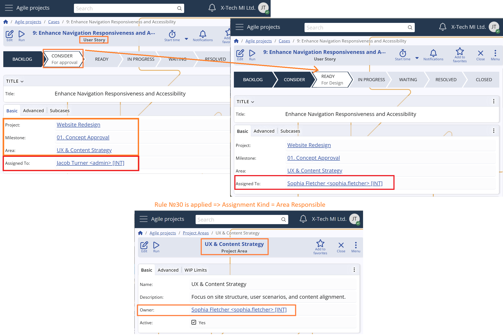

## Assignment rules

Case assignments in **Agile PM** can be managed either **manually** or **automatically**. While manual assignment is always available, organizations can streamline their workflows by defining **Assignment Rules** — a flexible system for automatic case routing based on predefined criteria.

# Rule settings

Here are the available configuration options for each rule:

## Rule availability

Each rule can be enabled or disabled and limited to a specific time period:

- **Active**  
  Indicates whether the rule is currently enabled. Only active rules are evaluated by the system.

- **From Date / To Date**  
  Optional date range in which the rule is valid.  
  - If empty, the rule is always valid.  
  - If both dates are set, the system applies the rule only within that range.  
  - If only one date is set, the rule is considered valid from or until that date.

## Rule triggers

The rule is evaluated when one or more of the following fields from the Case match the values specified in the rule: *Project*, *Project Area*, *Project Milestone*, *Case Category*, *Stakeholder Party*, *System State*, and *User State*.

  - If a field in the rule has a value, the corresponding value in the Case must match exactly.  
  - If a field in the rule is empty, it is treated as a match for any value in the Case.

> The more fields you fill in, the more specific the rule becomes. Rules with empty condition fields are more general and apply to a broader range of cases.

## Conflict resolution

When multiple rules match a given scenario, the system uses the following criteria to select which one to apply:

- **Priority**  
  Select from: Highest, High, Medium, Low, Lowest.  
  Rules with higher priority take precedence.

- **Rule No**  
  A unique number assigned to each rule.  
  - Used as a tie-breaker when two or more rules have the same priority.  
  - The rule with the higher number is used.  

> Tip: You can manually adjust Rule No to influence rule precedence.

## Assignment logic

This setting defines who the Case will be assigned to when the rule is triggered:

- **Assignment Kind**  
  Determines how the system selects the assignee. Options include:

  - **Area Responsible** – assigns to the *Primary User* of the **Project Area**.  
    *Suitable for team-based case assignment.*

  - **Project Responsible** – assigns to the *Primary User* of the **Project**.  
    *Useful for centralized control or leadership assignment.*

  - **Case Owner** – assigns to the *Owner* of the **Case**.  
    *Ensures that the designated responsible person receives it.*

  - **Current User** – assigns to the user who made the triggering change (e.g., updated the case state).  
    *Useful for self-assignment or contextual handling.*

  - **Specific User** – assigns to a fixed user defined in the rule.  
    *n this case, the **Assign To User** field becomes required.*

> This setup provides flexibility to support both static and dynamic assignment patterns, allowing the system to reflect organizational structure, business rules, and real-time actions.

#### Example

> A Case is initially created with the following values:  
> - Project = Website Redesign
> - Project Milestone = 01. Concept Approval
> - Project Area = UX & Content Strategy
> - Case Category = User Story  
> - System State = CONSIDER
> - User State = For approval
> - Assigned To User = Jacob Turner
> - Stakeholder Party = *null*
>
> The Case is then updated with: 
> - System State = READY
> - User State = "For Design"
>
> There are four active Assignment Rules in the system:
>
> **Rule №10**  
> - Project = Website Redesign
> - Project Area = *null* (applies to all) 
> - Project Milestone = *null* (applies to all) 
> - Case Category = *null* (applies to all) 
> - Stakeholder Party = *null* (applies to all) 
> - System State = CONSIDER
> - User State = For approval
> - Assignment Kind = Project Responsible //Jacob Turner
> - Priority = Medium
>
>  **Rule №20**  
> - Project = Website Redesign
> - Project Area = *null* (applies to all) 
> - Project Milestone = *null* (applies to all) 
> - Case Category = *null* (applies to all) 
> - Stakeholder Party = *null* (applies to all) 
> - System State = READY
> - User State = For Design
> - Assignment Kind = Specific User
> - Assign To User = Michael Reeds
> - Priority = Medium
>
>  **Rule №30**  
> - Project = Website Redesign"
> - Project Area = *null* (applies to all) 
> - Project Milestone = *null* (applies to all) 
> - Case Category = User Story 
> - Stakeholder Party = *null* (applies to all) 
> - System State = READY
> - User State = For Design
> - Assignment Kind = Area Responsible //Sophie Fletcher
> - Priority = Medium
>
> **Rule №40**  
> - Project = Product Strategy
> - Project Area = *null* (applies to all) 
> - Project Milestone = *null* (applies to all) 
> - Case Category = Design Issue 
> - Stakeholder Party = *null* (applies to all) 
> - System State = READY
> - User State = For Design
> - Assignment Kind = Specific User
> - Assign To User = Ryan Powell
> - Priority = Medium
>
> Rules №20 and №30 both match the current Case values.  
> Since they have the same priority, the rule with the higher **Rule No.** is selected.  
> ➤ The Case is assigned to **Sophie Fletcher**, the Primary User of Project Area "UX & Content Strategy".

